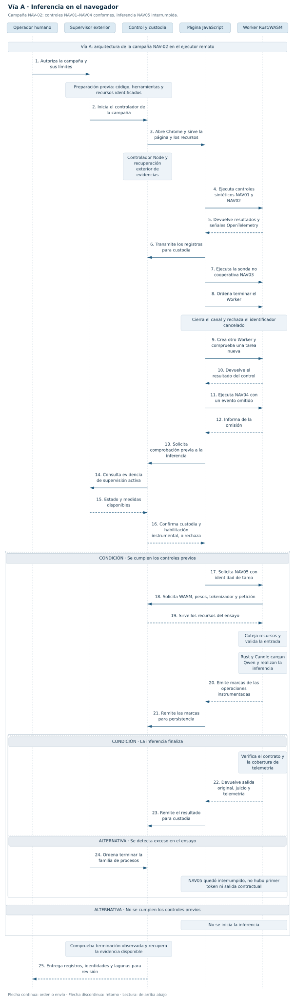
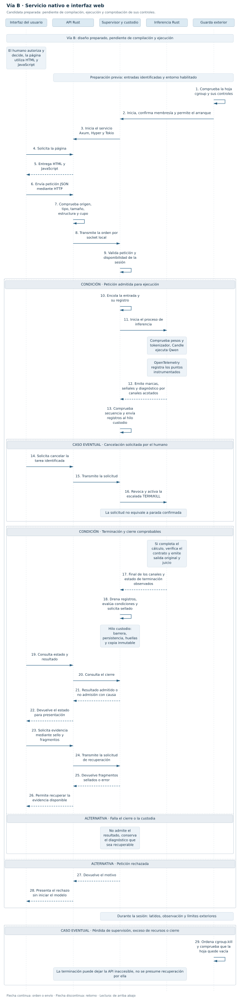

# Ensayo de inteligencia artificial y observabilidad

**Edición documental 2.7 · 23 de septiembre de 2026.**

Estudio experimental de la ejecución de modelos auxiliares de inteligencia artificial, su supervisión y la conservación verificable de entradas y resultados. Se desarrolla mediante componentes Rust y pertenece a la investigación lateral (p1+P3)-Bis del Lenguaje SV.

**Estado:** campaña Qwen/B **concluida como realización parcial con limitaciones identificadas**. gpt-oss-20b instalado para ejecución nativa, todavía sin respuesta de inferencia. Ninguno de estos resultados acredita la conformidad integral de la vía B.

## Objeto y criterio experimental

El ensayo aporta evidencia para definir contratos, controles, semántica y representación intermedia del Lenguaje SV. Se distinguen cuatro juicios: qué propone el modelo, si la ejecución es técnicamente admisible, si el contenido satisface su contrato y si una operación está autorizada. Una respuesta generada no concede permisos ni modifica el conocimiento canónico.

El [contrato experimental](contrato/README.md) identifica las obligaciones y fuentes rectoras. Las pruebas conservan la configuración, las entradas efectivamente suministradas, el resultado y el alcance de la observación. La instrumentación cubre las operaciones declaradas; no representa una observación exhaustiva del sistema.

## Dos vías de ejecución

| Vía | Lugar de la inferencia | Función del navegador | Alcance |
|---|---|---|---|
| **A · navegador** | Trabajador del navegador, mediante Rust compilado a WebAssembly. | Interfaz y alojamiento del trabajador. | Compatibilidad y recursos determinados para cada modelo, motor y navegador. |
| **B · nativa** | Proceso nativo en el anfitrión, separado de la interfaz. | Presentación y transporte de solicitudes. | Fronteras del servicio, supervisión, custodia y terminación sujetas a comprobación. |

Una página que consulta un modelo nativo corresponde a la vía B, aunque incorpore WebAssembly en otro componente. HTML y CSS resuelven la presentación; JavaScript se limita al transporte y la interacción necesarios. En la aplicación nativa, Rust ejecuta la inferencia y los controles propios del ensayo.

La elección de una vía responde a la factibilidad y al resultado buscado. No exige ensayar todas las combinaciones de modelos y soportes. Una vía no realizada puede retomarse si surge una pregunta concreta. Comparar modelos distintos en vías distintas permite valorar ambas configuraciones, pero no atribuir sus diferencias exclusivamente a WebAssembly.

### Vía A: campaña de navegador

**Alcance de la figura:** secuencia de la campaña NAV-02 documentada en septiembre de 2026. Representa el navegador del ejecutor remoto de aquella campaña y la carga de Qwen con Candle; no una instalación de gpt-oss en navegador. Se conserva la figura original. [Ampliar](diagramas/via-a.svg) · [Fuente Mermaid](diagramas/via-a.mmd) · [Documentación de aquel corte](README_2_3_2026_09_20.md).

Los controles sintéticos iniciales se completaron. La prueba con el modelo se interrumpió al superar el umbral autorizado de memoria, antes del primer token. El resultado no acredita inferencia completa ni inviabilidad general de WebAssembly.

### Vía B: arquitectura nativa de referencia

**Alcance de la figura:** diseño EIO-NAT-PREP-02 del corte del 20 de septiembre de 2026. Sus indicaciones de preparación y pruebas pendientes pertenecen a ese diseño y a esa fecha. La figura no certifica que todos sus componentes estén integrados en la aplicación de conversación. [Ampliar](diagramas/via-b.svg) · [Fuente Mermaid](diagramas/via-b.mmd) · [Diseño NAT02](resultados/preparacion-nativa-02/DISENO.md) · [Desarrollo NAT03](resultados/preparacion-nativa-03/README.md).

## Versión distribuida

**Qwen/B: campaña cerrada.**

La campaña conserva la instalación experimental Qwen3-0.6B, GGUF Q4_K_M, con inferencia CPU mediante Candle. La [entrega EIO conversación 0.1.3-beta.1](https://github.com/juantoniolloretegea/SV-motor/releases/tag/eio-conversacion-v0.1.3-beta.1) identifica el ejecutable, la composición, las licencias y las comprobaciones de esa versión. Permite expedientes, conversaciones, consulta del contexto, cancelación y exportación.

| Aspecto | Resultado conservado | Límite de la conclusión |
|---|---|---|
| Conversación nativa | Inferencia, interfaz y conservación comprobadas en la configuración documentada. | Disponibilidad dependiente del servicio y la plataforma; autenticación profesional individual no acreditada. |
| Calidad del contenido | Resultados adversos y respuestas incorrectas conservados. | Una finalización técnica normal no acredita veracidad ni aptitud clínica. |
| Consulta documental DOC-01 | Cuatro peticiones completadas; cero aceptaciones del contrato estricto. | El contrato de citas literales no equivale a un verificador general de explicaciones. |
| Supervisión y observación | Control del hijo, plazos, cancelación, RSS muestreada, trazas y observador Linux. | No acreditan una cuota agregada ni la guarda exterior del diseño. |
| Custodia y cierre integral | Registros y evidencias de las versiones ensayadas conservados. | Independencia completa de custodia, guarda exterior e integración del recorrido contractual sin acreditar. |

El [informe de cierre de Qwen/B](resultados/cierre-qwen-b-20260923/INFORME.md) delimita lo demostrado y las limitaciones aceptadas. **La campaña está cerrada; la vía B no se declara plenamente conforme.** Una continuación requiere un objetivo nuevo y concreto, conservando este resultado.

La [candidata conversación 0.1.4](conversacion-nativa/verificacion-0.1.4/INFORME.md) incorpora correcciones verificadas localmente en Rust 1.98.0. No sustituye por sí sola la Beta instalada ni aporta una nueva campaña de inferencia.

## gpt-oss-20b: continuación nativa

La [ficha del modelo](modelos-de-ia/openai/gpt-oss-20b/README.md) identifica los pesos, el motor mistral.rs 0.9.3 y Harmony 0.0.8. Esta instalación utiliza un motor compatible con gpt-oss; no hereda automáticamente la composición de Qwen.

La [continuación del 23 de septiembre](modelos-de-ia/openai/gpt-oss-20b/resultados/continuacion-2026-09-23/INFORME.md) ejecutó el motor instalado y conservó medidas de memoria durante la carga. Dos trazas identifican una señal externa anterior a la parada del controlador, sin determinar su servicio emisor ni su motivo. Los intentos de recuantización Q3K alcanzaron el límite de RSS observado. No se habilitó el servicio ni se obtuvo una respuesta; la instancia quedó detenida.

El objetivo sigue abierto: obtener y documentar una respuesta real en la instalación nativa. La continuación requiere resolver el consumo de carga con una modificación fundamentada del cargador o de la representación empleada; repetir las configuraciones documentadas no resuelve ese obstáculo. El [controlador instrumental](modelos-de-ia/openai/gpt-oss-20b/controlador-nativo/README.md) y las variantes ensayadas conservan fuentes y evidencias identificadas. Este recorrido no acredita ejecución en navegador ni integración completa con el SV.

## Composición de la conversación Qwen

| Componente | Identificación | Función |
|---|---|---|
| Interfaz | HTML, CSS y JavaScript incluidos en el ejecutable | Presentación, solicitudes y consulta de estado. |
| Servicio HTTP | Axum 0.8.9, Hyper 1.11.1 y Tokio 1.53.1 | Bibliotecas del proceso servidor. |
| Modelo | Qwen3-0.6B, GGUF Q4_K_M | Inferencia en CPU; no corresponde a Qwen-Max. |
| Motor numérico | Candle, revisión `ddf1b879dc3a1760cbcb3f3c4a7c6467850cec4a` | Operaciones de inferencia en el proceso hijo. |
| Supervisión | Rust 1.98.0 | Admisión de una generación simultánea, plazos, cancelación y RSS muestreada. |
| Conservación | JSONL y huellas SHA-256 encadenadas | Registro sincronizado y detección de alteraciones, sin sello exterior independiente. |
| Instrumentación | OpenTelemetry Rust 0.31.0 | Trazas con exportación local; medidas como atributos, sin recolector externo de métricas. |
| Observador Linux | Proceso Rust separado | Muestreo del servicio y descendientes visibles, con cobertura declarada. |

## Evidencia y seguimiento

- [Catálogo de modelos](modelos-de-ia/README.md) y [aplicación de conversación](conversacion-nativa/README.md).
- [DOC-01: protocolo](resultados/consulta-documental-01/PROTOCOLO.md) e [informe](resultados/consulta-documental-01/INFORME.md). Utiliza material efectivamente suministrado del universo OP-IMM-001; sus referencias bibliográficas no equivalen al contenido de las obras citadas.
- [Observabilidad 0.1.3](conversacion-nativa/verificacion-0.1.3/INFORME.md) y [comparación de doce casos 0.1.2](conversacion-nativa/verificacion-0.1.2/INFORME.md), con la atribución de cada evidencia a su versión.
- [Seguimiento S39](https://github.com/juantoniolloretegea/SV-lenguaje-de-computacion/blob/main/docs/calidad/Inventario-sv/sucesos/SUCESOS_SV.md#s39) y [tiques técnicos](https://github.com/juantoniolloretegea/SV-lenguaje-de-computacion/blob/main/docs/calidad/Inventario-sv/tiques-tecnicos/TIQUES_TECNICOS.csv).
- Ediciones anteriores: [2.3](README_2_3_2026_09_20.md), [2.5](README_2_5_CORTE_2026_09_23.md) y [2.6, corte publicado](https://github.com/juantoniolloretegea/SV-motor/blob/8cddcc83359bf6733a360d5bba2cd72426f8b631/laboratorio/ensayo-ia-y-observabilidad/README.md).

## Licencias

Sistema Vectorial SV · [CC BY-NC-ND 4.0](https://creativecommons.org/licenses/by-nc-nd/4.0/deed.es). Los avisos del SV y las condiciones de terceros se identifican en [AVISO_LICENCIAS.json de Qwen](conversacion-nativa/AVISO_LICENCIAS.json), en el [aviso de gpt-oss-20b y su controlador](modelos-de-ia/openai/gpt-oss-20b/controlador-nativo/AVISO_LICENCIAS.json) y en la composición de cada entrega. Cada componente conserva su licencia; una identificación de versión no amplía derechos de uso o distribución.
