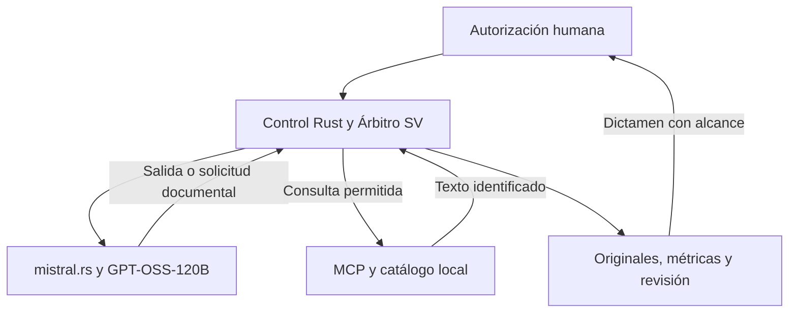

# Ensayo de inteligencia artificial y observabilidad

**Edición documental 2.15 · 27 de septiembre de 2026.**

Investigación experimental sobre ejecución nativa de modelos auxiliares, fidelidad documental, control y observación mediante Rust. Pertenece a la investigación lateral (p1+P3)-Bis y mantiene evaluaciones diferenciadas para inmunología y ciberseguridad. Las propuestas del modelo carecen de autoridad para modificar el conocimiento admitido o las decisiones del SV.

Esta página reúne el estado de los candidatos, la secuencia de publicaciones, las versiones de los componentes y sus límites. El [registro estructurado de versiones](VERSIONES.json) fija las referencias por commit y distingue fuentes, distribuciones y archivos de conservación.

**Consulta:** [estado actual](#estado-actual) · [publicaciones](#publicaciones-en-orden-cronológico) · [componentes](#versiones-de-los-componentes) · [vías y diagramas](#vías-de-ejecución-y-diagramas) · [trazabilidad](#trazabilidad-y-criterios-de-lectura).

## Estado actual

La continuación corresponde a **GPT-OSS-120B en la vía B nativa CPU**. Su compatibilidad, dimensionamiento y selección permanecen pendientes de resultado. No hay inferencia del nuevo candidato acreditada en este corte.

| Modelo o configuración | Resultado conservado | Situación |
|---|---|---|
| [Qwen3-0.6B · Q4_K_M](modelos-de-ia/qwen/qwen3-0.6b/README.md) | Inferencia nativa y controles parciales; cuatro consultas DOC-01 terminadas, sin conformidad contractual completa. | Campaña cerrada con limitaciones. |
| [GPT-OSS-20B · MXFP4](modelos-de-ia/openai/gpt-oss-20b/README.md) | Funcionamiento técnico y bancos documentales conservados; la evaluación médica no acreditó la función prevista. | Configuración excluida de esa selección; archivo conservado. |
| [Qwen3.8-27B](modelos-de-ia/qwen/qwen3.8-27b/README.md) | Respuesta final completa en la selección mínima, con omisión material y deficiencias de citas y localización. | **No pasa**; configuración retirada de la selección actual. |
| [GPT-OSS-120B](modelos-de-ia/openai/gpt-oss-120b/README.md) | Preparación y comprobación preliminar; sin resultado de selección. | Candidato, pendiente. |

Los juicios se refieren a configuraciones y bancos concretos; no califican a una familia completa ni se suman como una tasa general de acierto. El [catálogo de modelos](modelos-de-ia/README.md) conserva también los estudios documentales sin inferencia.

El MCP documental tiene seguimiento propio. Sus controles instrumentales no convierten un modelo en apto ni prueban que sus afirmaciones estén sustentadas por las citas.

**Secuencia vigente:** selección nativa B → Apto en el alcance experimental → posible autorización de un ensayo A/WebAssembly. Cargar el modelo no satisface la selección. La aptitud clínica general, el uso productivo y la integración en el núcleo requieren decisiones y evidencia propias.

## Publicaciones en orden cronológico

Se han cotejado **cinco publicaciones preliminares**: dos distribuciones de aplicaciones y tres archivos de conservación. Las revisiones `v1` de los archivos identifican cada paquete fechado; no son versiones sucesoras de la aplicación ni nuevos modelos.

| Fecha | Publicación | Objeto y alcance |
|---|---|---|
| 22/09/2026 | [EIO conversación 0.1.3-beta.1](https://github.com/juantoniolloretegea/SV-motor/releases/tag/eio-conversacion-v0.1.3-beta.1) | Aplicación nativa para Qwen3-0.6B: binario, fuentes, ficha, licencias y manifiesto. Pesos externos identificados. |
| 25/09/2026 | [GPT-OSS conversación 0.2.4-beta.1](https://github.com/juantoniolloretegea/SV-motor/releases/tag/gpt-oss-conversacion-v0.2.4-beta.1) | Aplicación nativa y motor para GPT-OSS-20B, con resultados y límites. No acredita aptitud clínica. |
| 25/09/2026 | [GPT-OSS: imagen de recuperación, v1](https://github.com/juantoniolloretegea/SV-motor/releases/tag/gpt-oss-imagen-onecloud-20260925-v1) | Archivo cifrado de recuperación. La restitución funcional comprobada corresponde a esta imagen y a su procedimiento. |
| 26/09/2026 | [GPT-OSS: archivo de cierre, v1](https://github.com/juantoniolloretegea/SV-motor/releases/tag/gpt-oss-archivo-cierre-20260926-v1) | Archivo posterior de la campaña. Esta imagen no hereda la comprobación de arranque de la imagen anterior. |
| 27/09/2026 | [Qwen3.8-27B: archivo de cierre, v1](https://github.com/juantoniolloretegea/SV-motor/releases/tag/qwen38-27b-archivo-cierre-20260927-v1) | Reúne las imágenes del 26 y 27 de septiembre, sin pesos del modelo. No se ha acreditado su arranque en una instancia restaurada. |

Cada publicación conserva su etiqueta, commit de referencia, activos y manifiestos. El último archivo de una campaña no borra los anteriores ni modifica su dictamen. Los activos cifrados preservan contenido de acceso restringido; su publicación no concede acceso a ese contenido.

MCP 0.1.0–0.1.2 se conserva en directorios versionados, sin release específico en el corte consultado. GPT-OSS-120B todavía no tiene distribución o imagen publicada en este ensayo.

## Versiones de los componentes

| Componente | Versión o referencia | Estatuto |
|---|---|---|
| EIO conversación para Qwen3-0.6B | **0.1.3**, distribuida como **0.1.3-beta.1** | Aplicación de la campaña conservada. |
| Fuentes candidatas de EIO conversación | [0.1.4](conversacion-nativa/verificacion-0.1.4/INFORME.md) | Verificación local documentada; no sustituyen la distribución 0.1.3-beta.1 ni acreditan una nueva inferencia. |
| EIO conversación para GPT-OSS-20B | [0.2.4, distribuida como 0.2.4-beta.1](modelos-de-ia/openai/gpt-oss-20b/distribucion/0.2.4-beta.1/FICHA_TECNICA.md) | Fuentes y ejecutable identificados. El rótulo interno 0.2.2 es una discrepancia documentada, no otra entrega. |
| Servicio documental MCP | [0.1.0](modelos-de-ia/model-context-protocol/0.1.0/README.md) | Antecedente conservado con preparación incompleta. |
| Servicio documental MCP | [0.1.1](modelos-de-ia/model-context-protocol/0.1.1/LEAME.md) | Correcciones de validación, paginación y conservación; controles dirigidos documentados y recepción pendiente. |
| Servicio documental y cliente local | [0.1.2](modelos-de-ia/model-context-protocol/0.1.2/LEAME.md) | Añade supervisión del cliente mínimo. Este cliente no ofrece herramientas al modelo; no acredita por sí mismo una integración MCP. |

Las versiones se interpretan dentro de su componente. **Qwen3.8-27B** es una identidad de modelo; **0.1.2** puede identificar el componente MCP; **2.15** es exclusivamente la edición de este documento. Los pesos y motores se fijan mediante revisión y huella, no mediante la edición del índice.

Las realizaciones conservadas utilizan Rust 1.98.0. Qwen3-0.6B utiliza Candle; GPT-OSS-20B y Qwen3.8-27B utilizan revisiones identificadas de mistral.rs. OpenTelemetry Rust registra únicamente los puntos instrumentados. Las fichas de cada modelo precisan la composición y sus límites; no se presume equivalencia entre motores o campañas.

## Vías de ejecución y diagramas

| Vía | Lugar de la inferencia | Función del navegador | Alcance |
|---|---|---|---|
| **A · navegador** | Trabajador del navegador, mediante Rust compilado a WebAssembly. | Interfaz y alojamiento del trabajador. | Compatibilidad y recursos determinados para cada modelo, motor y navegador. |
| **B · nativa** | Proceso nativo en el anfitrión, separado de la interfaz. | Presentación y transporte de solicitudes. | Fronteras del servicio, supervisión, custodia y terminación sujetas a comprobación. |

Una página que consulta un modelo nativo corresponde a la vía B, aunque incorpore WebAssembly en otro componente. HTML y CSS resuelven la presentación; JavaScript se limita al transporte y la interacción necesarios. En la aplicación nativa, Rust ejecuta la inferencia y los controles propios del ensayo.

La elección de una vía responde a la factibilidad y al resultado buscado. No exige ensayar todas las combinaciones de modelos y soportes. Una vía no realizada puede retomarse si surge una pregunta concreta. Comparar modelos distintos en vías distintas permite valorar ambas configuraciones, pero no atribuir sus diferencias exclusivamente a WebAssembly.

### Vía A: campaña de navegador

**Alcance de la figura:** secuencia de la campaña NAV-02 documentada en septiembre de 2026. Representa el navegador del ejecutor remoto de aquella campaña y la carga de Qwen con Candle; no una instalación de gpt-oss en navegador. Se conserva la figura original. [Ampliar](diagramas/via-a.svg) · [Fuente Mermaid](diagramas/via-a.mmd) · [Documentación de aquel corte](README_2_3_2026_09_20.md).

Los controles sintéticos iniciales se completaron. La prueba con el modelo se interrumpió al superar el umbral autorizado de memoria, antes del primer token. El resultado no acredita inferencia completa ni inviabilidad general de WebAssembly.

### Vía B: arquitectura nativa de referencia

**Alcance de la figura:** diseño EIO-NAT-PREP-02 del corte del 20 de septiembre de 2026. Sus indicaciones de preparación y pruebas pendientes pertenecen a ese diseño y a esa fecha. La figura no certifica que todos sus componentes estén integrados en la aplicación de conversación. [Ampliar](diagramas/via-b.svg) · [Fuente Mermaid](diagramas/via-b.mmd) · [Diseño NAT02](resultados/preparacion-nativa-02/DISENO.md) · [Desarrollo NAT03](resultados/preparacion-nativa-03/README.md).

### Continuación de la vía B · GPT-OSS-120B

```mermaid
flowchart TD
  H["Autorización humana"] --> C["Control Rust y Árbitro SV"]
  C --> M["mistral.rs y GPT-OSS-120B"]
  M -->|"Salida o solicitud documental"| C
  C -->|"Consulta permitida"| D["MCP y catálogo local"]
  D -->|"Texto identificado"| C
  C --> E["Originales, métricas y revisión"]
  E -->|"Dictamen con alcance"| H
```

**Alcance de esta actualización visual:** esquema funcional previsto para el nuevo candidato, pendiente de comprobar e integrar en su realización concreta. El Árbitro SV comprende controles externos al protocolo MCP; no se atribuye aquí una implementación completa. La inferencia prevista deberá operar sin acceso a Internet. La adquisición administrativa de documentos precede al ensayo. Los dos diagramas anteriores se conservan como evidencia de sus respectivos cortes históricos.

## Trazabilidad y criterios de lectura

La secuencia de identificación es **configuración → campaña → resultado → entrega → recepción**. Ninguno de esos objetos sustituye a los restantes.

| Para comprobar | Referencia principal |
|---|---|
| Identidad del modelo, motor y condiciones | Ficha de cada modelo, en la tabla de estado actual. |
| Archivos distribuidos e integridad declarada | Publicación correspondiente, manifiesto y [VERSIONES.json](VERSIONES.json). |
| Contrato y límites del ensayo | [EIO-CONTRATO-01, revisión 1](contrato/README.md). |
| Continuidad y dictámenes | [S39](https://github.com/juantoniolloretegea/SV-lenguaje-de-computacion/blob/main/docs/calidad/Inventario-sv/sucesos/SUCESOS_SV.md#s39) y [Acta 004](https://github.com/juantoniolloretegea/SV-lenguaje-de-computacion/blob/main/docs/calidad/tuberias-ia/continuacion-15-09-2026/ACTA_004_FINALIDAD_ALCANCE_Y_CONTINUIDAD_EIO_2026_09_22.md). |
| Alcances de los tiques | [TT-0013: cierre GPT-OSS-20B](https://github.com/juantoniolloretegea/SV-lenguaje-de-computacion/blob/main/docs/calidad/Inventario-sv/tiques-tecnicos/TT-0013.md), [TT-0014: MCP](https://github.com/juantoniolloretegea/SV-lenguaje-de-computacion/blob/main/docs/calidad/Inventario-sv/tiques-tecnicos/TT-0014.md) y [TT-0015: nuevo candidato](https://github.com/juantoniolloretegea/SV-lenguaje-de-computacion/blob/main/docs/calidad/Inventario-sv/tiques-tecnicos/TT-0015.md). |

TT-0013 conserva su cierre acotado; TT-0014 requiere recepción propia; TT-0015 permanece pendiente de resultado material. Esta reorganización documental no modifica esos dictámenes.

Los enlaces de las tablas permiten lectura pública de las fichas y los resultados resumidos. Los originales de acceso restringido mantienen su custodia propia. Una huella identifica bytes; no acredita veracidad clínica, restauración funcional o conformidad general. El registro de versiones recoge huellas publicadas: esta revisión documental no ha descargado ni recalculado los grandes activos binarios.

### Historia de la edición documental

| Fechas de las revisiones | Ediciones declaradas | Contenido principal |
|---|---|---|
| 18–20/09/2026 | 0.1 y 0.2 | Apertura del ensayo y delimitación inicial. |
| 20/09/2026 | 2.0, 2.1, 2.2, 2.2.1 y 2.3 | Organización de las vías y diagramas. |
| 22–23/09/2026 | 2.4–2.10 | Distribución Qwen y continuación nativa GPT-OSS. |
| 24–25/09/2026 | 2.11–2.13 | Resultados y cierre experimental GPT-OSS-20B. |
| 27/09/2026 | 2.14 | Nuevo candidato y documentación del cierre Qwen3.8-27B. |
| 27/09/2026 | **2.15** | Índice unificado, secuencia de publicaciones y registro estructurado de versiones. |

Se conservan los rótulos históricos, incluido el salto de 0.2 a 2.0. Algunas ediciones abarcan varios commits y mantienen fechas de cabecera anteriores a su última modificación; para recuperar un contenido exacto se utiliza el commit. [VERSIONES.json](VERSIONES.json) enumera las treinta revisiones anteriores localizadas, con su edición declarada y la fecha del commit.

La edición 2.15 se limita a organización documental y correspondencia de referencias. No modifica etiquetas, activos, fuentes de software, originales experimentales ni dictámenes. Su identidad exacta es el commit que contiene estos documentos.

## Licencias

Sistema Vectorial SV · [CC BY-NC-ND 4.0](https://creativecommons.org/licenses/by-nc-nd/4.0/deed.es). Se conservan el [aviso de EIO conversación](conversacion-nativa/AVISO_LICENCIAS.json), el [aviso de GPT-OSS y su controlador](modelos-de-ia/openai/gpt-oss-20b/controlador-nativo/AVISO_LICENCIAS.json) y los avisos específicos de cada entrega. Cada componente mantiene su licencia; una publicación no amplía derechos de uso o distribución.
