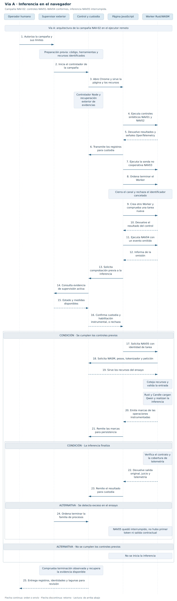
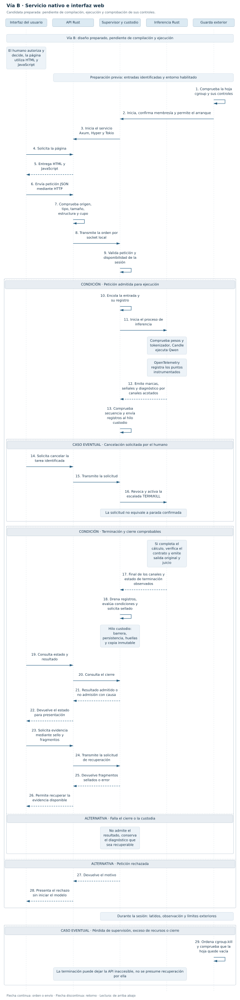
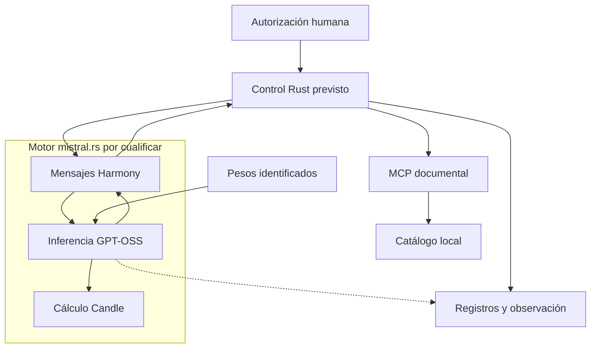
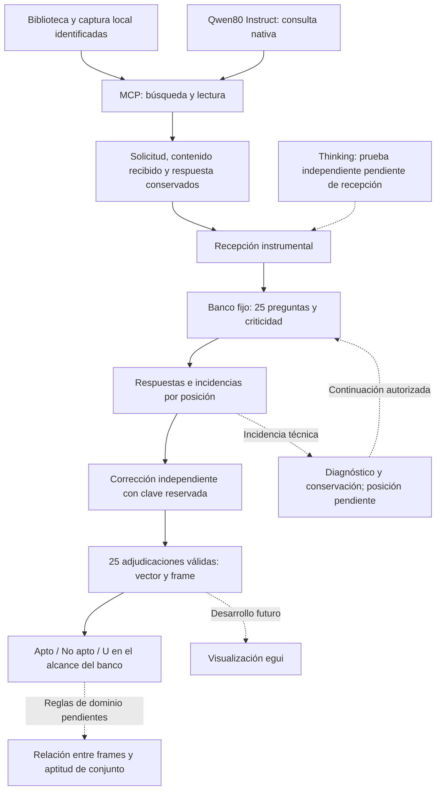
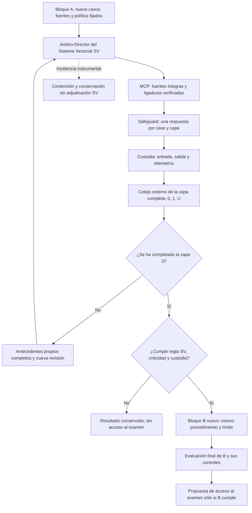

# Ensayo de inteligencia artificial y observabilidad

**Edición documental 2.25 · 6 de octubre de 2026.**

**Corte documental conservado de los demás expedientes:** 05/10/2026. Esta edición añade únicamente el cierre de conservación de Qwen3.5 del 06/10/2026; no revalida la ejecución o los resultados de los estudios distintos. Reúne el cierre publicado de la fase Qwen3.5, los cierres de Safeguard y Thinking, los candidatos Kimi/GLM en estudio y la autorización de una prueba instrumental de cálculo Rust en AMD. Cada fuente conserva su fecha, alcance y recepción; esta página no es un monitor de ejecución.

## Objeto y alcance

Investigación experimental sobre ejecución de modelos auxiliares, fidelidad documental, control y observación mediante Rust. Pertenece a la investigación lateral (p1+P3)-Bis y mantiene evaluaciones diferenciadas para inmunología y ciberseguridad. Las propuestas del modelo carecen de autoridad para modificar el conocimiento admitido o las decisiones del SV.

Esta página relaciona configuraciones, resultados, componentes, publicaciones y antecedentes. El [registro estructurado](VERSIONES.json) distingue sus identidades; el [catálogo de modelos](modelos-de-ia/README.md) enlaza las fichas. El Núcleo del SV, la semántica V0.2 y la IR 0.3 permanecen intactos.

**Consulta:** [estado actual](#estado-actual) · [familias en estudio](#familias-en-estudio-de-viabilidad) · [evaluación](#evaluación-documental-y-resultado) · [funciones](#componentes-y-funciones-del-conjunto) · [versiones](#versiones-de-los-componentes) · [publicaciones](#publicaciones-en-orden-cronológico) · [historia](#historia-completa-de-la-edición-documental) · [diagramas](#vías-de-ejecución-y-diagramas) · [trazabilidad](#trazabilidad-y-criterios-de-lectura).

## Estado actual

La fase **Qwen3.5-122B-A10B Q8_0** ha concluido con **admisión no acreditada por impedimento temporal**. Se completaron siete solicitudes iniciales: seis adjudicaciones 0 y un error sustantivo crítico, A06. A08 y A09 no se ejecutaron; tampoco las revisiones adversariales, el bloque B o el examen. La capa está incompleta, sin κ ni puntuación global. Se conserva el [dictamen y su alcance](https://github.com/juantoniolloretegea/SV-motor/blob/0b5104c4658bc98a9612fd2a97d7b8a5214b63cc/laboratorio/ensayo-ia-y-observabilidad/modelos-de-ia/qwen/qwen3.5-122b-a10b-q8-0/preevaluacion-20261004/resultados/cierre-r1/INFORME-FINAL.md); el resultado no constituye un descarte universal de la familia Qwen. La recepción independiente de A04–A07 y de la fase permanece pendiente en el corte de la entrega.

**Safeguard** cerró su preevaluación sin acceso al examen; **Thinking** cerró por inviabilidad operativa. La retirada de sus recursos se distingue de la conservación documental y del resultado experimental. Kimi K3 y GLM-5.3/Flash continúan en estudio de viabilidad, sin dictamen de aptitud ni descarte definitivo.

| Modelo o configuración | Resultado y alcance | Situación al corte |
|---|---|---|
| [Qwen3-0.6B · Q4_K_M](modelos-de-ia/qwen/qwen3-0.6b/README.md) | Inferencia nativa y controles parciales; cuatro consultas DOC-01 terminadas sin conformidad contractual completa. | Campaña cerrada con limitaciones. |
| [GPT-OSS-20B · MXFP4](modelos-de-ia/openai/gpt-oss-20b/README.md) | Funcionamiento técnico y bancos documentales conservados; la evaluación médica no acreditó la función prevista. | Configuración excluida de esa selección; archivo conservado. |
| [Qwen3.8-27B](modelos-de-ia/qwen/qwen3.8-27b/README.md) | Respuesta completa en la selección mínima, con omisión material y deficiencias de citas y localización. | **No apto** en la selección examinada. |
| [GPT-OSS-120B](modelos-de-ia/openai/gpt-oss-120b/README.md) | El estudio preliminar no llegó a inferencia: los pesos superaban la cota de la configuración considerada. La [demostración pública posterior](modelos-de-ia/openai/gpt-oss-120b/prueba-playground/readme.md) obtuvo −100/100 en tres respuestas relacionadas; no constituye un examen completo ni mide recursos de una instalación propia. | Viabilidad nativa pendiente; [TT-0015](https://github.com/juantoniolloretegea/SV-lenguaje-de-computacion/blob/main/docs/calidad/Inventario-sv/tiques-tecnicos/TT-0015.md). Ensayo 1 público abierto, con impedimentos de servicio conservados. |
| [Qwen3-Next-80B-A3B-Instruct](modelos-de-ia/qwen/qwen3-next-80b-a3B-instruct/REGISTRO-INSTALACION-20260929.md) | Dos consultas MCP recibidas. Examen posterior: **28/100; No apto**. Diecinueve finales: siete aciertos, dos errores críticos y diez U; seis impedimentos técnicos. | Examen y diagnóstico terminados; [puntuación](modelos-de-ia/qwen/qwen3-next-80b-a3B-instruct/tests-y-pruebas-efectuadas/PUNTUACION-FINAL-20261001.md), [archivo y retirada](modelos-de-ia/qwen/qwen3-next-80b-a3B-instruct/tests-y-pruebas-efectuadas/ARCHIVO-Y-RETIRADA-20261001.md). Recepción científica independiente pendiente; [TT-0016](https://github.com/juantoniolloretegea/SV-lenguaje-de-computacion/blob/main/docs/calidad/Inventario-sv/tiques-tecnicos/TT-0016.md). |
| [Qwen3-Next-80B-A3B-Thinking](modelos-de-ia/qwen/qwen3-next-80b-a3b-thinking) | Examen cerrado: **No apto en las condiciones evaluadas por demoras operativas excesivas y falta de finalización fiable**. Nueve finales pendientes de adjudicación de contenido, cuatro impedimentos, P14 incompleta y once no ejecutadas; sin puntuación global. | [Cierre público](https://github.com/juantoniolloretegea/SV-motor/releases/tag/qwen3-next-80b-a3b-thinking-archivo-cierre-20261005-v1) y [conservación privada cotejada](https://github.com/juantoniolloretegea/SV-sala-de-maquinas/releases/tag/thinking-imagen-cierre-20261005-v1). [Instancia y almacenamiento retirados](https://github.com/juantoniolloretegea/SV-sala-de-maquinas/blob/2ddf814bb039b0c7876745023ea165baf38ed6f9/respuestas-ejecucion/QWEN80-THINKING-Q4K-ONECLOUD-20260930/entrega-03/retirada-20261005/ACTA-RETIRADA.md); no hay arranque restaurado ensayado. [TT-0017](https://github.com/juantoniolloretegea/SV-lenguaje-de-computacion/blob/main/docs/calidad/Inventario-sv/tiques-tecnicos/TT-0017.md). |
| [GPT-OSS-Safeguard-120B](modelos-de-ia/openai/gpt-oss-safeguard-120b/ensayos-reiterados-adversariales-y-aprendizaje/readme.md) | Contrastes anteriores separados: **87,5/100**, **66,67/100** y **50/100**, con **No apto** en sus respectivos alcances. El diagnóstico D01 reprodujo el error crítico del último contraste. | Preevaluación terminada: A0–A3 sin mejora, −88,89/100 según la rúbrica completa y **No apto para acceder al examen**. Diagnósticos e incidencias separados en el [cierre](modelos-de-ia/openai/gpt-oss-safeguard-120b/ensayos-reiterados-adversariales-y-aprendizaje/resultados/cierre-20261004/INFORME-FINAL.md). Sin aptitud clínica acreditada. [Expediente v3](modelos-de-ia/openai/gpt-oss-safeguard-120b/tests-y-pruebas-efectuadas/ARBITRO-SV-SAFEGUARD-V3-20261002.md) · [TT-0018](https://github.com/juantoniolloretegea/SV-lenguaje-de-computacion/blob/main/docs/calidad/Inventario-sv/tiques-tecnicos/TT-0018.md). |
| [Qwen3.5-122B-A10B · Q8_0](modelos-de-ia/qwen/qwen3.5-122b-a10b-q8-0/readme.md) | Realización CPU en UpCloud: 48 CPU y 256 GB nominales de RAM, sin GPU. Fase A0 concluida: seis 0, un 1 crítico en A06 y dos casos no ejecutados. | [Admisión no acreditada por impedimento temporal](https://github.com/juantoniolloretegea/SV-motor/blob/0b5104c4658bc98a9612fd2a97d7b8a5214b63cc/laboratorio/ensayo-ia-y-observabilidad/modelos-de-ia/qwen/qwen3.5-122b-a10b-q8-0/preevaluacion-20261004/resultados/cierre-r1/INFORME-FINAL.md); sin revisiones, B ni examen. Custodia de fase y [imagen de instalación cotejadas](https://github.com/juantoniolloretegea/SV-sala-de-maquinas/releases/tag/qwen35-122b-q8-imagen-cierre-20261006-v1); [archivo público](https://github.com/juantoniolloretegea/SV-motor/releases/tag/qwen3.5-122b-a10b-q8-0-archivo-cierre-20261006-v1). Retirada administrativa pendiente; arranque restaurado no ensayado. Recepción independiente de A04–A07 y fase pendiente. [TT-0019](https://github.com/juantoniolloretegea/SV-lenguaje-de-computacion/blob/main/docs/calidad/Inventario-sv/tiques-tecnicos/TT-0019.md). |

### Familias en estudio de viabilidad

| Familia o candidato | Objeto del estudio | Situación y dependencia |
|---|---|---|
| [Kimi K3](modelos-de-ia/kimi/kimi-k3/ESTUDIO-VIABILIDAD-20261005.md) | Alternativa independiente para AMD; se conserva K3 como identidad de estudio. | Sin instalación o inferencia. Las representaciones examinadas exceden la configuración de una MI300X; falta una realización Rust completa admisible. |
| [GLM-5.3 de zai-org](modelos-de-ia/zai-org/glm-5.3/ESTUDIO-VIABILIDAD-20261005.md) | Viabilidad de la arquitectura y representación concreta en AMD. | Sin instalación o inferencia. Memoria distribuida y realización completa aún no acreditadas. |
| [GLM-5.3-Flash de zai-org](modelos-de-ia/zai-org/glm-5.3/ESTUDIO-VIABILIDAD-20261005.md) | Variante distinta, con arquitectura y resultados propios. | Algunas representaciones permiten estudiar el alojamiento de pesos; memoria total, motor Rust y recepción GPU pendientes. |

Los candidatos permanecen en estudio. El cierre de una búsqueda técnica delimitada no constituye un descarte definitivo ni una evaluación de respuestas. Tampoco se sustituyen por modelos menores ni se transfieren puntuaciones entre versiones. Su posible realización depende de los [componentes de cálculo](#cálculo-rust-para-amd), que tienen un objeto de prueba distinto.

Safeguard es un candidato distinto del GPT-OSS-120B ordinario. Su función declarada por OpenAI es la clasificación de seguridad conforme a políticas textuales; el contraste actual estudia clasificación documental bajo una política explícita. No presupone capacidad médica general. La demostración pública, las instalaciones nativas, los contrastes asistidos y los exámenes conservan resultados separados.

<strong>Antecedente instrumental Qwen · corte del 30/09/2026, 08:42 UTC</strong>

La línea principal de aquel corte era Instruct en UQFF Q4K, vía B nativa CPU. Dos consultas documentales habían recibido conformidad instrumental; la ronda posterior de 25 preguntas aún no disponía de un resultado final recibido. Thinking tenía una prueba independiente preparada y su carpeta fue incorporada después de aquel corte.

La [recepción instrumental de Instruct](https://github.com/juantoniolloretegea/SV-sala-de-maquinas/blob/816a70bd6ff72c8d55f9bd599823a17e1fd57454/respuestas-ejecucion/QWEN80-Q4K-ONECLOUD-20260929/revision-entrega-08/RECEPCION.md) —original de acceso restringido— coteja dos recorridos completos: solicitud del modelo, búsqueda, lectura del catálogo local, incorporación de su resultado y respuesta final. Las citas coinciden con la fuente tras convertir exclusivamente los saltos LF/CRLF en espacios. Las duraciones fueron **1532,618 y 1535,382 segundos**; el máximo registrado del grupo alcanzó **59 GiB**, sin agotamiento de memoria registrado en esos intentos. Estos datos no acreditan holgura de memoria, rapidez interactiva ni capacidad general de cualquier configuración de 64 GB.

El aviso posterior de aquel corte comunicaba P01–P08 conservadas, P09 sin respuesta final y P10–P25 sin ejecutar. P09 propuso dos lecturas en un intercambio limitado a una; el rechazo se propagó al cierre de aquel segmento. La continuación correctiva estaba preparada para distinguir el fallo de un ítem de un fallo general de seguridad o conservación, pero aún no se acreditaba su ejecución. Ocho respuestas conservadas no equivalían a ocho respuestas correctas. El examen completo y su diagnóstico posteriores conservan ese antecedente.

Thinking mantiene tratamiento independiente de plantilla, razonamiento emitido, respuesta final y llamadas a herramientas. No recibe los resultados de Instruct por extensión. El [registro de modelos](modelos-de-ia/README.md) enlaza los expedientes; cada entrega y recepción fija el alcance de lo acreditado.

## Evaluación documental y resultado

La pregunta experimental es si una configuración puede **responder con fundamento verificable dentro de una biblioteca delimitada**. La primera ronda utiliza una captura identificada del [PDQ profesional del NCI sobre leucemia de células pilosas](https://www.cancer.gov/espanol/tipos/leucemia/pro/tratamiento-celulas-pilosas-pdq), consultada desde el catálogo local. La página pública identifica la procedencia; no sustituye los bytes congelados del ensayo.

El [banco de preguntas](https://github.com/juantoniolloretegea/SVperitus-dataset/blob/6f1118a323bcefac9400d01274e4f8d1db3636ff/dominios/inmunologia/tes-examenes-conocimientos/ronda-01-pdq-tricoleucemia-20260929/PREGUNTAS.md) y el [protocolo de evaluación, revisión r1](https://github.com/juantoniolloretegea/SVperitus-dataset/blob/6f1118a323bcefac9400d01274e4f8d1db3636ff/dominios/inmunologia/tes-examenes-conocimientos/ronda-01-pdq-tricoleucemia-20260929/PROTOCOLO.md) fijan **25 posiciones, cinco niveles propuestos de dificultad, 20 preguntas críticas y cinco no críticas**. La clave de corrección queda fuera del alcance del candidato. Los casos son sintéticos y la graduación de dificultad aún no tiene calibración empírica.

| Resultado por posición | Significado |
|---|---|
| **0** | Respuesta correcta y sustentada conforme a la clave y a las evidencias. |
| **1** | Error demostrado conforme al criterio previo. |
| **U** | Indeterminación auténtica: no se acredita 0 y no hay falsedad relevante demostrada. |
| **Intento inválido o pendiente** | Fallo técnico, evidencia perdida o pregunta no ejecutada. Se registra fuera de la terna; no se rellena con U. |

La puntuación y la aptitud siguen el [criterio común](modelos-de-ia/CRITERIO-PUNTUACION-MODELOS-20261001.md). La **puntuación sobre 100 es 100 × (aciertos − errores no críticos) / N**, con N fijado antes del ensayo. U y blanco no suman ni restan; no se recortan saldos negativos ni se reduce el denominador por incidencias. Los errores críticos se contabilizan aparte y tienen efecto eliminatorio. Así, Instruct conserva 100 × (7 − 0) / 25 = **28/100**, junto a sus dos errores críticos.

La clasificación SV se calcula separadamente con **T(n)=⌊7n/9⌋**: primero N₁ ≥ T(n) determina No apto; después N₀ ≥ T(n) determina Apto; en otro caso corresponde Indeterminado. Requiere un vector completo de adjudicaciones válidas. Para 25 posiciones, T(25) = 19. El dictamen del instrumento incorpora además la criticidad: cualquier 1 crítico determina **No apto**; si no hay 1 crítico pero existe U crítica, corresponde **U (indeterminación honesta)**; las veinte críticas en 0 y la clasificación auxiliar favorable permiten **Apto**. Con esta distribución, las veinte respuestas críticas correctas ya superan el umbral. Los errores no críticos siguen siendo visibles.

Un error crítico acreditado permite declarar No apto en el alcance de la prueba aunque existan posiciones impedidas; no autoriza a completar un vector ni a atribuirle κ. Sólo tras **25 adjudicaciones válidas e independientes** se constituye el vector ordenado y su frame o polígono. Cada posición queda ligada a pregunta, fuente, respuesta, configuración y fundamento de corrección. Las comprobaciones sintéticas del evaluador Rust acreditan su cálculo en esos casos, no la validez médica de las respuestas.

La célula canónica **(9,3)** contiene vectores de nueve componentes ternarios y un universo de **3⁹ = 19.683 vectores posibles**. Las capas experimentales son filas sucesivas de vectores, no una matriz de 3 × 3. El par vector–frame debe conservar identidad, posiciones, fuentes y revisión. La futura visualización **egui** presentará inicialmente el frame o los frames y permitirá consultar los valores y evidencias a petición; no se declara implementada. **Un frame Apto puede formar parte de un conjunto No apto**: la composición y la aptitud de dominio necesitan reglas aún no constituidas por esta ronda. Una U puede motivar nuevas preguntas con identidad propia, conservando los resultados anteriores.

La secuencia es: suficiencia instrumental → evaluación documental → dictamen limitado al banco → decisión sobre una eventual fase posterior. La vía A/WebAssembly conserva su dependencia de una selección favorable y de autorización propia. No se acredita aptitud clínica general, uso productivo ni integración en el núcleo del SV.

## Preevaluación de Safeguard con retroalimentación

El recorrido efectivo fue A0–A3 y tres diagnósticos delimitados de A08. Los resultados de contenido y forma se informan separadamente; el error crítico persiste. El [informe final](modelos-de-ia/openai/gpt-oss-safeguard-120b/ensayos-reiterados-adversariales-y-aprendizaje/resultados/cierre-20261004/INFORME-FINAL.md) conserva condiciones, incidentes y reservas. Las ampliaciones previstas en la preparación no habilitan continuación tras el cierre.

Preparación histórica y situación del corte precedente

El [protocolo completo](modelos-de-ia/openai/gpt-oss-safeguard-120b/ensayos-reiterados-adversariales-y-aprendizaje/readme.md) fija un bloque A de nueve casos y un bloque B de nueve casos nuevos. Cada caso tiene respuesta inicial y **tres revisiones adversariales como máximo**; se recorre cada capa completa antes de preparar la siguiente. La admisión se decide sobre la capa 3, sin seleccionar retrospectivamente la mejor. B sólo comienza si A cumple; el máximo de ambos bloques es 72 generaciones.

El Árbitro-Director del Sistema Vectorial SV entrega las fuentes íntegras mediante MCP, comprueba sus ligaduras y bytes, conserva entradas, canales emitidos y telemetría, y organiza la revisión con los antecedentes completos del propio caso en `pensamiento-afinado`. La clave externa permanece reservada. El candidato explica qué mantiene o modifica; el cotejo externo adjudica **0, 1 o U**, y el Árbitro-Director aplica la continuación o el cierre fijados. No es otra IA ni certifica por sí mismo la verdad de la respuesta.

El **Aprendizaje por Retroalimentación del Sistema Vectorial SV** es aquí revisión contextual acumulativa, sin entrenamiento ni ajuste de pesos. Se conservan aciertos ganados y perdidos, transiciones de la terna, puntuaciones, criticidad, tiempos, tokens, memoria e incidencias. Para cada bloque, **T(9)=7**; la conformidad exige además nueve respuestas evaluables, todas las críticas en 0, custodia conforme y ausencia de incidencias pendientes. El bloque B debe cumplir las mismas condiciones antes de proponer acceso al examen de 25 preguntas.

La preparación acredita 41 comprobaciones Rust conformes e igualdad de las nueve entradas prefijadas. **A0 está en ejecución; A1–A3 y B no se han ejecutado al corte.** La fase posterior requiere conservar y evaluar la capa anterior. Un progreso favorable no autoriza una cuarta revisión. El Núcleo, la semántica V0.2 y la IR 0.3 permanecen intactos; las necesidades de representación se documentan para la recepción competente conforme al [sistema conjunto](../sistema-conjunto-lenguaje-computacion-ia-gobernada/README.md), sin correcciones silenciosas.

## Componentes y funciones del conjunto

En la línea GPT-OSS, **Harmony** es el formato requerido de conversación. Es el formato de mensajes, canales, llamadas y terminación; la biblioteca oficial `openai-harmony` proporciona su codificación y análisis. **Candle** aporta operaciones numéricas y tensores. En las bases de mistral.rs examinadas se utilizan ambas bibliotecas: sus funciones son complementarias. [Formato oficial](https://github.com/openai/harmony) · [Candle](https://github.com/huggingface/candle).

| Elemento | Función | Condición de interpretación |
|---|---|---|
| Modelo, pesos y tokenizador | Parámetros y representación de las entradas y salidas. | La identidad incluye revisión, formato y huellas. |
| mistral.rs | Carga, implementación del modelo y servicio de inferencia. | Motor Rust; su nombre no identifica un modelo comercial Mistral. |
| Harmony / openai-harmony | Estructura y análisis de la conversación GPT-OSS. | Es necesario comprobar plantilla, identificadores, canales y fin de turno conjuntamente. |
| Candle | Operaciones numéricas utilizadas por la implementación de inferencia. | No es un modelo auxiliar ni sustituye el formato Harmony. |
| MCP documental | Búsqueda textual y lectura del catálogo local. | El protocolo no verifica por sí mismo la verdad de las afirmaciones ni concede permisos. |
| Árbitro-Director del Sistema Vectorial SV | Suministro documental, admisión, custodia, límites y recorrido de retroalimentación. | Realización y comprobaciones en Rust identificadas por contraste; no constituye autoridad del Núcleo ni un verificador general de verdad. |
| OpenTelemetry Rust y observador | Trazas instrumentadas y medidas de procesos o cgroup, respectivamente. | Deben declararse cobertura, pérdidas y ámbito; no constituyen observación exhaustiva. |
| Axum, Hyper y Reqwest | Servicio y transporte HTTP. | Son componentes de comunicación; no son medidores de recursos. |

La base mistral.rs [0.9.3](https://github.com/EricLBuehler/mistral.rs/blob/24dbf5c256f232176ee5949485ba264049407fbe/Cargo.toml) fija Candle en `35d7ae7…`; la base [0.9.4](https://github.com/EricLBuehler/mistral.rs/blob/2370966bb91e2e3dafa0b1521b87c50fd5c01244/Cargo.toml), en `66a8cf1…`. Ambas declaran Candle 0.11.0 y `openai-harmony` 0.0.8. El número de versión común no hace equivalentes sus fuentes ni acredita el binario utilizado. Las modificaciones CPU del antecedente GPT-OSS-20B requieren cotejo específico antes de aplicarse al 120B.

**Antecedente GPT-OSS, separado de la campaña Qwen:** la compatibilidad conceptual entre Candle y Harmony está fundamentada; la cualificación del ensamblaje **GPT-OSS-120B ordinario** permanece pendiente; Safeguard tiene instalación, comprobaciones y resultados propios. Deben verificarse el tratamiento de errores y truncamientos de Harmony, el vocabulario local identificado, la ruta numérica MXFP4, las dependencias efectivamente compiladas y los controles de red y herramientas. El [adaptador examinado](https://github.com/EricLBuehler/mistral.rs/blob/24dbf5c256f232176ee5949485ba264049407fbe/mistralrs-core/src/reasoning_parsers/harmony.rs) descarta determinados errores de análisis; este hallazgo estático no constituye una explotación reproducida. La [biblioteca Harmony](https://github.com/openai/harmony/blob/ec7606df9e87e3d0a1fec9f50928c1e407f0c438/src/tiktoken_ext/public_encodings.rs) admite un vocabulario local verificado y contempla descarga si no se fija el directorio local y falta una caché válida. El ensayo debe acreditar funcionamiento sin red. Usar Rust o incluir una dependencia no constituye una certificación de seguridad.

### Cálculo Rust para AMD

[CubeCL y rust-gpu](inferencia/cubecl-evaluacion-20261005/ESTUDIO.md) son posibles bases de cálculo GPU. CubeCL conserva prioridad provisional por su adecuación funcional y mantenimiento observado; rust-gpu es una alternativa. No son modelos ni incorporan automáticamente las arquitecturas Kimi o GLM a mistral.rs.

| Elemento | Función y límite constatado | Estado al corte |
|---|---|---|
| CubeCL / LLVM | Compilación de operaciones Rust para AMD; la revisión examinada excluye MFMA de CDNA en esta vía. | Evaluación documental concluida; adaptación y contraste MI300X/gfx942 pendientes. |
| CubeK / Burn | Operaciones reutilizables y composición de modelos. | Su existencia no acredita la arquitectura completa o la cuantización de un candidato. |
| rust-gpu / SPIR-V | Compilación de Rust a SPIR-V para cálculo GPU. | Compatibilidad efectiva de controlador y extensiones matriciales en MI300X pendiente. |
| SPIR-V | Representación intermedia externa al SV. | La revisión del estándar no acredita su implementación ni modifica la IR 0.3 del SV. |

La dirección ha autorizado crear **una instancia AMD MI300X** e iniciar una prueba instrumental delimitada: multiplicación matricial f16 con acumulación f32, vía LLVM/MFMA, referencia independiente Rust y medidas de tiempo y memoria. El [encargo de ejecución](https://github.com/juantoniolloretegea/SV-sala-de-maquinas/blob/main/encargos-ejecucion/AMD-CUBECL-MFMA-20261005/v1/ENCARGO.md), de acceso restringido, fija configuración, cotas, conservación y cierre. Al corte de esta edición se registra la autorización; no se afirma creación del recurso ni resultado experimental.

[TT-0020](https://github.com/juantoniolloretegea/SV-lenguaje-de-computacion/blob/main/docs/calidad/Inventario-sv/tiques-tecnicos/TT-0020.md) identifica las necesidades N-C01–N-C05. Una operación correcta no acredita un motor completo, un modelo o su acceso al examen. La prueba AMD y los expedientes de Qwen mantienen resultados y límites independientes.

## Versiones de los componentes

La **edición documental 2.25**, las **aplicaciones 0.1.x/0.2.x**, el **MCP 0.1.x**, los **modelos** y los **archivos de recuperación v1** tienen identidades independientes. Una numeración no sustituye a las restantes. Los antecedentes identifican Rust 1.98.0; la preparación de retroalimentación identifica Rust 1.98.1. Cada expediente fija sus fuentes, dependencias, ejecutables y comprobaciones; una compilación no acredita utilización efectiva.

<strong>EIO conversación · Qwen3-0.6B · 0.1.0 → 0.1.4</strong>

La distribución publicada es 0.1.3-beta.1. La fuente candidata 0.1.4 conserva verificación propia y no sustituye esa distribución.

| Versión de fuentes | Fecha de incorporación | Cambio relevante | Acceso completo al corte inicial |
|---|---|---|---|
| 0.1.0 | 22/09/2026 | Conversación con Qwen y conservación por expediente. | [Fuentes 0.1.0](https://github.com/juantoniolloretegea/SV-motor/tree/5330c6c9d2c7d9d6a9cec6079a7118bf0f5567db/laboratorio/ensayo-ia-y-observabilidad/conversacion-nativa) |
| 0.1.1 | 22/09/2026 | Identificación de licencias y precisión de validación y observación. | [Fuentes 0.1.1](https://github.com/juantoniolloretegea/SV-motor/tree/eec0d87fd9e41a3341b799540bb4545c6dd686d9/laboratorio/ensayo-ia-y-observabilidad/conversacion-nativa) |
| 0.1.2 | 22/09/2026 | Recuperación de peticiones y medición; comparación acotada documentada. | [Fuentes 0.1.2](https://github.com/juantoniolloretegea/SV-motor/tree/feefbe68a4131c43c46673b841a0dd72b590e4f7/laboratorio/ensayo-ia-y-observabilidad/conversacion-nativa) |
| 0.1.3 | 22/09/2026 | Integración OpenTelemetry y observador Linux; distribuida como 0.1.3-beta.1. | [Fuentes 0.1.3](https://github.com/juantoniolloretegea/SV-motor/tree/7f1dd02f4b4960c7e989da7caca63d4c78c85690/laboratorio/ensayo-ia-y-observabilidad/conversacion-nativa) |
| 0.1.4 | 23/09/2026 | Correcciones de supervisión y conservación verificadas localmente; sin nueva inferencia. | [Fuentes 0.1.4](https://github.com/juantoniolloretegea/SV-motor/tree/8cddcc83359bf6733a360d5bba2cd72426f8b631/laboratorio/ensayo-ia-y-observabilidad/conversacion-nativa) |

[Comprobación 0.1.2](conversacion-nativa/verificacion-0.1.2/INFORME.md) · [Observación 0.1.3](conversacion-nativa/verificacion-0.1.3/INFORME.md) · [Correcciones 0.1.4](conversacion-nativa/verificacion-0.1.4/INFORME.md).

Las versiones de fuentes pueden abarcar varios commits; el enlace identifica el corte inicial de esa versión. Los informes y las distribuciones fijan sus propios cortes de comprobación.

<strong>EIO conversación · GPT-OSS-20B · 0.2.0 → 0.2.4</strong>

La adaptación parte de la aplicación Qwen 0.1.4, pero utiliza otra integración de inferencia. La distribución es 0.2.4-beta.1; el rótulo interno 0.2.2 se interpreta mediante su ficha y huellas.

| Versión de fuentes | Fecha de incorporación | Cambio relevante | Acceso completo al corte inicial |
|---|---|---|---|
| 0.2.0 | 24/09/2026 | Adaptación de la interfaz a motor residente GPT-OSS, contexto y cancelación. | [Fuentes 0.2.0](https://github.com/juantoniolloretegea/SV-motor/tree/d564ec3ed1702f2f185ccb152fe3d5a494bddba8/laboratorio/ensayo-ia-y-observabilidad/modelos-de-ia/openai/gpt-oss-20b/conversacion) |
| 0.2.1 | 24/09/2026 | Corrección del reconocimiento del fin de turno. | [Fuentes 0.2.1](https://github.com/juantoniolloretegea/SV-motor/tree/032ef13602ae9288cdd8467335c34198dda08871/laboratorio/ensayo-ia-y-observabilidad/modelos-de-ia/openai/gpt-oss-20b/conversacion) |
| 0.2.2 | 24/09/2026 | Corrección de identificadores de tokens y observación del motor residente. | [Fuentes 0.2.2](https://github.com/juantoniolloretegea/SV-motor/tree/dbaf4ed071388710e901b87c36842497893e10fb/laboratorio/ensayo-ia-y-observabilidad/modelos-de-ia/openai/gpt-oss-20b/conversacion) |
| 0.2.3 | 24/09/2026 | Acotación de trazas y preparación de la continuación comparativa. | [Fuentes 0.2.3](https://github.com/juantoniolloretegea/SV-motor/tree/e668d8e1efa18dd5462e9519eb9c5f73cd4e48a0/laboratorio/ensayo-ia-y-observabilidad/modelos-de-ia/openai/gpt-oss-20b/conversacion) |
| 0.2.4 | 25/09/2026 | Fuentes de la distribución 0.2.4-beta.1 y cierre experimental; conserva el rótulo interno 0.2.2. | [Fuentes 0.2.4](https://github.com/juantoniolloretegea/SV-motor/tree/ab713cdc73d6a55184d52c03b99745c99a1ced64/laboratorio/ensayo-ia-y-observabilidad/modelos-de-ia/openai/gpt-oss-20b/conversacion) |

[Ficha de la distribución 0.2.4-beta.1](modelos-de-ia/openai/gpt-oss-20b/distribucion/0.2.4-beta.1/FICHA_TECNICA.md) · [Resultados y límites](modelos-de-ia/openai/gpt-oss-20b/distribucion/0.2.4-beta.1/RESULTADOS.md).

Las versiones de fuentes pueden abarcar varios commits; el enlace identifica el corte inicial de esa versión. Los informes y las distribuciones fijan sus propios cortes de comprobación.

<strong>MCP documental · 0.1.0 → 0.1.1 → 0.1.2 → 0.1.3</strong>

| Versión | Cambio y resultado conservado | Acceso completo |
|---|---|---|
| 0.1.0 | Prototipo de búsqueda textual y lectura paginada; preparación incompleta y reparos conservados. | [Paquete y documentación](modelos-de-ia/model-context-protocol/0.1.0/README.md) |
| 0.1.1 | Rechazo de claves JSON duplicadas, paginación sobre la respuesta completa y custodia supervisada. Controles dirigidos documentados; recepción pendiente. | [Fuentes y uso](modelos-de-ia/model-context-protocol/0.1.1/LEAME.md) · [Ficha y alcance](modelos-de-ia/model-context-protocol/0.1.1/FICHA_TECNICA.md) |
| 0.1.2 | Añade el cliente mínimo con supervisión independiente y observador del conjunto. Ese cliente no ofrece herramientas al modelo. | [Fuentes, uso y límites](modelos-de-ia/model-context-protocol/0.1.2/LEAME.md) |
| 0.1.3 | Lectura íntegra y paginación verificadas; búsqueda acotada por caracteres, sin la restricción anterior de ocho palabras. Veinticinco comprobaciones Rust conservadas. | [Fuentes, uso y comprobaciones](modelos-de-ia/model-context-protocol/0.1.3/LEAME.md) |

Son versiones del componente documental. El corte del 27/09 no registraba una publicación Release específica; las conservaciones posteriores se identifican en los expedientes que las utilizan. TT-0014 conserva su recepción propia; la selección del modelo tiene criterios separados.

<strong>Qwen3-Next-80B-A3B · Instruct y Thinking</strong>

Instruct utiliza una realización CPU identificada del motor mistral.rs 0.9.4 y Candle, con correcciones de acceso a tensores y descompresión selectiva de expertos. La [identidad de fuentes, binarios, pesos y pruebas](modelos-de-ia/qwen/qwen3-next-80b-a3B-instruct/REGISTRO-INSTALACION-20260929.md) corresponde a ese ensamblaje; no se atribuye a la distribución estándar sin modificaciones. El ciclo instrumental recibido ejecuta las herramientas MCP mediante su controlador Rust; no procede del cliente mínimo 0.1.2.

El desarrollo experimental y sus controles se realizan en Rust. Las excepciones criptográficas nativas declaradas se identifican en el registro; no se presenta el conjunto de dependencias como íntegramente Rust.

La [carpeta de Thinking](modelos-de-ia/qwen/qwen3-next-80b-a3b-thinking) conserva la instalación y primera respuesta, con sus salvedades. El examen posterior tiene [cierre propio publicado](https://github.com/juantoniolloretegea/SV-motor/releases/tag/qwen3-next-80b-a3b-thinking-archivo-cierre-20261005-v1), por inviabilidad operativa, y [conservación cotejada](https://github.com/juantoniolloretegea/SV-sala-de-maquinas/releases/tag/thinking-imagen-cierre-20261005-v1). El contenido de nueve finales sigue pendiente de adjudicación. La [retirada administrativa posterior](https://github.com/juantoniolloretegea/SV-sala-de-maquinas/blob/2ddf814bb039b0c7876745023ea165baf38ed6f9/respuestas-ejecucion/QWEN80-THINKING-Q4K-ONECLOUD-20260930/entrega-03/retirada-20261005/ACTA-RETIRADA.md) acredita eliminación de la instancia y su almacenamiento asociado; no se ha ensayado arranque restaurado.

<strong>Qwen3.5-122B-A10B · GGUF Q8_0</strong>

Modelo de 122 mil millones de parámetros totales y aproximadamente 10 mil millones activos por token, en la distribución GGUF Q8_0 de Unsloth. La [recepción instrumental del 04/10](https://github.com/juantoniolloretegea/SV-motor/blob/149c4b848475802942af35ab39e7335081398480/laboratorio/ensayo-ia-y-observabilidad/modelos-de-ia/qwen/qwen3.5-122b-a10b-q8-0/seguimiento/RECEPCION_INSTRUMENTAL_20261004.md) acredita ejecución nativa con 48 CPU y 256 GB nominales de RAM, aproximadamente 251,65 GiB efectivos, sin GPU. La [fase inicial cerrada](https://github.com/juantoniolloretegea/SV-motor/blob/0b5104c4658bc98a9612fd2a97d7b8a5214b63cc/laboratorio/ensayo-ia-y-observabilidad/modelos-de-ia/qwen/qwen3.5-122b-a10b-q8-0/preevaluacion-20261004/resultados/cierre-r1/INFORME-FINAL.md) conserva seis aciertos, un error crítico y dos casos no ejecutados; admisión no acreditada por impedimento temporal. La instalación se conserva en [imagen cifrada cotejada](https://github.com/juantoniolloretegea/SV-sala-de-maquinas/releases/tag/qwen35-122b-q8-imagen-cierre-20261006-v1), sin duplicar pesos; retirada administrativa pendiente y arranque restaurado no ensayado. La recepción científica independiente de fase conserva su reserva.

[Ficha técnica](modelos-de-ia/qwen/qwen3.5-122b-a10b-q8-0/ficha-tecnica/FICHA_TECNICA.md) · [Identidad y archivos](modelos-de-ia/qwen/qwen3.5-122b-a10b-q8-0/ficha-tecnica/IDENTIDAD_Y_ARCHIVOS.json) · [Justificación y comparativa](modelos-de-ia/qwen/qwen3.5-122b-a10b-q8-0/readme.md).

<strong>Cálculo AMD en evaluación · CubeCL, rust-gpu y SPIR-V</strong>

| Componente | Identidad documental examinada | Alcance |
|---|---|---|
| CubeCL | v0.11.0-pre.4, preliminar; revisión 2a8814843c319ae07b15453ef35dce32fd8b9997 | Prioridad provisional; la realización exacta y cualquier adaptación deben quedar fijadas antes del contraste. |
| rust-gpu | v0.10.0; revisión c49441a4c472098f5b221984f5bea1dbf866ad10 | Alternativa; soporte efectivo del dispositivo pendiente. |
| SPIR-V | 1.6 revisión 8, publicada el 10/09/2026 | Estándar externo; no es una versión del SV ni una recepción de la GPU. |

[Estudio y fuentes](inferencia/cubecl-evaluacion-20261005/ESTUDIO.md) · [Registro de la consulta](inferencia/cubecl-evaluacion-20261005/FUENTES.json). Se distinguen publicación, código leído, compilación y ejecución recibida; no se mezclan revisiones como si fueran una distribución única.

## Publicaciones en orden cronológico

La primera secuencia conserva **cinco publicaciones preliminares: dos distribuciones y tres archivos de recuperación o cierre**. Las entregas posteriores se relacionan a continuación de esa secuencia. Cada desplegable conduce a la publicación completa, sus activos y la documentación de alcance. Las revisiones v1 corresponden a paquetes fechados distintos.

<strong>22/09/2026 · EIO conversación 0.1.3-beta.1 · Qwen3-0.6B</strong>

Aplicación nativa con ejecutable, fuentes, licencias y manifiesto. Los pesos y el tokenizador tienen referencias externas identificadas. DOC-01 completó cuatro peticiones sin conformidad contractual completa; la distribución conserva ese resultado.

[Publicación completa y activos](https://github.com/juantoniolloretegea/SV-motor/releases/tag/eio-conversacion-v0.1.3-beta.1) · [Ficha o procedimiento y límites](entregas/0.1.3-beta.1/FICHA_TECNICA.md).

<strong>25/09/2026 · GPT-OSS conversación 0.2.4-beta.1 · GPT-OSS-20B</strong>

Distribución de la aplicación y el motor identificados, con resultados y límites. Las fuentes declaran 0.2.4 y el rótulo interno conserva 0.2.2; la ficha documenta esta discrepancia. El funcionamiento técnico no acredita aptitud médica.

[Publicación completa y activos](https://github.com/juantoniolloretegea/SV-motor/releases/tag/gpt-oss-conversacion-v0.2.4-beta.1) · [Ficha o procedimiento y límites](modelos-de-ia/openai/gpt-oss-20b/distribucion/0.2.4-beta.1/FICHA_TECNICA.md).

<strong>25/09/2026 · GPT-OSS · imagen de recuperación v1</strong>

Archivo cifrado cuya restitución funcional fue comprobada mediante el procedimiento conservado. Ese resultado corresponde a esta imagen concreta y no se transfiere a imágenes posteriores. Los pesos se recuperan separadamente.

[Publicación completa y activos](https://github.com/juantoniolloretegea/SV-motor/releases/tag/gpt-oss-imagen-onecloud-20260925-v1) · [Ficha o procedimiento y límites](modelos-de-ia/openai/gpt-oss-20b/imagen-onecloud/README.md).

<strong>26/09/2026 · GPT-OSS · archivo de cierre v1</strong>

Conserva una imagen posterior de cierre y los pesos cifrados identificados. No se ha acreditado el arranque de esta nueva imagen; el ensayo de restitución del día anterior no prueba estos bytes.

[Publicación completa y activos](https://github.com/juantoniolloretegea/SV-motor/releases/tag/gpt-oss-archivo-cierre-20260926-v1) · [Ficha o procedimiento y límites](modelos-de-ia/openai/gpt-oss-20b/imagen-onecloud/cierre-20260926/README.md).

<strong>27/09/2026 · Qwen3.8-27B · archivo de cierre v1</strong>

Reúne las imágenes del diagnóstico inicial y del cierre, sin pesos Qwen. Se conservan sus comprobaciones de integridad, sin arranque acreditado en una instancia restaurada. La configuración mantiene el dictamen No apto.

[Publicación completa y activos](https://github.com/juantoniolloretegea/SV-motor/releases/tag/qwen38-27b-archivo-cierre-20260927-v1) · [Ficha o procedimiento y límites](modelos-de-ia/qwen/qwen3.8-27b/imagen-onecloud/README.md).

El archivo posterior conserva la historia anterior y su dictamen. La publicación de activos cifrados no concede acceso al contenido reservado. El GPT-OSS-120B ordinario no tiene distribución ni imagen propias publicadas en las fuentes consultadas; su exploración pública se conserva separadamente. Las huellas publicadas se identifican en [VERSIONES.json](VERSIONES.json); esta revisión documental no ha descargado ni recalculado los grandes activos binarios.

### Entregas y conservación posteriores

Cada fila describe el corte de su publicación; los estados superados se mantienen como antecedentes y se actualizan en la tabla de estado actual.

| Fecha | Publicación y evidencia | Alcance |
|---|---|---|
| 30/09–01/10/2026 | [Examen Instruct, puntuación y originales](modelos-de-ia/qwen/qwen3-next-80b-a3B-instruct/tests-y-pruebas-efectuadas/PUNTUACION-FINAL-20261001.md) · [Archivo final](https://github.com/juantoniolloretegea/SV-sala-de-maquinas/releases/tag/qwen80-instruct-archivo-cierre-20261001-v1) | Examen, diagnóstico y conservación sin pesos; retirada registrada. La recepción científica se distingue del cierre administrativo. |
| 30/09/2026 | [Primera entrega Thinking](https://github.com/juantoniolloretegea/SV-sala-de-maquinas/blob/1cf92e92768938bd304ee22a792d16fc7a12bb9e/respuestas-ejecucion/QWEN80-THINKING-Q4K-ONECLOUD-20260930/entrega-01/INFORME.md) | Veintiocho archivos de evidencias y registros propios; consulta inicial, no examen de 25 preguntas. |
| 01–02/10/2026 | [Instalación Safeguard](modelos-de-ia/openai/gpt-oss-safeguard-120b/tests-y-pruebas-efectuadas/INSTALACION-CONTRASTE-20261001.md) · [Lectura íntegra](modelos-de-ia/openai/gpt-oss-safeguard-120b/tests-y-pruebas-efectuadas/LECTURA-INTEGRA-V2-20261001.md) · [Contraste con Árbitro-Director](modelos-de-ia/openai/gpt-oss-safeguard-120b/tests-y-pruebas-efectuadas/ARBITRO-SV-SAFEGUARD-V3-20261002.md) | Resultados, originales, incidencias y conservaciones de cada condición; no se suman como una única puntuación. |
| 02–03/10/2026 | [Demostración pública GPT-OSS-120B](modelos-de-ia/openai/gpt-oss-120b/prueba-playground/readme.md) · [Ensayo 1](modelos-de-ia/openai/gpt-oss-120b/prueba-playground/ensayo-1/readme.md) | Respuestas, relectura y cadena de impedimentos conservadas. Sin resultado adversarial final ni medición de una instalación propia. |
| 03/10/2026 | [Preevaluación Safeguard](modelos-de-ia/openai/gpt-oss-safeguard-120b/ensayos-reiterados-adversariales-y-aprendizaje/readme.md) · [Conservación de preparación A0](https://github.com/juantoniolloretegea/SV-sala-de-maquinas/releases/tag/safeguard-retroalimentacion-20261003-preparacion-a0) | Preparación y correcciones instrumentales recuperadas y cotejadas; la inferencia A0 está en curso y sus resultados finales siguen pendientes. |
| 04/10/2026 | [Expediente Qwen3.5-122B-A10B · Q8_0](modelos-de-ia/qwen/qwen3.5-122b-a10b-q8-0/readme.md) · [Revisión documental](modelos-de-ia/qwen/qwen3.5-122b-a10b-q8-0/seguimiento/REVISION_DOCUMENTAL_20261004.md) | Ficha técnica, justificación, comparativa y criterios de recepción; instalación y evaluación pendientes. |
| 04/10/2026 | [Cierre de Safeguard](modelos-de-ia/openai/gpt-oss-safeguard-120b/ensayos-reiterados-adversariales-y-aprendizaje/resultados/cierre-20261004/INFORME-FINAL.md) | A0–A3 sin mejora; A08 persiste; A3 y D02 conservan incidencias instrumentales diferenciadas. No apto para acceder al examen. |
| 04–05/10/2026 | [Recepción Qwen3.5](https://github.com/juantoniolloretegea/SV-motor/blob/149c4b848475802942af35ab39e7335081398480/laboratorio/ensayo-ia-y-observabilidad/modelos-de-ia/qwen/qwen3.5-122b-a10b-q8-0/seguimiento/RECEPCION_INSTRUMENTAL_20261004.md) · [Hito A04/A0](https://github.com/juantoniolloretegea/SV-motor/blob/149c4b848475802942af35ab39e7335081398480/laboratorio/ensayo-ia-y-observabilidad/modelos-de-ia/qwen/qwen3.5-122b-a10b-q8-0/preevaluacion-20261004/resultados/hitos/A04-A0/vector-parcial/CAPA.json) | Instalación recibida; cuatro adjudicaciones 0, cinco pendientes; bloque incompleto. |
| 04/10/2026 | [Retirada Safeguard](https://github.com/juantoniolloretegea/SV-sala-de-maquinas/blob/d7bae43cab1f900afc2dcc5e8c0e35c61215e5a3/respuestas-ejecucion/SAFEGUARD-CONSERVACION-20261004/ACTA-RETIRADA.md) | Instancia y disco eliminados después de conservación cotejada. |
| 05/10/2026 | [Cierre Thinking](https://github.com/juantoniolloretegea/SV-motor/releases/tag/qwen3-next-80b-a3b-thinking-archivo-cierre-20261005-v1) · [Conservación](https://github.com/juantoniolloretegea/SV-sala-de-maquinas/releases/tag/thinking-imagen-cierre-20261005-v1) | Examen cerrado por inviabilidad operativa; recuperación y cotejo conformes; eliminación del origen pendiente. |

| 05/10/2026 | [Retirada administrativa Thinking](https://github.com/juantoniolloretegea/SV-sala-de-maquinas/blob/2ddf814bb039b0c7876745023ea165baf38ed6f9/respuestas-ejecucion/QWEN80-THINKING-Q4K-ONECLOUD-20260930/entrega-03/retirada-20261005/ACTA-RETIRADA.md) | Instancia y almacenamiento eliminados tras la conservación cotejada; no acredita arranque restaurado. |
| 05/10/2026 | [Cierre de fase Qwen3.5](https://github.com/juantoniolloretegea/SV-motor/blob/0b5104c4658bc98a9612fd2a97d7b8a5214b63cc/laboratorio/ensayo-ia-y-observabilidad/modelos-de-ia/qwen/qwen3.5-122b-a10b-q8-0/preevaluacion-20261004/resultados/cierre-r1/INFORME-FINAL.md) · [Conservación única de fase](https://github.com/juantoniolloretegea/SV-sala-de-maquinas/releases/tag/qwen35-preevaluacion-20261004-r1) | Siete solicitudes iniciales, seis 0 y un 1 crítico; dos no ejecutadas. Sin κ ni puntuación global. Custodia posterior cotejada; recepción independiente de fase pendiente. |
| 05/10/2026 | [Kimi K3](modelos-de-ia/kimi/kimi-k3/ESTUDIO-VIABILIDAD-20261005.md) · [GLM-5.3/Flash](modelos-de-ia/zai-org/glm-5.3/ESTUDIO-VIABILIDAD-20261005.md) · [Cálculo Rust para AMD](inferencia/cubecl-evaluacion-20261005/ESTUDIO.md) | Candidatos en estudio de viabilidad; CubeCL prioritario provisional y rust-gpu alternativo. Documentación recuperada y cotejada. |
| 05/10/2026 | [Prueba instrumental AMD](https://github.com/juantoniolloretegea/SV-sala-de-maquinas/blob/main/encargos-ejecucion/AMD-CUBECL-MFMA-20261005/v1/ENCARGO.md) | Autorización delimitada de servidor y operación matricial; sin recepción experimental declarada en esta edición. |
| 06/10/2026 | [Archivo Qwen3.5 Q8_0](https://github.com/juantoniolloretegea/SV-motor/releases/tag/qwen3.5-122b-a10b-q8-0-archivo-cierre-20261006-v1) · [Conservación cifrada](https://github.com/juantoniolloretegea/SV-sala-de-maquinas/releases/tag/qwen35-122b-q8-imagen-cierre-20261006-v1) | Instalación y expedientes conservados sin duplicar pesos; recuperación, descifrado, inventario y contenido cotejados con Rust. Retirada administrativa pendiente; arranque restaurado no ensayado. |

Los enlaces de SV-sala-de-maquinas mantienen el acceso restringido de los originales. Las síntesis públicas enlazan su procedencia; no sustituyen los paquetes, sus manifiestos ni la recepción independiente.

## Historia completa de la edición documental

La secuencia comienza en **0.1** y avanza hasta la presente **2.25**. Se conservan todas las ediciones anteriores y sus referencias inmutables. Cada desplegable conserva lo relevante de su corte y ofrece el texto íntegro; sus estados históricos no sustituyen al estado actual.

El salto **0.2 → 2.0** se conserva tal como fue publicado; no se ha localizado una edición 1.x en el historial de este archivo. Cuando una edición reúne varios commits, se muestran todos en orden. Las fechas siguientes son las de esos commits en Europe/Madrid; una cabecera histórica puede conservar una fecha anterior.

<strong>0.1 · 18/09/2026 · Apertura del ensayo</strong>

Define Qwen3-0.6B Q4_K_M, Candle y OpenTelemetry Rust como selección inicial. Fija el perímetro experimental y separa calidad del modelo, controles y autoridad. Es documentación preparatoria, sin inferencias acreditadas en ese corte.

[Edición completa](https://github.com/juantoniolloretegea/SV-motor/blob/875a3df0f2e07fb3c71f98d7fd6968ccae54af24/laboratorio/ensayo-ia-y-observabilidad/README.md).

<strong>0.2 · 18/09/2026–20/09/2026 · Contrato y primeras campañas</strong>

Vincula el contrato a las fuentes rectoras y añade la continuidad EIO-05, EIO-06, JSON-01, NAV-01 y NAV-02. Los controles sintéticos no equivalen a inferencia completa en navegador; el diagnóstico NAV-02 termina antes del primer token.

Cortes de esta edición, en orden cronológico:

- [Contrato · 18/09/2026 · e1caf6d](https://github.com/juantoniolloretegea/SV-motor/blob/e1caf6df5bef2696f20d2b9fc5a5b5e9cffe509e/laboratorio/ensayo-ia-y-observabilidad/README.md).
- [Resultados EIO/JSON · 20/09/2026 · ee29460](https://github.com/juantoniolloretegea/SV-motor/blob/ee2946062f878282513b519e467cb6bfbb8a05d1/laboratorio/ensayo-ia-y-observabilidad/README.md).
- [Preparación NAV-01 · 20/09/2026 · 966b4b2](https://github.com/juantoniolloretegea/SV-motor/blob/966b4b23326312371ad0512ef586c8d9ea401c6b/laboratorio/ensayo-ia-y-observabilidad/README.md).
- [Resultado NAV-01 · 20/09/2026 · 4c68db7](https://github.com/juantoniolloretegea/SV-motor/blob/4c68db73b48962bb185a523c1de34da85678d375/laboratorio/ensayo-ia-y-observabilidad/README.md).
- [Preparación NAV-02 · 20/09/2026 · 8744e3d](https://github.com/juantoniolloretegea/SV-motor/blob/8744e3daf0c03f3675954ff774603454e44bfc45/laboratorio/ensayo-ia-y-observabilidad/README.md).
- [Diagnóstico NAV-02 · 20/09/2026 · dde1a59](https://github.com/juantoniolloretegea/SV-motor/blob/dde1a59fcd1bb23d9f146dff4e99750725ffa76f/laboratorio/ensayo-ia-y-observabilidad/README.md).

<strong>2.0 · 20/09/2026 · Dos vías y criterio de avance</strong>

Organiza A como navegador/WebAssembly y B como proceso nativo. El avance depende de factibilidad, controles y evidencia; ambas vías conservan comprobaciones propias. El salto desde 0.2 pertenece a la numeración original.

[Edición completa](https://github.com/juantoniolloretegea/SV-motor/blob/29a0dbe74018807fddf5759f30de12ac29c162bb/laboratorio/ensayo-ia-y-observabilidad/README.md).

<strong>2.1 · 20/09/2026 · Responsabilidades de Rust y JavaScript</strong>

Precisa que la interfaz nativa conserva HTML y JavaScript para presentación y transporte. Rust realiza inferencia y controles; utilizar HTTP o WebAssembly en una pieza no determina dónde se ejecuta el modelo.

[Edición completa](https://github.com/juantoniolloretegea/SV-motor/blob/88ea2e6b1e28b5c1ff22d29da7003c854bb8461d/laboratorio/ensayo-ia-y-observabilidad/README.md).

<strong>2.2 · 20/09/2026 · Diagramas de las vías A y B</strong>

Incorpora flujos diferenciados de inferencia, control, custodia y parada. Distingue la arquitectura prevista de las ramas efectivamente ejecutadas.

[Edición completa](https://github.com/juantoniolloretegea/SV-motor/blob/1b9190d1e146ef61599783191019c060d0ff899c/laboratorio/ensayo-ia-y-observabilidad/README.md).

<strong>2.2.1 · 20/09/2026 · Figuras SVG y procedencia</strong>

Publica los diagramas como SVG ampliables con sus fuentes Mermaid. El segundo corte añade la procedencia desde 0.1; ambos textos permanecen accesibles.

Cortes de esta edición, en orden cronológico:

- [SVG · 20/09/2026 · 078aa80](https://github.com/juantoniolloretegea/SV-motor/blob/078aa80d7e530eb4e38c582ea5a305202f12160a/laboratorio/ensayo-ia-y-observabilidad/README.md).
- [Procedencia · 20/09/2026 · 3d185b2](https://github.com/juantoniolloretegea/SV-motor/blob/3d185b27c6bb728f1b23509d53dc6ad99c52883d/laboratorio/ensayo-ia-y-observabilidad/README.md).

<strong>2.3 · 20/09/2026 · Síntesis de resultados y reservas</strong>

Ordena la lectura externa y separa resultados observados, diagnóstico estático y trabajo pendiente. Conserva las figuras y los límites de custodia y supervisión de las preparaciones nativas.

[Edición completa](https://github.com/juantoniolloretegea/SV-motor/blob/057dba8a4a1fd2774e35f61e6135fd096679502a/laboratorio/ensayo-ia-y-observabilidad/README.md).

<strong>2.4 · 22/09/2026 · Primera distribución de conversación</strong>

Presenta EIO conversación 0.1.3-beta.1 para Qwen3-0.6B. DOC-01 completa cuatro peticiones sin satisfacer el contrato estricto; la disponibilidad técnica no acredita calidad profesional.

[Edición completa](https://github.com/juantoniolloretegea/SV-motor/blob/a14ea31b3903d49a98f08b912206b1c8c9eeaf74/laboratorio/ensayo-ia-y-observabilidad/README.md).

<strong>2.5 · 22/09/2026–23/09/2026 · Límites de Qwen y transición a GPT-OSS</strong>

Delimita los controles pendientes de la vía B y abre el catálogo por modelos. Las notas del día siguiente incorporan el primer intento nativo GPT-OSS y la revisión de su controlador. La propuesta inicial de GPT-OSS en A no acredita una ejecución en navegador.

Cortes de esta edición, en orden cronológico:

- [Delimitación · 22/09/2026 · 511969f](https://github.com/juantoniolloretegea/SV-motor/blob/511969f4ba576734f4bf96e39eed3e90d5dd02d5/laboratorio/ensayo-ia-y-observabilidad/README.md).
- [Revisión del controlador · 23/09/2026 · 41c99e2](https://github.com/juantoniolloretegea/SV-motor/blob/41c99e2a6b68382e7ba867ff55aa3a1fcc07676c/laboratorio/ensayo-ia-y-observabilidad/README.md).
- [Corrección instrumental · 23/09/2026 · 4fafb8c](https://github.com/juantoniolloretegea/SV-motor/blob/4fafb8ccf158a028820168ab7f7b822c608ee6ba/laboratorio/ensayo-ia-y-observabilidad/README.md).

<strong>2.6 · 23/09/2026 · Cierre acotado de Qwen nativo</strong>

Conserva la campaña Qwen/B como realización parcial con limitaciones. Identifica las correcciones de conversación 0.1.4 y del controlador GPT-OSS; su comprobación local no constituye otra inferencia.

[Edición completa](https://github.com/juantoniolloretegea/SV-motor/blob/8cddcc83359bf6733a360d5bba2cd72426f8b631/laboratorio/ensayo-ia-y-observabilidad/README.md).

<strong>2.7 · 23/09/2026 · Recuperación visual y continuidad nativa</strong>

Restituye los diagramas A/B en la página de lectura. El segundo corte incorpora la continuación GPT-OSS y sus límites de carga, todavía sin respuesta final.

Cortes de esta edición, en orden cronológico:

- [Diagramas · 23/09/2026 · bf488a8](https://github.com/juantoniolloretegea/SV-motor/blob/bf488a86dcb1a311ddf4355345e267901adad7c9/laboratorio/ensayo-ia-y-observabilidad/README.md).
- [Continuación GPT-OSS · 23/09/2026 · 810a476](https://github.com/juantoniolloretegea/SV-motor/blob/810a476488deb8dfb22585a51c91aee89d75ba0c/laboratorio/ensayo-ia-y-observabilidad/README.md).

<strong>2.8 · 23/09/2026 · Rectificación instrumental</strong>

Corrige la contabilización de memoria y el plazo de confirmación de escritura. Distingue la cuantización solicitada de la seleccionada por el motor; no presenta los intentos como inferencias completadas.

[Edición completa](https://github.com/juantoniolloretegea/SV-motor/blob/250c3e27784d36f347e9ac0aefa5b53e6cc46c98/laboratorio/ensayo-ia-y-observabilidad/README.md).

<strong>2.9 · 23/09/2026 · Carga MXFP4 sin inferencia</strong>

Conserva dos intentos adicionales que no completaron la carga. Las causas no determinadas permanecen explícitas; no se atribuye el resultado a Harmony ni se declara una respuesta del modelo.

[Edición completa](https://github.com/juantoniolloretegea/SV-motor/blob/ae9ceaef37e18d9cc12e25ea0369e4ebf58d9fb8/laboratorio/ensayo-ia-y-observabilidad/README.md).

<strong>2.10 · 23/09/2026 · Carga GGUF y generación observada</strong>

Acredita carga CPU y emisión de tokens en GPT-OSS-20B. Las respuestas HTTP no proporcionaron todavía una respuesta final útil; carga, generación y finalización del caso se distinguen.

[Edición completa](https://github.com/juantoniolloretegea/SV-motor/blob/f3746b719a3e355d75ea566d3d3abde2b6ea9e0e/laboratorio/ensayo-ia-y-observabilidad/README.md).

<strong>2.11 · 24/09/2026 · Corrección CPU y recuperación</strong>

Documenta una regresión CPU MXFP4, una corrección comprobada en una prueba específica y la identidad de la candidata recuperada. La inferencia completa con esa candidata seguía pendiente en este corte.

[Edición completa](https://github.com/juantoniolloretegea/SV-motor/blob/a74632b0b6dde70629863113134082dc3f31d521/laboratorio/ensayo-ia-y-observabilidad/README.md).

<strong>2.12 · 24/09/2026 · Primera respuesta correcta acotada</strong>

OC-01/OC-02 aportan una respuesta aritmética correcta y un contraste con el ejecutable anterior. El resultado tiene alcance instrumental limitado; no constituye selección médica.

[Edición completa](https://github.com/juantoniolloretegea/SV-motor/blob/70750a516001cf13314176c529508d0712b7f3c1/laboratorio/ensayo-ia-y-observabilidad/README.md).

<strong>2.13 · 24/09/2026–25/09/2026 · Optimización y cierre GPT-OSS-20B</strong>

Reúne la optimización CPU y, en cortes posteriores, la distribución 0.2.4-beta.1 y la vinculación con TT-0013. Los resultados técnicos y documentales conservan su alcance; el cierre no acredita aptitud clínica.

Cortes de esta edición, en orden cronológico:

- [Optimización · 24/09/2026 · d4e62b2](https://github.com/juantoniolloretegea/SV-motor/blob/d4e62b29713a2044be0d1d4a7fb463155d3999c3/laboratorio/ensayo-ia-y-observabilidad/README.md).
- [Distribución y cierre · 25/09/2026 · ab713cd](https://github.com/juantoniolloretegea/SV-motor/blob/ab713cdc73d6a55184d52c03b99745c99a1ced64/laboratorio/ensayo-ia-y-observabilidad/README.md).
- [Vinculación TT-0013 · 25/09/2026 · c3b2793](https://github.com/juantoniolloretegea/SV-motor/blob/c3b279309c3ca54db6e94a693795b4367083cf0c/laboratorio/ensayo-ia-y-observabilidad/README.md).

<strong>2.14 · 27/09/2026 · Cierre Qwen3.8-27B y candidato 120B</strong>

Registra No pasa para la configuración Qwen3.8-27B y su archivo de conservación. Introduce GPT-OSS-120B como candidato de la vía B; la evaluación y los recursos quedan pendientes.

Cortes de esta edición, en orden cronológico:

- [Nuevo candidato · 27/09/2026 · 3f24439](https://github.com/juantoniolloretegea/SV-motor/blob/3f24439cccb8c677c18e6ea2b2b4f13adf7a95ae/laboratorio/ensayo-ia-y-observabilidad/README.md).
- [Archivo Qwen · 27/09/2026 · 9d99df0](https://github.com/juantoniolloretegea/SV-motor/blob/9d99df038657cd85eb1e50b9223bf5e351031f74/laboratorio/ensayo-ia-y-observabilidad/README.md).

<strong>2.15 · 27/09/2026 · Índice de publicaciones y registro JSON</strong>

Distingue cinco publicaciones, las versiones de los componentes y los dictámenes de los candidatos. Introduce VERSIONES.json; la historia seguía resumida por intervalos.

[Edición completa](https://github.com/juantoniolloretegea/SV-motor/blob/63f5bd5e9b8ef147ba6a92d7beba6f94fb5ea3eb/laboratorio/ensayo-ia-y-observabilidad/README.md).

<strong>2.16 · 27/09/2026 · Continuidad completa y funciones Harmony/Candle</strong>

Incorpora todas las ediciones anteriores y sus cortes, los antecedentes de las aplicaciones y las publicaciones identificadas. Precisa Harmony, mistral.rs y Candle, con sus límites de cualificación. Conserva las figuras históricas A/B y actualiza el esquema previsto del candidato 120B.

[Edición completa](https://github.com/juantoniolloretegea/SV-motor/blob/e45c5356fbbca6fcc489603dd8e486e54add1828/laboratorio/ensayo-ia-y-observabilidad/README.md) · [Registro estructurado](https://github.com/juantoniolloretegea/SV-motor/blob/e45c5356fbbca6fcc489603dd8e486e54add1828/laboratorio/ensayo-ia-y-observabilidad/VERSIONES.json).

<strong>2.17 · 30/09/2026 · Qwen80, evaluación documental y seguimiento diferenciado</strong>

Actualiza el estado desde las fuentes recibidas: funcionamiento documental de Instruct, campaña posterior parcial, seguimiento independiente de Thinking y situación condicionada de GPT-OSS-120B. Explica el banco, la criticidad, la indeterminación y el vínculo con vector y frame. Conserva las ediciones, publicaciones y diagramas anteriores; añade el recorrido documental vigente y enlaza S39 y TT-0014 a TT-0017.

[Registro estructurado](VERSIONES.json). La revisión exacta queda identificada por el commit que contiene esta edición.

<strong>2.18 · 03/10/2026 · resultados por modelo y preevaluación con retroalimentación</strong>

Incorpora el cierre de Instruct, la primera entrega documental de Thinking, los contrastes propios de Safeguard y la exploración pública del GPT-OSS-120B ordinario. Sitúa la nueva preevaluación Safeguard en A0, separa puntuación, regla SV y criticidad, y describe el recorrido acotado de retroalimentación. Conserva las publicaciones, diagramas y ediciones anteriores, y añade la representación de la fase actual.

[Texto íntegro de la edición 2.17](https://github.com/juantoniolloretegea/SV-motor/blob/ca0c159787038af2126d78194499fdd8e0340722/laboratorio/ensayo-ia-y-observabilidad/README.md). La revisión exacta de la edición presente queda identificada por el commit que la contiene.

<strong>2.19 · 04/10/2026 · Incorporación de Qwen3.5-122B-A10B · Q8_0</strong>

Añade el candidato a la tabla de estado, los componentes y la secuencia de entregas. Enlaza su expediente técnico y conserva los resultados anteriores con su corte de evidencias.

[Texto íntegro de la edición 2.18](https://github.com/juantoniolloretegea/SV-motor/blob/c4690d062f48a7970a4b8b943f4cb583d4eb1035/laboratorio/ensayo-ia-y-observabilidad/README.md). La revisión exacta de la edición presente queda identificada por el commit que la contiene.

<strong>2.20 · 04/10/2026 · Cierre de la preevaluación de Safeguard</strong>

Incorpora el cierre definitivo, distingue clasificación y forma de las incidencias instrumentales de A3 y D02 y conserva las reservas metodológicas. Mantiene todos los antecedentes y diagramas. La recepción de conservación y un eventual arranque restaurado se acreditan por separado.

[Edición precedente 2.19](https://github.com/juantoniolloretegea/SV-motor/blob/e6fad79538b2848c7a1fd4c1d6a28ecb7809ba7a/laboratorio/ensayo-ia-y-observabilidad/README.md).

<strong>2.21 · 04/10/2026 · Recepción de la conservación cifrada de Safeguard</strong>

Se acredita publicación privada, recuperación íntegra, descifrado y cotejo Rust del archivo sin pesos. Se conserva la incidencia de representación de tres nombres Linux y su corrección documentada. El dictamen experimental y los diagramas permanecen intactos. No se acredita arranque restaurado ni retirada administrativa.

[Edición precedente 2.20](https://github.com/juantoniolloretegea/SV-motor/blob/80e2ad521ab402e6cc6d9fdcab231111e633e3c8/laboratorio/ensayo-ia-y-observabilidad/README.md).

<strong>2.22 · 05/10/2026 · Conciliación de cierres y preevaluación Qwen</strong>

Actualiza la instalación CPU de Qwen3.5 y los cuatro casos publicados; distingue el cierre, conservación y eliminación de Safeguard y Thinking. Concuerda con S39 revisión 38, Acta 004 §32 y TT-0014/0017/0018/0019. Conserva las reservas y los antecedentes. [Edición 2.21 íntegra](https://github.com/juantoniolloretegea/SV-motor/blob/149c4b848475802942af35ab39e7335081398480/laboratorio/ensayo-ia-y-observabilidad/README.md).

<strong>2.23 · 05/10/2026 · Kimi/GLM y cálculo Rust para AMD</strong>

Incorpora Kimi K3 y GLM-5.3/Flash como candidatos en estudio, con CubeCL y rust-gpu como componentes de cálculo diferenciados. Conserva fuentes, mantenimiento, impedimentos y necesidades de recepción. S39 revisión 39, TT-0020, Acta 004 §33 y RETP-2026-278. No declaró despliegue ni aptitud de los candidatos.

[Edición 2.23 íntegra](https://github.com/juantoniolloretegea/SV-motor/blob/e1ef11a0c87dbd9cf3dda0d0461b980c1272f440/laboratorio/ensayo-ia-y-observabilidad/README.md) · [Edición 2.22 íntegra](https://github.com/juantoniolloretegea/SV-motor/blob/0b5104c4658bc98a9612fd2a97d7b8a5214b63cc/laboratorio/ensayo-ia-y-observabilidad/README.md).

<strong>2.24 · 05/10/2026 · Ordenación documental y prueba instrumental AMD</strong>

Integra los candidatos en el apartado de estado, el cálculo GPU en funciones y versiones, y cada incorporación en publicaciones e historia. Actualiza el estado principal desde el cierre Qwen3.5 y la retirada Thinking; conserva las fuentes y los cortes históricos. Registra la autorización de la prueba instrumental AMD y remite al encargo delimitado. Mantiene los diagramas y las ediciones precedentes.

<strong>2.25 · 06/10/2026 · Conservación de Qwen3.5 Q8_0</strong>

Añade la imagen cifrada y el complemento de la instalación, su recuperación estructural cotejada, el archivo público de cierre y las referencias de calidad. Conserva el dictamen de siete respuestas, el error crítico A06, dos casos sin ejecutar y las reservas independientes. La retirada administrativa se documenta separadamente; ningún arranque restaurado se presenta como ensayado. Antecedentes, licencias y diagramas permanecen intactos.

[Archivo público](https://github.com/juantoniolloretegea/SV-motor/releases/tag/qwen3.5-122b-a10b-q8-0-archivo-cierre-20261006-v1) · [Conservación restringida](https://github.com/juantoniolloretegea/SV-sala-de-maquinas/releases/tag/qwen35-122b-q8-imagen-cierre-20261006-v1).

## Vías de ejecución y diagramas

| Vía | Lugar de la inferencia | Función del navegador | Alcance |
|---|---|---|---|
| **A · navegador** | Trabajador del navegador, mediante Rust compilado a WebAssembly. | Interfaz y alojamiento del trabajador. | Compatibilidad y recursos determinados para cada modelo, motor y navegador. |
| **B · nativa** | Proceso nativo en el anfitrión, separado de la interfaz. | Presentación y transporte de solicitudes. | Fronteras del servicio, supervisión, custodia y terminación sujetas a comprobación. |

Una página que consulta un modelo nativo corresponde a la vía B, aunque incorpore WebAssembly en otro componente. HTML y CSS resuelven la presentación; JavaScript se limita al transporte y la interacción necesarios. En la aplicación nativa, Rust ejecuta la inferencia y los controles propios del ensayo.

La elección de una vía responde a la factibilidad y al resultado buscado. No exige ensayar todas las combinaciones de modelos y soportes. Una vía no realizada puede retomarse si surge una pregunta concreta. Comparar modelos distintos en vías distintas permite valorar ambas configuraciones, pero no atribuir sus diferencias exclusivamente a WebAssembly.

### Vía A: campaña de navegador

**Alcance de la figura:** secuencia de la campaña NAV-02 documentada en septiembre de 2026. Representa el navegador del ejecutor remoto de aquella campaña y la carga de Qwen con Candle; no una instalación de gpt-oss en navegador. Se conserva la figura original. [Ampliar](diagramas/via-a.svg) · [Fuente Mermaid](diagramas/via-a.mmd) · [Documentación de aquel corte](README_2_3_2026_09_20.md).

Los controles sintéticos iniciales se completaron. La prueba con el modelo se interrumpió al superar el umbral autorizado de memoria, antes del primer token. El resultado no acredita inferencia completa ni inviabilidad general de WebAssembly.

### Vía B: arquitectura nativa de referencia

**Alcance de la figura:** diseño EIO-NAT-PREP-02 del corte del 20 de septiembre de 2026. Sus indicaciones de preparación y pruebas pendientes pertenecen a ese diseño y a esa fecha. La figura no certifica que todos sus componentes estén integrados en la aplicación de conversación. [Ampliar](diagramas/via-b.svg) · [Fuente Mermaid](diagramas/via-b.mmd) · [Diseño NAT02](resultados/preparacion-nativa-02/DISENO.md) · [Desarrollo NAT03](resultados/preparacion-nativa-03/README.md).

### Antecedente de continuación de la vía B · GPT-OSS-120B

Este esquema conserva la propuesta del 27/09/2026 para el GPT-OSS-120B ordinario. Su ensamblaje sigue condicionado; la figura es distinta de las realizaciones posteriores de Qwen80 y Safeguard.

```mermaid
flowchart TD
  H["Autorización humana"] --> C["Control Rust previsto"]
  C --> D["MCP documental"]
  D --> L["Catálogo local"]
  C --> A["Mensajes Harmony"]
  subgraph M["Motor mistral.rs por cualificar"]
    A --> I["Inferencia GPT-OSS"]
    I --> A
    I --> N["Cálculo Candle"]
  end
  W["Pesos identificados"] --> I
  A --> C
  C --> E["Registros y observación"]
  I -.-> E
```

**Alcance de la figura:** composición funcional prevista, pendiente de cualificación. Harmony representa la preparación y el análisis de mensajes; Candle proporciona cálculo numérico dentro del motor. Los pesos mantienen identidad separada. El control previsto pertenece a las funciones del Árbitro-Director del Sistema Vectorial SV; este esquema histórico no acredita una implementación integral.

El acceso documental previo por controlador y las llamadas autónomas del modelo son recorridos distintos. El cliente mínimo 0.1.2 no habilita estas últimas. La inferencia prevista deberá operar sin Internet; la adquisición administrativa de documentos y recursos precede al ensayo. Las líneas de observación señalan cobertura que debe acreditarse, no una captura exhaustiva ya conseguida.

Las figuras históricas A/B conservan sus archivos y alcance. El esquema previo del candidato continúa accesible dentro de la [edición 2.15](https://github.com/juantoniolloretegea/SV-motor/blob/63f5bd5e9b8ef147ba6a92d7beba6f94fb5ea3eb/laboratorio/ensayo-ia-y-observabilidad/README.md).

### Recorrido Qwen: consulta, evaluación y retorno · 30/09/2026

```mermaid
flowchart TD
  B["Biblioteca y captura local identificadas"] --> M["MCP: búsqueda y lectura"]
  Q["Qwen80 Instruct: consulta nativa"] --> M
  M --> E["Solicitud, contenido recibido y respuesta conservados"]
  E --> R["Recepción instrumental"]
  R --> X["Banco fijo: 25 preguntas y criticidad"]
  X --> P["Respuestas e incidencias por posición"]
  P --> C["Corrección independiente con clave reservada"]
  C --> V["25 adjudicaciones válidas: vector y frame"]
  V --> D["Apto / No apto / U en el alcance del banco"]
  P -. "Incidencia técnica" .-> I["Diagnóstico y conservación; posición pendiente"]
  I -. "Continuación autorizada" .-> X
  T["Thinking: prueba independiente pendiente de recepción"] -.-> R
  V -. "Desarrollo futuro" .-> G["Visualización egui"]
  D -. "Reglas de dominio pendientes" .-> F["Relación entre frames y aptitud de conjunto"]
```

**Alcance de la figura:** conserva el recorrido del corte del 30/09, cuando la recepción instrumental de Instruct estaba acreditada y su examen permanecía parcial. Los nodos pendientes pertenecen a ese corte. El examen terminó después con 28/100 y No apto por errores críticos, sin vector completo debido a seis impedimentos. Thinking conserva prueba y recepción propias. Las líneas discontinuas señalan recorridos condicionados. El diagnóstico conserva los intentos anteriores; la continuación no permite sustituirlos por el mejor resultado.

### Preevaluación Safeguard: recorrido histórico acotado

```mermaid
flowchart TD
  A["Bloque A: nueve casos, fuentes y política fijados"] --> D["Árbitro-Director del Sistema Vectorial SV"]
  D --> M["MCP: fuentes íntegras y ligaduras verificadas"]
  M --> C["Safeguard: una respuesta por caso y capa"]
  C --> K["Custodia: entrada, salida y telemetría"]
  K --> E["Cotejo externo de la capa completa: 0, 1, U"]
  E --> R{"¿Se ha completado la capa 3?"}
  R -->|No| P["Antecedentes propios completos y nueva revisión"]
  P --> D
  R -->|Sí| F{"¿Cumple regla SV, criticidad y custodia?"}
  F -->|No| N["Resultado conservado; sin acceso al examen"]
  F -->|Sí| B["Bloque B nuevo: mismo procedimiento y límite"]
  B --> V["Evaluación final de B y sus controles"]
  V --> Q["Propuesta de acceso al examen sólo si B cumple"]
  D -. "Incidencia instrumental" .-> I["Contención y conservación sin adjudicación SV"]
```

**Alcance histórico de la figura:** diseño fijado para respuesta inicial y tres revisiones por caso, nunca un ciclo ilimitado. Representa el corte de preparación con A0 en ejecución; el cierre posterior y las modificaciones autorizadas se conservan en su expediente. La figura no autoriza reactivación. El Árbitro-Director organiza también el **Aprendizaje por Retroalimentación del Sistema Vectorial SV**; el modelo mantiene sus pesos y capacidades nativas. Una mejora sólo se atribuye a la configuración ensayada. El [diseño del componente](modelos-de-ia/model-context-protocol/controlador-pictograma-algoritmo/DISENO.md) y el protocolo propio concretan sus fronteras con el Núcleo.

## Trazabilidad y criterios de lectura

La secuencia de identificación es **configuración → campaña → resultado → entrega → recepción**. Ninguno de esos objetos sustituye a los restantes.

| Para comprobar | Referencia principal |
|---|---|
| Identidad del modelo, motor y condiciones | Ficha de cada modelo, en la tabla de estado actual. |
| Archivos distribuidos e integridad declarada | Publicación correspondiente, manifiesto y [VERSIONES.json](VERSIONES.json). |
| Contrato y límites del ensayo | [EIO-CONTRATO-01, revisión 1](contrato/README.md). |
| Continuidad y dictámenes | [S39](https://github.com/juantoniolloretegea/SV-lenguaje-de-computacion/blob/main/docs/calidad/Inventario-sv/sucesos/SUCESOS_SV.md#s39) y [Acta 004](https://github.com/juantoniolloretegea/SV-lenguaje-de-computacion/blob/main/docs/calidad/tuberias-ia/continuacion-15-09-2026/ACTA_004_FINALIDAD_ALCANCE_Y_CONTINUIDAD_EIO_2026_09_22.md). |
| Cálculo Rust para AMD y candidatos asociados | [TT-0020](https://github.com/juantoniolloretegea/SV-lenguaje-de-computacion/blob/main/docs/calidad/Inventario-sv/tiques-tecnicos/TT-0020.md), S39 revisión 39, Acta 004 §33, RETP-2026-278 y [encargo instrumental](https://github.com/juantoniolloretegea/SV-sala-de-maquinas/blob/main/encargos-ejecucion/AMD-CUBECL-MFMA-20261005/v1/ENCARGO.md). La autorización posterior se distingue de la recepción aún pendiente. |
| Alcances de los tiques | [TT-0013: cierre GPT-OSS-20B](https://github.com/juantoniolloretegea/SV-lenguaje-de-computacion/blob/main/docs/calidad/Inventario-sv/tiques-tecnicos/TT-0013.md), [TT-0014: MCP](https://github.com/juantoniolloretegea/SV-lenguaje-de-computacion/blob/main/docs/calidad/Inventario-sv/tiques-tecnicos/TT-0014.md) y [TT-0015: viabilidad GPT-OSS-120B](https://github.com/juantoniolloretegea/SV-lenguaje-de-computacion/blob/main/docs/calidad/Inventario-sv/tiques-tecnicos/TT-0015.md). |

El seguimiento vigente se completa con [TT-0016: banco y evaluación de Instruct](https://github.com/juantoniolloretegea/SV-lenguaje-de-computacion/blob/main/docs/calidad/Inventario-sv/tiques-tecnicos/TT-0016.md) y [TT-0017: prueba y cierre Thinking](https://github.com/juantoniolloretegea/SV-lenguaje-de-computacion/blob/main/docs/calidad/Inventario-sv/tiques-tecnicos/TT-0017.md). TT-0013 conserva su cierre acotado; TT-0014 mantiene su recepción propia pendiente; TT-0015 dispone de un estudio preliminar adverso para la configuración considerada, sin inferencia. Safeguard conserva su seguimiento en [TT-0018](https://github.com/juantoniolloretegea/SV-lenguaje-de-computacion/blob/main/docs/calidad/Inventario-sv/tiques-tecnicos/TT-0018.md), con recepciones anteriores pendientes. La preevaluación Qwen3.5 tiene protocolo y seguimiento propios en [TT-0019](https://github.com/juantoniolloretegea/SV-lenguaje-de-computacion/blob/main/docs/calidad/Inventario-sv/tiques-tecnicos/TT-0019.md). TT-0017 y TT-0018 finalizan su alcance experimental y documental, con reservas y situación de infraestructura separadas. S39 continúa en ejecución y TT-0014 conserva su recepción integral pendiente. El retorno al Lenguaje y al Núcleo sigue la [guía del sistema conjunto](../sistema-conjunto-lenguaje-computacion-ia-gobernada/README.md).

Los enlaces de las tablas permiten lectura pública de las fichas y los resultados resumidos. Los originales de acceso restringido mantienen su custodia propia. Una huella identifica bytes; no acredita veracidad clínica, restauración funcional o conformidad general. La revisión de continuidad no repite los ensayos ni modifica sus resultados.

## Licencias

[Texto de la licencia CC BY-NC-ND 4.0](https://creativecommons.org/licenses/by-nc-nd/4.0/deed.es). Se conservan el [aviso de EIO conversación](conversacion-nativa/AVISO_LICENCIAS.json), el [aviso de GPT-OSS y su controlador](modelos-de-ia/openai/gpt-oss-20b/controlador-nativo/AVISO_LICENCIAS.json) y los avisos específicos de cada entrega. Cada componente mantiene su licencia; una publicación no amplía derechos de uso o distribución.

## Constancia posterior de retirada · 06/10/2026

La instancia y su disco exclusivo están retirados, con desaparición cotejada. Conservación estructural conforme; arranque restaurado no ensayado. Véase el [acta posterior](https://github.com/juantoniolloretegea/SV-motor/blob/main/laboratorio/ensayo-ia-y-observabilidad/modelos-de-ia/qwen/qwen3.5-122b-a10b-q8-0/seguimiento/cierre-20261006/ACTA-RETIRADA.md). Los cortes anteriores conservan su fecha y alcance.

© 2026 Juan Antonio Lloret Egea. Algunos derechos reservados. | ORCID: 0000-0002-6634-3351 | Instituto Tecnológico Virtual de la Inteligencia Artificial para el Español™ (ITVIA) | IA eñ™ – La Biblia de la IA™ | ISSN 2695-6411 | Licencia Creative Commons Atribución-NoComercial-SinDerivadas 4.0 Internacional (CC BY-NC-ND 4.0).
