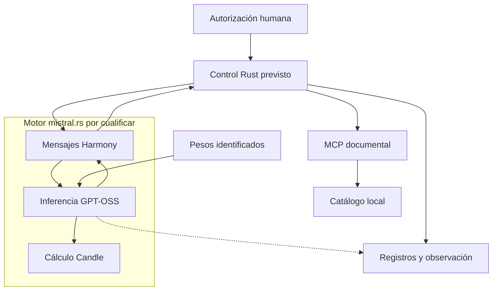
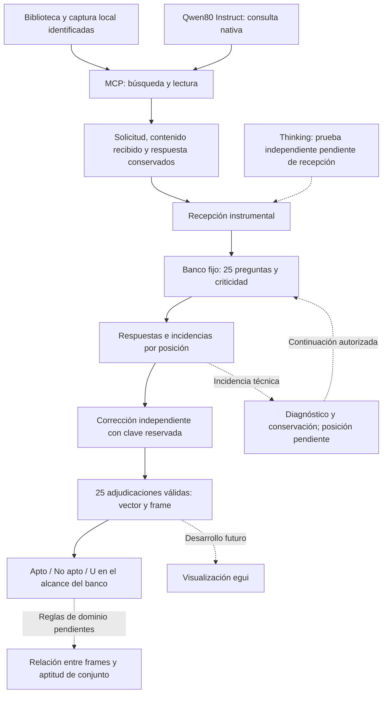

# Ensayo de inteligencia artificial y observabilidad

**Edición documental 2.17 · 30 de septiembre de 2026.**

**Corte de evidencias:** 30/09/2026, 08:42 UTC. Las comunicaciones posteriores se identifican por separado; esta página no es un monitor de ejecución.

Investigación experimental sobre ejecución de modelos auxiliares, fidelidad documental, control y observación mediante Rust. Pertenece a la investigación lateral (p1+P3)-Bis y mantiene evaluaciones diferenciadas para inmunología y ciberseguridad. Las propuestas del modelo carecen de autoridad para modificar el conocimiento admitido o las decisiones del SV.

Esta página reúne el estado de los candidatos, la secuencia de publicaciones, las versiones de los componentes y sus límites. El [registro estructurado de versiones](VERSIONES.json) fija las referencias por commit y distingue fuentes, distribuciones y archivos de conservación.

**Consulta:** [estado actual](#estado-actual) · [evaluación y resultado](#evaluación-documental-y-resultado) · [componentes](#versiones-de-los-componentes) · [publicaciones](#publicaciones-en-orden-cronológico) · [historia completa](#historia-completa-de-la-edición-documental) · [diagramas](#vías-de-ejecución-y-diagramas) · [seguimiento](#trazabilidad-y-criterios-de-lectura).

## Estado actual

La línea experimental vigente es **Qwen3-Next-80B-A3B-Instruct, cuantizado en UQFF Q4K, en la vía B nativa CPU**. Se han recibido favorablemente dos consultas documentales completas con búsqueda y lectura reales mediante MCP. La ronda posterior de 25 preguntas **no tiene todavía un resultado final recibido**. Funcionamiento documental, respuesta conservada y aptitud son resultados distintos.

| Modelo o configuración | Resultado y alcance | Situación al corte |
|---|---|---|
| [Qwen3-0.6B · Q4_K_M](modelos-de-ia/qwen/qwen3-0.6b/README.md) | Inferencia nativa y controles parciales; cuatro consultas DOC-01 terminadas sin conformidad contractual completa. | Campaña cerrada con limitaciones. |
| [GPT-OSS-20B · MXFP4](modelos-de-ia/openai/gpt-oss-20b/README.md) | Funcionamiento técnico y bancos documentales conservados; la evaluación médica no acreditó la función prevista. | Configuración excluida de esa selección; archivo conservado. |
| [Qwen3.8-27B](modelos-de-ia/qwen/qwen3.8-27b/README.md) | Respuesta completa en la selección mínima, con omisión material y deficiencias de citas y localización. | **No pasa** en la selección examinada. |
| [GPT-OSS-120B](modelos-de-ia/openai/gpt-oss-120b/README.md) | Comprobación preliminar entregada: los archivos de pesos superaban el límite de memoria de la configuración considerada. Sin consumo máximo de inferencia medido. | Alternativa condicionada; [TT-0015](https://github.com/juantoniolloretegea/SV-lenguaje-de-computacion/blob/main/docs/calidad/Inventario-sv/tiques-tecnicos/TT-0015.md). |
| [Qwen3-Next-80B-A3B-Instruct](modelos-de-ia/qwen/qwen3-next-80b-a3B-instruct/REGISTRO-INSTALACION-20260929.md) | Dos consultas MCP recibidas. En la campaña posterior se comunican ocho respuestas conservadas y una interrupción en P09. | Evaluación parcial y recepción pendientes; [TT-0016](https://github.com/juantoniolloretegea/SV-lenguaje-de-computacion/blob/main/docs/calidad/Inventario-sv/tiques-tecnicos/TT-0016.md). |
| [Qwen3-Next-80B-A3B-Thinking](modelos-de-ia/qwen/qwen3-next-80b-a3b-thinking) | Prueba documental independiente preparada y transmisión humana comunicada. La carpeta del modelo ha sido incorporada después del corte. | Sin resultado recibido; [TT-0017](https://github.com/juantoniolloretegea/SV-lenguaje-de-computacion/blob/main/docs/calidad/Inventario-sv/tiques-tecnicos/TT-0017.md). |

La [recepción instrumental de Instruct](https://github.com/juantoniolloretegea/SV-sala-de-maquinas/blob/816a70bd6ff72c8d55f9bd599823a17e1fd57454/respuestas-ejecucion/QWEN80-Q4K-ONECLOUD-20260929/revision-entrega-08/RECEPCION.md) —original de acceso restringido— coteja dos recorridos completos: solicitud del modelo, búsqueda, lectura del catálogo local, incorporación de su resultado y respuesta final. Las citas coinciden con la fuente tras convertir exclusivamente los saltos LF/CRLF en espacios. Las duraciones fueron **1532,618 y 1535,382 segundos**; el máximo registrado del grupo alcanzó **59 GiB**, sin agotamiento de memoria registrado en esos intentos. Estos datos no acreditan holgura de memoria, rapidez interactiva ni capacidad general de cualquier configuración de 64 GB.

El avance posterior es **una comunicación de ejecución todavía pendiente de recepción independiente**: P01–P08 conservadas, P09 sin respuesta final y P10–P25 sin ejecutar en ese aviso. P09 propuso dos lecturas en un intercambio limitado a una; el rechazo se propagó al cierre de la campaña. La continuación correctiva está preparada para distinguir el fallo de un ítem de un fallo general de seguridad o conservación. Su preparación no demuestra que se haya ejecutado. Ocho respuestas conservadas no equivalen a ocho respuestas correctas.

Thinking se sigue de forma independiente: su plantilla, razonamiento generado, respuesta final y llamadas a herramientas necesitan tratamiento diferenciado. Los resultados de Instruct no se transfieren a esta variante. El [registro de modelos](modelos-de-ia/README.md) conserva antecedentes; las fichas de seguimiento anteriores identifican el estado actualizado de estas dos líneas.

## Evaluación documental y resultado

La pregunta experimental es si una configuración puede **responder con fundamento verificable dentro de una biblioteca delimitada**. La primera ronda utiliza una captura identificada del [PDQ profesional del NCI sobre leucemia de células pilosas](https://www.cancer.gov/espanol/tipos/leucemia/pro/tratamiento-celulas-pilosas-pdq), consultada desde el catálogo local. La página pública identifica la procedencia; no sustituye los bytes congelados del ensayo.

El [banco de preguntas](https://github.com/juantoniolloretegea/SVperitus-dataset/blob/6f1118a323bcefac9400d01274e4f8d1db3636ff/dominios/inmunologia/tes-examenes-conocimientos/ronda-01-pdq-tricoleucemia-20260929/PREGUNTAS.md) y el [protocolo de evaluación, revisión r1](https://github.com/juantoniolloretegea/SVperitus-dataset/blob/6f1118a323bcefac9400d01274e4f8d1db3636ff/dominios/inmunologia/tes-examenes-conocimientos/ronda-01-pdq-tricoleucemia-20260929/PROTOCOLO.md) fijan **25 posiciones, cinco niveles propuestos de dificultad, 20 preguntas críticas y cinco no críticas**. La clave de corrección queda fuera del alcance del candidato. Los casos son sintéticos y la graduación de dificultad aún no tiene calibración empírica.

| Resultado por posición | Significado |
|---|---|
| **0** | Respuesta correcta y sustentada conforme a la clave y a las evidencias. |
| **1** | Error demostrado conforme al criterio previo. |
| **U** | Indeterminación auténtica: no se acredita 0 y no hay falsedad relevante demostrada. |
| **Intento inválido o pendiente** | Fallo técnico, evidencia perdida o pregunta no ejecutada. Se registra fuera de la terna; no se rellena con U. |

La clasificación auxiliar aplica **T(n)=⌊7n/9⌋**, que para 25 posiciones vale 19. El dictamen del instrumento incorpora además la criticidad: cualquier 1 crítico determina **No apto**; si no hay 1 crítico pero existe U crítica, corresponde **U (indeterminación honesta)**; las veinte críticas en 0 y la clasificación auxiliar favorable permiten **Apto**. Con esta distribución, las veinte respuestas críticas correctas ya superan el umbral. Los errores no críticos siguen siendo visibles.

Sólo tras **25 adjudicaciones válidas e independientes** se constituye el vector ordenado y su frame o polígono. Cada posición queda ligada a pregunta, fuente, respuesta, configuración y fundamento de corrección. Las comprobaciones sintéticas del evaluador Rust acreditan su cálculo en esos casos, no la validez médica de las respuestas.

La futura visualización **egui** deberá facilitar la lectura humana y la relación entre frames; no se declara implementada. **Un frame Apto puede formar parte de un conjunto No apto**: la composición y la aptitud de dominio necesitan reglas aún no constituidas por esta ronda. Una U puede motivar nuevas preguntas con identidad propia, conservando los resultados anteriores.

La secuencia es: suficiencia instrumental → evaluación documental → dictamen limitado al banco → decisión sobre una eventual fase posterior. La vía A/WebAssembly conserva su dependencia de una selección favorable y de autorización propia. No se acredita aptitud clínica general, uso productivo ni integración en el núcleo del SV.

## Harmony, Candle y funciones del conjunto

En la línea GPT-OSS, **Harmony** es el formato requerido de conversación. Es el formato de mensajes, canales, llamadas y terminación; la biblioteca oficial `openai-harmony` proporciona su codificación y análisis. **Candle** aporta operaciones numéricas y tensores. En las bases de mistral.rs examinadas se utilizan ambas bibliotecas: sus funciones son complementarias. [Formato oficial](https://github.com/openai/harmony) · [Candle](https://github.com/huggingface/candle).

| Elemento | Función | Condición de interpretación |
|---|---|---|
| Modelo, pesos y tokenizador | Parámetros y representación de las entradas y salidas. | La identidad incluye revisión, formato y huellas. |
| mistral.rs | Carga, implementación del modelo y servicio de inferencia. | Motor Rust; su nombre no identifica un modelo comercial Mistral. |
| Harmony / openai-harmony | Estructura y análisis de la conversación GPT-OSS. | Es necesario comprobar plantilla, identificadores, canales y fin de turno conjuntamente. |
| Candle | Operaciones numéricas utilizadas por la implementación de inferencia. | No es un modelo auxiliar ni sustituye el formato Harmony. |
| MCP documental | Búsqueda textual y lectura del catálogo local. | El protocolo no verifica por sí mismo la verdad de las afirmaciones ni concede permisos. |
| Control Rust / Árbitro SV | Admisión, permisos, límites y supervisión previstos. | No se atribuye una implementación integral a la suma de MCP y cliente. |
| OpenTelemetry Rust y observador | Trazas instrumentadas y medidas de procesos o cgroup, respectivamente. | Deben declararse cobertura, pérdidas y ámbito; no constituyen observación exhaustiva. |
| Axum, Hyper y Reqwest | Servicio y transporte HTTP. | Son componentes de comunicación; no son medidores de recursos. |

La base mistral.rs [0.9.3](https://github.com/EricLBuehler/mistral.rs/blob/24dbf5c256f232176ee5949485ba264049407fbe/Cargo.toml) fija Candle en `35d7ae7…`; la base [0.9.4](https://github.com/EricLBuehler/mistral.rs/blob/2370966bb91e2e3dafa0b1521b87c50fd5c01244/Cargo.toml), en `66a8cf1…`. Ambas declaran Candle 0.11.0 y `openai-harmony` 0.0.8. El número de versión común no hace equivalentes sus fuentes ni acredita el binario utilizado. Las modificaciones CPU del antecedente GPT-OSS-20B requieren cotejo específico antes de aplicarse al 120B.

**Antecedente GPT-OSS, separado de la campaña Qwen:** la compatibilidad conceptual entre Candle y Harmony está fundamentada; la cualificación del ensamblaje 120B permanece pendiente. Deben verificarse el tratamiento de errores y truncamientos de Harmony, el vocabulario local identificado, la ruta numérica MXFP4, las dependencias efectivamente compiladas y los controles de red y herramientas. El [adaptador examinado](https://github.com/EricLBuehler/mistral.rs/blob/24dbf5c256f232176ee5949485ba264049407fbe/mistralrs-core/src/reasoning_parsers/harmony.rs) descarta determinados errores de análisis; este hallazgo estático no constituye una explotación reproducida. La [biblioteca Harmony](https://github.com/openai/harmony/blob/ec7606df9e87e3d0a1fec9f50928c1e407f0c438/src/tiktoken_ext/public_encodings.rs) admite un vocabulario local verificado y contempla descarga si no se fija el directorio local y falta una caché válida. El ensayo debe acreditar funcionamiento sin red. Usar Rust o incluir una dependencia no constituye una certificación de seguridad.

## Versiones de los componentes

La **edición documental 2.17**, las **aplicaciones 0.1.x/0.2.x**, el **MCP 0.1.x**, los **modelos** y los **archivos de recuperación v1** tienen identidades independientes. Una numeración no sustituye a las restantes. Las realizaciones conservadas identifican Rust 1.98.0 y sus dependencias en cada expediente.

<strong>EIO conversación · Qwen3-0.6B · 0.1.0 → 0.1.4</strong>

La distribución publicada es 0.1.3-beta.1. La fuente candidata 0.1.4 conserva verificación propia y no sustituye esa distribución.

| Versión de fuentes | Fecha de incorporación | Cambio relevante | Acceso completo al corte inicial |
|---|---|---|---|
| 0.1.0 | 22/09/2026 | Conversación con Qwen y conservación por expediente. | [Fuentes 0.1.0](https://github.com/juantoniolloretegea/SV-motor/tree/5330c6c9d2c7d9d6a9cec6079a7118bf0f5567db/laboratorio/ensayo-ia-y-observabilidad/conversacion-nativa) |
| 0.1.1 | 22/09/2026 | Identificación de licencias y precisión de validación y observación. | [Fuentes 0.1.1](https://github.com/juantoniolloretegea/SV-motor/tree/eec0d87fd9e41a3341b799540bb4545c6dd686d9/laboratorio/ensayo-ia-y-observabilidad/conversacion-nativa) |
| 0.1.2 | 22/09/2026 | Recuperación de peticiones y medición; comparación acotada documentada. | [Fuentes 0.1.2](https://github.com/juantoniolloretegea/SV-motor/tree/feefbe68a4131c43c46673b841a0dd72b590e4f7/laboratorio/ensayo-ia-y-observabilidad/conversacion-nativa) |
| 0.1.3 | 22/09/2026 | Integración OpenTelemetry y observador Linux; distribuida como 0.1.3-beta.1. | [Fuentes 0.1.3](https://github.com/juantoniolloretegea/SV-motor/tree/7f1dd02f4b4960c7e989da7caca63d4c78c85690/laboratorio/ensayo-ia-y-observabilidad/conversacion-nativa) |
| 0.1.4 | 23/09/2026 | Correcciones de supervisión y conservación verificadas localmente; sin nueva inferencia. | [Fuentes 0.1.4](https://github.com/juantoniolloretegea/SV-motor/tree/8cddcc83359bf6733a360d5bba2cd72426f8b631/laboratorio/ensayo-ia-y-observabilidad/conversacion-nativa) |

[Comprobación 0.1.2](conversacion-nativa/verificacion-0.1.2/INFORME.md) · [Observación 0.1.3](conversacion-nativa/verificacion-0.1.3/INFORME.md) · [Correcciones 0.1.4](conversacion-nativa/verificacion-0.1.4/INFORME.md).

Las versiones de fuentes pueden abarcar varios commits; el enlace identifica el corte inicial de esa versión. Los informes y las distribuciones fijan sus propios cortes de comprobación.

<strong>EIO conversación · GPT-OSS-20B · 0.2.0 → 0.2.4</strong>

La adaptación parte de la aplicación Qwen 0.1.4, pero utiliza otra integración de inferencia. La distribución es 0.2.4-beta.1; el rótulo interno 0.2.2 se interpreta mediante su ficha y huellas.

| Versión de fuentes | Fecha de incorporación | Cambio relevante | Acceso completo al corte inicial |
|---|---|---|---|
| 0.2.0 | 24/09/2026 | Adaptación de la interfaz a motor residente GPT-OSS, contexto y cancelación. | [Fuentes 0.2.0](https://github.com/juantoniolloretegea/SV-motor/tree/d564ec3ed1702f2f185ccb152fe3d5a494bddba8/laboratorio/ensayo-ia-y-observabilidad/modelos-de-ia/openai/gpt-oss-20b/conversacion) |
| 0.2.1 | 24/09/2026 | Corrección del reconocimiento del fin de turno. | [Fuentes 0.2.1](https://github.com/juantoniolloretegea/SV-motor/tree/032ef13602ae9288cdd8467335c34198dda08871/laboratorio/ensayo-ia-y-observabilidad/modelos-de-ia/openai/gpt-oss-20b/conversacion) |
| 0.2.2 | 24/09/2026 | Corrección de identificadores de tokens y observación del motor residente. | [Fuentes 0.2.2](https://github.com/juantoniolloretegea/SV-motor/tree/dbaf4ed071388710e901b87c36842497893e10fb/laboratorio/ensayo-ia-y-observabilidad/modelos-de-ia/openai/gpt-oss-20b/conversacion) |
| 0.2.3 | 24/09/2026 | Acotación de trazas y preparación de la continuación comparativa. | [Fuentes 0.2.3](https://github.com/juantoniolloretegea/SV-motor/tree/e668d8e1efa18dd5462e9519eb9c5f73cd4e48a0/laboratorio/ensayo-ia-y-observabilidad/modelos-de-ia/openai/gpt-oss-20b/conversacion) |
| 0.2.4 | 25/09/2026 | Fuentes de la distribución 0.2.4-beta.1 y cierre experimental; conserva el rótulo interno 0.2.2. | [Fuentes 0.2.4](https://github.com/juantoniolloretegea/SV-motor/tree/ab713cdc73d6a55184d52c03b99745c99a1ced64/laboratorio/ensayo-ia-y-observabilidad/modelos-de-ia/openai/gpt-oss-20b/conversacion) |

[Ficha de la distribución 0.2.4-beta.1](modelos-de-ia/openai/gpt-oss-20b/distribucion/0.2.4-beta.1/FICHA_TECNICA.md) · [Resultados y límites](modelos-de-ia/openai/gpt-oss-20b/distribucion/0.2.4-beta.1/RESULTADOS.md).

Las versiones de fuentes pueden abarcar varios commits; el enlace identifica el corte inicial de esa versión. Los informes y las distribuciones fijan sus propios cortes de comprobación.

<strong>MCP documental · 0.1.0 → 0.1.1 → 0.1.2</strong>

| Versión | Cambio y resultado conservado | Acceso completo |
|---|---|---|
| 0.1.0 | Prototipo de búsqueda textual y lectura paginada; preparación incompleta y reparos conservados. | [Paquete y documentación](modelos-de-ia/model-context-protocol/0.1.0/README.md) |
| 0.1.1 | Rechazo de claves JSON duplicadas, paginación sobre la respuesta completa y custodia supervisada. Controles dirigidos documentados; recepción pendiente. | [Fuentes y uso](modelos-de-ia/model-context-protocol/0.1.1/LEAME.md) · [Ficha y alcance](modelos-de-ia/model-context-protocol/0.1.1/FICHA_TECNICA.md) |
| 0.1.2 | Añade el cliente mínimo con supervisión independiente y observador del conjunto. Ese cliente no ofrece herramientas al modelo. | [Fuentes, uso y límites](modelos-de-ia/model-context-protocol/0.1.2/LEAME.md) |

Son versiones del componente documental, sin publicación Release específica en este corte. TT-0014 conserva su recepción propia; la selección del modelo tiene criterios separados.

<strong>Qwen3-Next-80B-A3B · Instruct y Thinking</strong>

Instruct utiliza una realización CPU identificada del motor mistral.rs 0.9.4 y Candle, con correcciones de acceso a tensores y descompresión selectiva de expertos. La [identidad de fuentes, binarios, pesos y pruebas](modelos-de-ia/qwen/qwen3-next-80b-a3B-instruct/REGISTRO-INSTALACION-20260929.md) corresponde a ese ensamblaje; no se atribuye a la distribución estándar sin modificaciones. El ciclo instrumental recibido ejecuta las herramientas MCP mediante su controlador Rust; no procede del cliente mínimo 0.1.2.

El desarrollo experimental y sus controles se realizan en Rust. Las excepciones criptográficas nativas declaradas se identifican en el registro; no se presenta el conjunto de dependencias como íntegramente Rust.

La [carpeta de Thinking](modelos-de-ia/qwen/qwen3-next-80b-a3b-thinking) conserva su documentación propia conforme avance la realización. La presencia de esa carpeta no acredita instalación, carga, inferencia ni recepción.

## Publicaciones en orden cronológico

Se conservan **cinco publicaciones preliminares: dos distribuciones y tres archivos de recuperación o cierre**. Cada desplegable conduce a la publicación completa, sus activos y la documentación de alcance. Las revisiones v1 corresponden a paquetes fechados distintos.

<strong>22/09/2026 · EIO conversación 0.1.3-beta.1 · Qwen3-0.6B</strong>

Aplicación nativa con ejecutable, fuentes, licencias y manifiesto. Los pesos y el tokenizador tienen referencias externas identificadas. DOC-01 completó cuatro peticiones sin conformidad contractual completa; la distribución conserva ese resultado.

[Publicación completa y activos](https://github.com/juantoniolloretegea/SV-motor/releases/tag/eio-conversacion-v0.1.3-beta.1) · [Ficha o procedimiento y límites](entregas/0.1.3-beta.1/FICHA_TECNICA.md).

<strong>25/09/2026 · GPT-OSS conversación 0.2.4-beta.1 · GPT-OSS-20B</strong>

Distribución de la aplicación y el motor identificados, con resultados y límites. Las fuentes declaran 0.2.4 y el rótulo interno conserva 0.2.2; la ficha documenta esta discrepancia. El funcionamiento técnico no acredita aptitud médica.

[Publicación completa y activos](https://github.com/juantoniolloretegea/SV-motor/releases/tag/gpt-oss-conversacion-v0.2.4-beta.1) · [Ficha o procedimiento y límites](modelos-de-ia/openai/gpt-oss-20b/distribucion/0.2.4-beta.1/FICHA_TECNICA.md).

<strong>25/09/2026 · GPT-OSS · imagen de recuperación v1</strong>

Archivo cifrado cuya restitución funcional fue comprobada mediante el procedimiento conservado. Ese resultado corresponde a esta imagen concreta y no se transfiere a imágenes posteriores. Los pesos se recuperan separadamente.

[Publicación completa y activos](https://github.com/juantoniolloretegea/SV-motor/releases/tag/gpt-oss-imagen-onecloud-20260925-v1) · [Ficha o procedimiento y límites](modelos-de-ia/openai/gpt-oss-20b/imagen-onecloud/README.md).

<strong>26/09/2026 · GPT-OSS · archivo de cierre v1</strong>

Conserva una imagen posterior de cierre y los pesos cifrados identificados. No se ha acreditado el arranque de esta nueva imagen; el ensayo de restitución del día anterior no prueba estos bytes.

[Publicación completa y activos](https://github.com/juantoniolloretegea/SV-motor/releases/tag/gpt-oss-archivo-cierre-20260926-v1) · [Ficha o procedimiento y límites](modelos-de-ia/openai/gpt-oss-20b/imagen-onecloud/cierre-20260926/README.md).

<strong>27/09/2026 · Qwen3.8-27B · archivo de cierre v1</strong>

Reúne las imágenes del diagnóstico inicial y del cierre, sin pesos Qwen. Se conservan sus comprobaciones de integridad, sin arranque acreditado en una instancia restaurada. La configuración mantiene el dictamen No pasa.

[Publicación completa y activos](https://github.com/juantoniolloretegea/SV-motor/releases/tag/qwen38-27b-archivo-cierre-20260927-v1) · [Ficha o procedimiento y límites](modelos-de-ia/qwen/qwen3.8-27b/imagen-onecloud/README.md).

El archivo posterior conserva la historia anterior y su dictamen. La publicación de activos cifrados no concede acceso al contenido reservado. GPT-OSS-120B no tiene distribución ni imagen publicada en este corte. Las huellas publicadas se identifican en [VERSIONES.json](VERSIONES.json); esta revisión documental no ha descargado ni recalculado los grandes activos binarios.

## Historia completa de la edición documental

La secuencia comienza en **0.1** y avanza hasta la presente **2.17**. Se conserva la historia anterior y se incorpora la edición 2.16 mediante su referencia inmutable. Cada desplegable conserva lo relevante de su corte y ofrece el texto íntegro; sus estados históricos no sustituyen al estado actual.

El salto **0.2 → 2.0** se conserva tal como fue publicado; no se ha localizado una edición 1.x en el historial de este archivo. Cuando una edición reúne varios commits, se muestran todos en orden. Las fechas siguientes son las de esos commits en Europe/Madrid; una cabecera histórica puede conservar una fecha anterior.

<strong>0.1 · 18/09/2026 · Apertura del ensayo</strong>

Define Qwen3-0.6B Q4_K_M, Candle y OpenTelemetry Rust como selección inicial. Fija el perímetro experimental y separa calidad del modelo, controles y autoridad. Es documentación preparatoria, sin inferencias acreditadas en ese corte.

[Edición completa](https://github.com/juantoniolloretegea/SV-motor/blob/875a3df0f2e07fb3c71f98d7fd6968ccae54af24/laboratorio/ensayo-ia-y-observabilidad/README.md).

<strong>0.2 · 18/09/2026–20/09/2026 · Contrato y primeras campañas</strong>

Vincula el contrato a las fuentes rectoras y añade la continuidad EIO-05, EIO-06, JSON-01, NAV-01 y NAV-02. Los controles sintéticos no equivalen a inferencia completa en navegador; el diagnóstico NAV-02 termina antes del primer token.

Cortes de esta edición, en orden cronológico:

- [Contrato · 18/09/2026 · e1caf6d](https://github.com/juantoniolloretegea/SV-motor/blob/e1caf6df5bef2696f20d2b9fc5a5b5e9cffe509e/laboratorio/ensayo-ia-y-observabilidad/README.md).
- [Resultados EIO/JSON · 20/09/2026 · ee29460](https://github.com/juantoniolloretegea/SV-motor/blob/ee2946062f878282513b519e467cb6bfbb8a05d1/laboratorio/ensayo-ia-y-observabilidad/README.md).
- [Preparación NAV-01 · 20/09/2026 · 966b4b2](https://github.com/juantoniolloretegea/SV-motor/blob/966b4b23326312371ad0512ef586c8d9ea401c6b/laboratorio/ensayo-ia-y-observabilidad/README.md).
- [Resultado NAV-01 · 20/09/2026 · 4c68db7](https://github.com/juantoniolloretegea/SV-motor/blob/4c68db73b48962bb185a523c1de34da85678d375/laboratorio/ensayo-ia-y-observabilidad/README.md).
- [Preparación NAV-02 · 20/09/2026 · 8744e3d](https://github.com/juantoniolloretegea/SV-motor/blob/8744e3daf0c03f3675954ff774603454e44bfc45/laboratorio/ensayo-ia-y-observabilidad/README.md).
- [Diagnóstico NAV-02 · 20/09/2026 · dde1a59](https://github.com/juantoniolloretegea/SV-motor/blob/dde1a59fcd1bb23d9f146dff4e99750725ffa76f/laboratorio/ensayo-ia-y-observabilidad/README.md).

<strong>2.0 · 20/09/2026 · Dos vías y criterio de avance</strong>

Organiza A como navegador/WebAssembly y B como proceso nativo. El avance depende de factibilidad, controles y evidencia; ambas vías conservan comprobaciones propias. El salto desde 0.2 pertenece a la numeración original.

[Edición completa](https://github.com/juantoniolloretegea/SV-motor/blob/29a0dbe74018807fddf5759f30de12ac29c162bb/laboratorio/ensayo-ia-y-observabilidad/README.md).

<strong>2.1 · 20/09/2026 · Responsabilidades de Rust y JavaScript</strong>

Precisa que la interfaz nativa conserva HTML y JavaScript para presentación y transporte. Rust realiza inferencia y controles; utilizar HTTP o WebAssembly en una pieza no determina dónde se ejecuta el modelo.

[Edición completa](https://github.com/juantoniolloretegea/SV-motor/blob/88ea2e6b1e28b5c1ff22d29da7003c854bb8461d/laboratorio/ensayo-ia-y-observabilidad/README.md).

<strong>2.2 · 20/09/2026 · Diagramas de las vías A y B</strong>

Incorpora flujos diferenciados de inferencia, control, custodia y parada. Distingue la arquitectura prevista de las ramas efectivamente ejecutadas.

[Edición completa](https://github.com/juantoniolloretegea/SV-motor/blob/1b9190d1e146ef61599783191019c060d0ff899c/laboratorio/ensayo-ia-y-observabilidad/README.md).

<strong>2.2.1 · 20/09/2026 · Figuras SVG y procedencia</strong>

Publica los diagramas como SVG ampliables con sus fuentes Mermaid. El segundo corte añade la procedencia desde 0.1; ambos textos permanecen accesibles.

Cortes de esta edición, en orden cronológico:

- [SVG · 20/09/2026 · 078aa80](https://github.com/juantoniolloretegea/SV-motor/blob/078aa80d7e530eb4e38c582ea5a305202f12160a/laboratorio/ensayo-ia-y-observabilidad/README.md).
- [Procedencia · 20/09/2026 · 3d185b2](https://github.com/juantoniolloretegea/SV-motor/blob/3d185b27c6bb728f1b23509d53dc6ad99c52883d/laboratorio/ensayo-ia-y-observabilidad/README.md).

<strong>2.3 · 20/09/2026 · Síntesis de resultados y reservas</strong>

Ordena la lectura externa y separa resultados observados, diagnóstico estático y trabajo pendiente. Conserva las figuras y los límites de custodia y supervisión de las preparaciones nativas.

[Edición completa](https://github.com/juantoniolloretegea/SV-motor/blob/057dba8a4a1fd2774e35f61e6135fd096679502a/laboratorio/ensayo-ia-y-observabilidad/README.md).

<strong>2.4 · 22/09/2026 · Primera distribución de conversación</strong>

Presenta EIO conversación 0.1.3-beta.1 para Qwen3-0.6B. DOC-01 completa cuatro peticiones sin satisfacer el contrato estricto; la disponibilidad técnica no acredita calidad profesional.

[Edición completa](https://github.com/juantoniolloretegea/SV-motor/blob/a14ea31b3903d49a98f08b912206b1c8c9eeaf74/laboratorio/ensayo-ia-y-observabilidad/README.md).

<strong>2.5 · 22/09/2026–23/09/2026 · Límites de Qwen y transición a GPT-OSS</strong>

Delimita los controles pendientes de la vía B y abre el catálogo por modelos. Las notas del día siguiente incorporan el primer intento nativo GPT-OSS y la revisión de su controlador. La propuesta inicial de GPT-OSS en A no acredita una ejecución en navegador.

Cortes de esta edición, en orden cronológico:

- [Delimitación · 22/09/2026 · 511969f](https://github.com/juantoniolloretegea/SV-motor/blob/511969f4ba576734f4bf96e39eed3e90d5dd02d5/laboratorio/ensayo-ia-y-observabilidad/README.md).
- [Revisión del controlador · 23/09/2026 · 41c99e2](https://github.com/juantoniolloretegea/SV-motor/blob/41c99e2a6b68382e7ba867ff55aa3a1fcc07676c/laboratorio/ensayo-ia-y-observabilidad/README.md).
- [Corrección instrumental · 23/09/2026 · 4fafb8c](https://github.com/juantoniolloretegea/SV-motor/blob/4fafb8ccf158a028820168ab7f7b822c608ee6ba/laboratorio/ensayo-ia-y-observabilidad/README.md).

<strong>2.6 · 23/09/2026 · Cierre acotado de Qwen nativo</strong>

Conserva la campaña Qwen/B como realización parcial con limitaciones. Identifica las correcciones de conversación 0.1.4 y del controlador GPT-OSS; su comprobación local no constituye otra inferencia.

[Edición completa](https://github.com/juantoniolloretegea/SV-motor/blob/8cddcc83359bf6733a360d5bba2cd72426f8b631/laboratorio/ensayo-ia-y-observabilidad/README.md).

<strong>2.7 · 23/09/2026 · Recuperación visual y continuidad nativa</strong>

Restituye los diagramas A/B en la página de lectura. El segundo corte incorpora la continuación GPT-OSS y sus límites de carga, todavía sin respuesta final.

Cortes de esta edición, en orden cronológico:

- [Diagramas · 23/09/2026 · bf488a8](https://github.com/juantoniolloretegea/SV-motor/blob/bf488a86dcb1a311ddf4355345e267901adad7c9/laboratorio/ensayo-ia-y-observabilidad/README.md).
- [Continuación GPT-OSS · 23/09/2026 · 810a476](https://github.com/juantoniolloretegea/SV-motor/blob/810a476488deb8dfb22585a51c91aee89d75ba0c/laboratorio/ensayo-ia-y-observabilidad/README.md).

<strong>2.8 · 23/09/2026 · Rectificación instrumental</strong>

Corrige la contabilización de memoria y el plazo de confirmación de escritura. Distingue la cuantización solicitada de la seleccionada por el motor; no presenta los intentos como inferencias completadas.

[Edición completa](https://github.com/juantoniolloretegea/SV-motor/blob/250c3e27784d36f347e9ac0aefa5b53e6cc46c98/laboratorio/ensayo-ia-y-observabilidad/README.md).

<strong>2.9 · 23/09/2026 · Carga MXFP4 sin inferencia</strong>

Conserva dos intentos adicionales que no completaron la carga. Las causas no determinadas permanecen explícitas; no se atribuye el resultado a Harmony ni se declara una respuesta del modelo.

[Edición completa](https://github.com/juantoniolloretegea/SV-motor/blob/ae9ceaef37e18d9cc12e25ea0369e4ebf58d9fb8/laboratorio/ensayo-ia-y-observabilidad/README.md).

<strong>2.10 · 23/09/2026 · Carga GGUF y generación observada</strong>

Acredita carga CPU y emisión de tokens en GPT-OSS-20B. Las respuestas HTTP no proporcionaron todavía una respuesta final útil; carga, generación y finalización del caso se distinguen.

[Edición completa](https://github.com/juantoniolloretegea/SV-motor/blob/f3746b719a3e355d75ea566d3d3abde2b6ea9e0e/laboratorio/ensayo-ia-y-observabilidad/README.md).

<strong>2.11 · 24/09/2026 · Corrección CPU y recuperación</strong>

Documenta una regresión CPU MXFP4, una corrección comprobada en una prueba específica y la identidad de la candidata recuperada. La inferencia completa con esa candidata seguía pendiente en este corte.

[Edición completa](https://github.com/juantoniolloretegea/SV-motor/blob/a74632b0b6dde70629863113134082dc3f31d521/laboratorio/ensayo-ia-y-observabilidad/README.md).

<strong>2.12 · 24/09/2026 · Primera respuesta correcta acotada</strong>

OC-01/OC-02 aportan una respuesta aritmética correcta y un contraste con el ejecutable anterior. El resultado tiene alcance instrumental limitado; no constituye selección médica.

[Edición completa](https://github.com/juantoniolloretegea/SV-motor/blob/70750a516001cf13314176c529508d0712b7f3c1/laboratorio/ensayo-ia-y-observabilidad/README.md).

<strong>2.13 · 24/09/2026–25/09/2026 · Optimización y cierre GPT-OSS-20B</strong>

Reúne la optimización CPU y, en cortes posteriores, la distribución 0.2.4-beta.1 y la vinculación con TT-0013. Los resultados técnicos y documentales conservan su alcance; el cierre no acredita aptitud clínica.

Cortes de esta edición, en orden cronológico:

- [Optimización · 24/09/2026 · d4e62b2](https://github.com/juantoniolloretegea/SV-motor/blob/d4e62b29713a2044be0d1d4a7fb463155d3999c3/laboratorio/ensayo-ia-y-observabilidad/README.md).
- [Distribución y cierre · 25/09/2026 · ab713cd](https://github.com/juantoniolloretegea/SV-motor/blob/ab713cdc73d6a55184d52c03b99745c99a1ced64/laboratorio/ensayo-ia-y-observabilidad/README.md).
- [Vinculación TT-0013 · 25/09/2026 · c3b2793](https://github.com/juantoniolloretegea/SV-motor/blob/c3b279309c3ca54db6e94a693795b4367083cf0c/laboratorio/ensayo-ia-y-observabilidad/README.md).

<strong>2.14 · 27/09/2026 · Cierre Qwen3.8-27B y candidato 120B</strong>

Registra No pasa para la configuración Qwen3.8-27B y su archivo de conservación. Introduce GPT-OSS-120B como candidato de la vía B; la evaluación y los recursos quedan pendientes.

Cortes de esta edición, en orden cronológico:

- [Nuevo candidato · 27/09/2026 · 3f24439](https://github.com/juantoniolloretegea/SV-motor/blob/3f24439cccb8c677c18e6ea2b2b4f13adf7a95ae/laboratorio/ensayo-ia-y-observabilidad/README.md).
- [Archivo Qwen · 27/09/2026 · 9d99df0](https://github.com/juantoniolloretegea/SV-motor/blob/9d99df038657cd85eb1e50b9223bf5e351031f74/laboratorio/ensayo-ia-y-observabilidad/README.md).

<strong>2.15 · 27/09/2026 · Índice de publicaciones y registro JSON</strong>

Distingue cinco publicaciones, las versiones de los componentes y los dictámenes de los candidatos. Introduce VERSIONES.json; la historia seguía resumida por intervalos.

[Edición completa](https://github.com/juantoniolloretegea/SV-motor/blob/63f5bd5e9b8ef147ba6a92d7beba6f94fb5ea3eb/laboratorio/ensayo-ia-y-observabilidad/README.md).

<strong>2.16 · 27/09/2026 · Continuidad completa y funciones Harmony/Candle</strong>

Incorpora todas las ediciones anteriores y sus cortes, los antecedentes de las aplicaciones y las publicaciones identificadas. Precisa Harmony, mistral.rs y Candle, con sus límites de cualificación. Conserva las figuras históricas A/B y actualiza el esquema previsto del candidato 120B.

[Edición completa](https://github.com/juantoniolloretegea/SV-motor/blob/e45c5356fbbca6fcc489603dd8e486e54add1828/laboratorio/ensayo-ia-y-observabilidad/README.md) · [Registro estructurado](https://github.com/juantoniolloretegea/SV-motor/blob/e45c5356fbbca6fcc489603dd8e486e54add1828/laboratorio/ensayo-ia-y-observabilidad/VERSIONES.json).

<strong>2.17 · 30/09/2026 · Qwen80, evaluación documental y seguimiento diferenciado</strong>

Actualiza el estado desde las fuentes recibidas: funcionamiento documental de Instruct, campaña posterior parcial, seguimiento independiente de Thinking y situación condicionada de GPT-OSS-120B. Explica el banco, la criticidad, la indeterminación y el vínculo con vector y frame. Conserva las ediciones, publicaciones y diagramas anteriores; añade el recorrido documental vigente y enlaza S39 y TT-0014 a TT-0017.

[Registro estructurado](VERSIONES.json). La revisión exacta queda identificada por el commit que contiene esta edición.

## Vías de ejecución y diagramas

| Vía | Lugar de la inferencia | Función del navegador | Alcance |
|---|---|---|---|
| **A · navegador** | Trabajador del navegador, mediante Rust compilado a WebAssembly. | Interfaz y alojamiento del trabajador. | Compatibilidad y recursos determinados para cada modelo, motor y navegador. |
| **B · nativa** | Proceso nativo en el anfitrión, separado de la interfaz. | Presentación y transporte de solicitudes. | Fronteras del servicio, supervisión, custodia y terminación sujetas a comprobación. |

Una página que consulta un modelo nativo corresponde a la vía B, aunque incorpore WebAssembly en otro componente. HTML y CSS resuelven la presentación; JavaScript se limita al transporte y la interacción necesarios. En la aplicación nativa, Rust ejecuta la inferencia y los controles propios del ensayo.

La elección de una vía responde a la factibilidad y al resultado buscado. No exige ensayar todas las combinaciones de modelos y soportes. Una vía no realizada puede retomarse si surge una pregunta concreta. Comparar modelos distintos en vías distintas permite valorar ambas configuraciones, pero no atribuir sus diferencias exclusivamente a WebAssembly.

### Vía A: campaña de navegador

**Alcance de la figura:** secuencia de la campaña NAV-02 documentada en septiembre de 2026. Representa el navegador del ejecutor remoto de aquella campaña y la carga de Qwen con Candle; no una instalación de gpt-oss en navegador. Se conserva la figura original. [Ampliar](diagramas/via-a.svg) · [Fuente Mermaid](diagramas/via-a.mmd) · [Documentación de aquel corte](README_2_3_2026_09_20.md).

Los controles sintéticos iniciales se completaron. La prueba con el modelo se interrumpió al superar el umbral autorizado de memoria, antes del primer token. El resultado no acredita inferencia completa ni inviabilidad general de WebAssembly.

### Vía B: arquitectura nativa de referencia

**Alcance de la figura:** diseño EIO-NAT-PREP-02 del corte del 20 de septiembre de 2026. Sus indicaciones de preparación y pruebas pendientes pertenecen a ese diseño y a esa fecha. La figura no certifica que todos sus componentes estén integrados en la aplicación de conversación. [Ampliar](diagramas/via-b.svg) · [Fuente Mermaid](diagramas/via-b.mmd) · [Diseño NAT02](resultados/preparacion-nativa-02/DISENO.md) · [Desarrollo NAT03](resultados/preparacion-nativa-03/README.md).

### Antecedente de continuación de la vía B · GPT-OSS-120B

Este esquema conserva la propuesta del 27/09/2026. El candidato sigue condicionado y no representa la realización Qwen80 vigente.

```mermaid
flowchart TD
  H["Autorización humana"] --> C["Control Rust previsto"]
  C --> D["MCP documental"]
  D --> L["Catálogo local"]
  C --> A["Mensajes Harmony"]
  subgraph M["Motor mistral.rs por cualificar"]
    A --> I["Inferencia GPT-OSS"]
    I --> A
    I --> N["Cálculo Candle"]
  end
  W["Pesos identificados"] --> I
  A --> C
  C --> E["Registros y observación"]
  I -.-> E
```

**Alcance de la figura:** composición funcional prevista, pendiente de cualificación. Harmony representa la preparación y el análisis de mensajes; Candle proporciona cálculo numérico dentro del motor. Los pesos mantienen identidad separada. El control previsto forma parte de las funciones del Árbitro SV; no se declara una implementación integral.

El acceso documental previo por controlador y las llamadas autónomas del modelo son recorridos distintos. El cliente mínimo 0.1.2 no habilita estas últimas. La inferencia prevista deberá operar sin Internet; la adquisición administrativa de documentos y recursos precede al ensayo. Las líneas de observación señalan cobertura que debe acreditarse, no una captura exhaustiva ya conseguida.

Las figuras históricas A/B conservan sus archivos y alcance. El esquema previo del candidato continúa accesible dentro de la [edición 2.15](https://github.com/juantoniolloretegea/SV-motor/blob/63f5bd5e9b8ef147ba6a92d7beba6f94fb5ea3eb/laboratorio/ensayo-ia-y-observabilidad/README.md).

### Recorrido vigente: consulta, evaluación y retorno

```mermaid
flowchart TD
  B["Biblioteca y captura local identificadas"] --> M["MCP: búsqueda y lectura"]
  Q["Qwen80 Instruct: consulta nativa"] --> M
  M --> E["Solicitud, contenido recibido y respuesta conservados"]
  E --> R["Recepción instrumental"]
  R --> X["Banco fijo: 25 preguntas y criticidad"]
  X --> P["Respuestas e incidencias por posición"]
  P --> C["Corrección independiente con clave reservada"]
  C --> V["25 adjudicaciones válidas: vector y frame"]
  V --> D["Apto / No apto / U en el alcance del banco"]
  P -. "Incidencia técnica" .-> I["Diagnóstico y conservación; posición pendiente"]
  I -. "Continuación autorizada" .-> X
  T["Thinking: prueba independiente pendiente de recepción"] -.-> R
  V -. "Desarrollo futuro" .-> G["Visualización egui"]
  D -. "Reglas de dominio pendientes" .-> F["Relación entre frames y aptitud de conjunto"]
```

**Alcance de la figura:** la recepción instrumental de Instruct está acreditada; el examen posterior permanece parcial. Los nodos de corrección, vector completo y dictamen representan resultados aún pendientes. Thinking conserva su prueba y su recepción propias. Las líneas discontinuas señalan recorridos condicionados, no avances ya conseguidos. El diagnóstico conserva los intentos anteriores; la continuación no permite sustituirlos por el mejor resultado.

## Trazabilidad y criterios de lectura

La secuencia de identificación es **configuración → campaña → resultado → entrega → recepción**. Ninguno de esos objetos sustituye a los restantes.

| Para comprobar | Referencia principal |
|---|---|
| Identidad del modelo, motor y condiciones | Ficha de cada modelo, en la tabla de estado actual. |
| Archivos distribuidos e integridad declarada | Publicación correspondiente, manifiesto y [VERSIONES.json](VERSIONES.json). |
| Contrato y límites del ensayo | [EIO-CONTRATO-01, revisión 1](contrato/README.md). |
| Continuidad y dictámenes | [S39](https://github.com/juantoniolloretegea/SV-lenguaje-de-computacion/blob/main/docs/calidad/Inventario-sv/sucesos/SUCESOS_SV.md#s39) y [Acta 004](https://github.com/juantoniolloretegea/SV-lenguaje-de-computacion/blob/main/docs/calidad/tuberias-ia/continuacion-15-09-2026/ACTA_004_FINALIDAD_ALCANCE_Y_CONTINUIDAD_EIO_2026_09_22.md). |
| Alcances de los tiques | [TT-0013: cierre GPT-OSS-20B](https://github.com/juantoniolloretegea/SV-lenguaje-de-computacion/blob/main/docs/calidad/Inventario-sv/tiques-tecnicos/TT-0013.md), [TT-0014: MCP](https://github.com/juantoniolloretegea/SV-lenguaje-de-computacion/blob/main/docs/calidad/Inventario-sv/tiques-tecnicos/TT-0014.md) y [TT-0015: viabilidad GPT-OSS-120B](https://github.com/juantoniolloretegea/SV-lenguaje-de-computacion/blob/main/docs/calidad/Inventario-sv/tiques-tecnicos/TT-0015.md). |

El seguimiento vigente se completa con [TT-0016: banco y evaluación de Instruct](https://github.com/juantoniolloretegea/SV-lenguaje-de-computacion/blob/main/docs/calidad/Inventario-sv/tiques-tecnicos/TT-0016.md) y [TT-0017: primera prueba Thinking](https://github.com/juantoniolloretegea/SV-lenguaje-de-computacion/blob/main/docs/calidad/Inventario-sv/tiques-tecnicos/TT-0017.md). TT-0013 conserva su cierre acotado; TT-0014 mantiene su recepción propia pendiente; TT-0015 dispone de un estudio preliminar adverso para la configuración considerada, sin inferencia. Ninguno de los tiques abiertos se cierra mediante esta actualización documental.

Los enlaces de las tablas permiten lectura pública de las fichas y los resultados resumidos. Los originales de acceso restringido mantienen su custodia propia. Una huella identifica bytes; no acredita veracidad clínica, restauración funcional o conformidad general. La revisión de continuidad no repite los ensayos ni modifica sus resultados.

## Licencias

Sistema Vectorial SV · [CC BY-NC-ND 4.0](https://creativecommons.org/licenses/by-nc-nd/4.0/deed.es). Se conservan el [aviso de EIO conversación](conversacion-nativa/AVISO_LICENCIAS.json), el [aviso de GPT-OSS y su controlador](modelos-de-ia/openai/gpt-oss-20b/controlador-nativo/AVISO_LICENCIAS.json) y los avisos específicos de cada entrega. Cada componente mantiene su licencia; una publicación no amplía derechos de uso o distribución.
