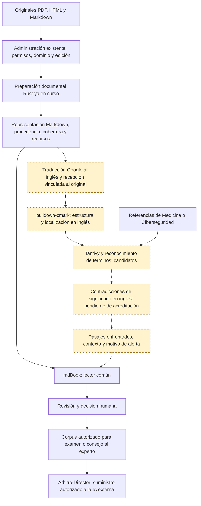

# Estructura lógica de revisión documental en Rust y presentación común mdBook

**Edición pública del 11/10/2026. Estado: estudio documental; detector de contradicciones de significado pendiente de acreditación.** Las referencias al estado de comprobación describen sus respectivos cortes; no equivalen a integración o recepción científica.

11 de octubre de 2026 · Estudio de integración para Medicina y Ciberseguridad.

## Alcance y conclusión

La estructura propuesta reutiliza la administración documental y establece mdBook como presentación común de los documentos. Los originales PDF, HTML y Markdown permanecen conservados; la consulta se efectúa sobre una representación Markdown vinculada a ellos, con sus recursos gráficos cuando estén incorporados y recibidos.

Se distingue una composición técnicamente coherente de una aplicación cuya función principal esté acreditada. Existen los componentes comunitarios de lectura, conversión, búsqueda y presentación. Por precisión humana posterior se acepta la traducción automática de Google como instrumento para llevar los documentos al inglés y realizar allí la comparación. No se exige traducción profesional como condición previa. **No se ha acreditado todavía un componente que descubra las contradicciones complejas de significado exigidas en Medicina y Ciberseguridad, aun con la entrada en inglés, sin un modelo de IA como juez ni preparación conceptual del corpus por el usuario.** Esa función aparece expresamente pendiente en el flujo.

La finalidad es preparar el corpus documental que se proporcionará a una IA para exámenes y para consejo al experto. Las herramientas localizan y presentan posibles conflictos; la autoridad final pertenece a la persona. Ésta determina qué documentos y ediciones pueden suministrarse conjuntamente, qué diferencias tienen una explicación y qué conflictos requieren resolución, exclusión o delimitación. El Árbitro-Director aplica la decisión al suministro efectivo. La ausencia de alertas no equivale a una autorización.

La decisión del lector común se consultó antes de elaborar esta estructura. La continuidad del 11/10/2026 registra la recepción de la presentación mdBook para Markdown y el acceso a las representaciones vinculadas de PDF y HTML; conserva límites para el contenido gráfico íntegro. mdBook admite imágenes y tablas; la distribución protegida de archivos gráficos y la recuperación fiel de las figuras PDF aún requieren la ampliación correspondiente. No se atribuye a mdBook extracción PDF ni interpretación semántica.

## Funciones y relación con lo existente

| Función | Componente | Estado y contribución |
| --- | --- | --- |
| Acceso y operaciones documentales | Administración existente, Axum y redb | Reutilizar identidad, permisos, dominios, revisiones y conservación de decisiones. No crear un registro decisorio paralelo. |
| Conversión HTML | html-to-markdown-rs | El manifiesto local fija 3.17.2. Produce la representación de lectura; debe conservarse la vinculación con el original. |
| Extracción PDF | Lector Rust existente basado en pdf-extract y lopdf | La adaptación local es 0.12.1-sv.2. No sustituirla automáticamente por el paquete comunitario. Texto por página no equivale a tablas, figuras y fórmulas reconstruidas. |
| Estructura del Markdown | pulldown-cmark | El recorrido local consultado fija 0.13.0. Extrae elementos y posiciones. Puede vincular el análisis con capítulos, párrafos, tablas y referencias sin analizar el HTML generado. |
| Presentación común | mdBook | Versión local 0.5.4. Organiza el libro; la integración documental protege sus páginas y, cuando se incorporen, los recursos gráficos. |
| Idioma común de comparación | Traductor Google existente y adaptación de recepción en Rust | Instrumento externo expresamente aceptado. Se conservarán original y traducción utilizada, vinculados por pasajes. La obtención de una representación inglesa estable para el analizador aún requiere comprobación. |
| Localización en varios documentos | Tantivy | Candidato para búsqueda y recuperación de pasajes. Su puntuación de relevancia no mide contradicción ni verdad. La búsqueda dentro de un libro y el contraste entre documentos tienen funciones diferentes. |
| Reconocimiento de denominaciones conocidas | aho-corasick | Candidato para localizar automáticamente términos e identificadores procedentes de fuentes existentes. Ya figura entre las dependencias de Tantivy. No desambigua significados ni descubre por sí solo equivalencias ausentes. |
| Comparación entre ediciones | Xberg o Similar, según capacidad comprobada | Xberg ya existe en el trabajo documental con perfil 1.3.6. Su comparación deberá comprobarse en esa versión antes de añadir otro componente. Similar es una alternativa, no una dependencia adicional obligatoria. |
| Conservación visual de páginas o figuras | Hayro | Candidato experimental bajo estudio en el recorrido del lector común. Puede contribuir a generar representaciones visuales; no aporta interpretación de diagramas ni extracción semántica de tablas. |
| Hallazgo de posibles contradicciones | Buscador-Semántico - Diferencial, con entrada común en inglés | Función pendiente de acreditación. Debe examinar incompatibilidades de significado entre afirmaciones bajo las mismas condiciones. La comparación de palabras o de redacción no la sustituye. |
| Resolución y habilitación documental | Revisión humana y Árbitro-Director existentes | La persona examina y resuelve; la aplicación conserva la decisión y su alcance. La habilitación de usos conserva la autoridad establecida. No se modifica el núcleo, su semántica ni su IR. |

## Repositorios, Rust y mantenimiento observado

Se leyeron los manifiestos y módulos Rust de los componentes relacionados. La columna de seguimiento muestra **estrellas / bifurcaciones** de GitHub; son indicadores públicos de interés y reutilización, no el número de mantenedores activos ni una garantía de calidad. La consulta de colaboradores no produjo una relación utilizable; no se inventa una cifra.

La fecha de actividad es la registrada por GitHub para el último envío al repositorio. Puede corresponder a una rama o documentación. Se diferencia de la fecha de publicación de una edición. Todas las lecturas se realizaron el 11/10/2026.

| Repositorio y comunidad identificable | Comprobación del código Rust | Seguimiento | Actividad UTC | Edición publicada observada |
| --- | --- | --- | --- | --- |
| [tokio-rs/axum](https://github.com/tokio-rs/axum) | [axum/Cargo.toml](https://github.com/tokio-rs/axum/blob/main/axum/Cargo.toml) | 27.442 / 1506 | 2026-10-09 | [axum-v0.8.9](https://github.com/tokio-rs/axum/releases/tag/axum-v0.8.9) · 2026-04-14 |
| [cberner/redb](https://github.com/cberner/redb) | [Cargo.toml](https://github.com/cberner/redb/blob/master/Cargo.toml) | 4835 / 244 | 2026-10-05 | [v4.3.0](https://github.com/cberner/redb/releases/tag/v4.3.0) · 2026-09-15 |
| [xberg-io/xberg](https://github.com/xberg-io/xberg) | [crates/xberg/Cargo.toml](https://github.com/xberg-io/xberg/blob/main/crates/xberg/Cargo.toml) | 9400 / 590 | 2026-10-11 | [v1.3.8](https://github.com/xberg-io/xberg/releases/tag/v1.3.8) · 2026-10-11 |
| [pulldown-cmark/pulldown-cmark](https://github.com/pulldown-cmark/pulldown-cmark) | [pulldown-cmark/Cargo.toml](https://github.com/pulldown-cmark/pulldown-cmark/blob/main/pulldown-cmark/Cargo.toml) | 2737 / 314 | 2026-10-09 | [v0.13.4](https://github.com/pulldown-cmark/pulldown-cmark/releases/tag/v0.13.4) · 2026-05-20 |
| [jrmuizel/pdf-extract](https://github.com/jrmuizel/pdf-extract) | [Cargo.toml](https://github.com/jrmuizel/pdf-extract/blob/master/Cargo.toml) | 601 / 128 | 2026-09-16 | No se obtuvo una publicación mediante la consulta de última edición de GitHub. |
| [quickwit-oss/tantivy](https://github.com/quickwit-oss/tantivy) | [Cargo.toml](https://github.com/quickwit-oss/tantivy/blob/main/Cargo.toml) | 16.203 / 1004 | 2026-10-10 | [0.26.1](https://github.com/quickwit-oss/tantivy/releases/tag/0.26.1) · 2026-05-10 |
| [mitsuhiko/similar](https://github.com/mitsuhiko/similar) | [Cargo.toml](https://github.com/mitsuhiko/similar/blob/main/Cargo.toml) | 1332 / 56 | 2026-09-28 | No se obtuvo una publicación mediante la consulta de última edición de GitHub. |
| [BurntSushi/aho-corasick](https://github.com/BurntSushi/aho-corasick) | [Cargo.toml](https://github.com/BurntSushi/aho-corasick/blob/master/Cargo.toml) | 1302 / 123 | 2026-08-10 | No se obtuvo una publicación mediante la consulta de última edición de GitHub. |
| [rust-lang/mdBook](https://github.com/rust-lang/mdBook) | [Cargo.toml](https://github.com/rust-lang/mdBook/blob/main/Cargo.toml) | 22.209 / 1907 | 2026-10-05 | [v0.5.4](https://github.com/rust-lang/mdBook/releases/tag/v0.5.4) · 2026-07-06 |
| [xberg-io/html-to-markdown](https://github.com/xberg-io/html-to-markdown) | [crates/html-to-markdown/Cargo.toml](https://github.com/xberg-io/html-to-markdown/blob/main/crates/html-to-markdown/Cargo.toml) | 881 / 74 | 2026-10-11 | [v3.17.2](https://github.com/xberg-io/html-to-markdown/releases/tag/v3.17.2) · 2026-10-06 |
| [LaurenzV/hayro](https://github.com/LaurenzV/hayro) | [hayro/src/lib.rs](https://github.com/LaurenzV/hayro/blob/main/hayro/src/lib.rs) | 790 / 87 | 2026-10-10 | No se obtuvo una publicación mediante la consulta de última edición de GitHub. |

Axum pertenece al conjunto de proyectos Tokio; mdBook está alojado en la organización rust-lang. Tantivy se desarrolla en quickwit-oss; Xberg y html-to-markdown comparten organización. Los demás repositorios tienen mantenimiento propio y colaboración pública, sin que esta inspección acredite una organización de soporte o una continuidad garantizada.

Las versiones de los manifiestos de una rama no siempre coinciden con la última edición publicada. Se comprobó explícitamente pulldown-cmark 0.13.4 en su etiqueta, mientras la rama consultada declaraba 0.13.1; Tantivy declara 0.27.0 en la rama y 0.26.1 en su etiqueta publicada. No se propone actualizar automáticamente las versiones locales.

### Condición efectiva de Rust

Una clasificación de GitHub no basta: html-to-markdown aparece predominantemente como HTML, pero su biblioteca `crates/html-to-markdown` y su tratamiento están escritos en Rust. A la inversa, un repositorio predominantemente Rust puede habilitar componentes de otros lenguajes.

Se comprobó que [Tantivy 0.26.1](https://github.com/quickwit-oss/tantivy/blob/0.26.1/Cargo.toml) activa `columnar-zstd-compression` por defecto. Su recorrido llega a [zstd](https://github.com/quickwit-oss/tantivy/blob/0.26.1/sstable/Cargo.toml), que enlaza la [biblioteca C de compresión](https://github.com/gyscos/zstd-rs). Para cumplir el criterio del SV habría que seleccionar un perfil que no incluya ese recorrido y comprobar sus dependencias efectivas y su funcionamiento. No se ha realizado esa compilación aquí.

Xberg ofrece también funciones opcionales con OCR, modelos y PDFium. Sólo procede examinar el perfil autorizado sin IA, conservando las exclusiones establecidas. Esta inspección no constituye una auditoría completa de todas las dependencias transitivas.

mdBook está escrito en Rust; la presentación producida utiliza HTML, CSS y recursos del navegador. La lógica documental, los permisos y el análisis seguirían en Rust. No se atribuye a la presentación web la resolución de contradicciones.

## Recursos propios de los dos dominios

Estos recursos son **datos de referencia**, no programas Rust. Su eventual lectura y utilización se realizarían desde componentes Rust, sin incorporar los programas auxiliares de otros lenguajes que pueda contener su repositorio.

| Dominio | Recurso y mantenimiento | Uso admisible en el estudio | Límite |
| --- | --- | --- | --- |
| Medicina | [DeCS/MeSH](https://decs.bvsalud.org/en/about-decs/), mantenido por BIREME/OPS/OMS con colaboradores institucionales; actualización anual y edición 2026 | Denominaciones españolas e inglesas vinculadas a conceptos comunes | Su [descarga XML o API](https://decs.bvsalud.org/en/for-developers/) requiere licencia gratuita solicitada. No consta obtenida. No resuelve afirmaciones ni desambiguación contextual. |
| Ciberseguridad | [MITRE ATT&CK](https://github.com/mitre-attack/attack-stix-data); [edición 19.2 del 05/08/2026](https://github.com/mitre-attack/attack-stix-data/blob/master/index.md) | Identificadores, técnicas, relaciones y versiones expresados en JSON STIX | No acredita un vocabulario completo español-inglés ni todas las materias de Ciberseguridad. |
| Ciberseguridad | [CVE List V5](https://github.com/CVEProject/cvelistV5), mantenida mediante los servicios oficiales del programa CVE; actualización declarada aproximadamente cada siete minutos | Identificadores de vulnerabilidades, productos, versiones y estados cuando consten en los registros | Una actualización de estado no equivale necesariamente a contradicción. El uso de identificadores sólo ayuda cuando éstos figuran o pueden reconocerse de manera acreditada. |

Estos recursos quedan como apoyos de identificación y precisión por dominio. La traducción al inglés aceptada permite estudiar un analizador en un idioma común, sin convertir la preparación de un diccionario bilingüe particular en una obligación del usuario. No se declara con ello demostrada la interpretación correcta de todos los contenidos traducidos.

Los criterios de comparación difieren por dominio. En Medicina importan, entre otros, población, intervención, dosis, unidad, vía, desenlace y momento. En Ciberseguridad importan producto, versión, configuración, plataforma, privilegios, técnica, condiciones de explotación y fecha. Sólo la representación y las operaciones comunes deben compartirse; no se equiparan entidades o condiciones heterogéneas.

## Traducción existente y adaptación necesaria

Se recuperó el [código publicado de presentación de la biblioteca](https://github.com/IA-en/biblioteca-documental/blob/07d58a3351fc6d4f323ce3fe7ad7d72d1c542175/presentacion.js), objeto Git 385daa132f5df8b50829cfabd32ff995ccfba529. Carga Google Translate en el navegador y establece el español como idioma de origen. Conserva el acceso al original y marca código y fórmulas para no traducirlos. El mecanismo existente de presentación queda identificado; no se ha recuperado aquí el código completo del Worker ni comprobado una traducción nueva en funcionamiento.

El código consultado no produce por sí mismo una representación Markdown inglesa conservada para el análisis. Es necesario adaptar y comprobar esa recepción, conservar el texto efectivamente comparado y asociarlo a identificadores de pasaje del original. El servicio Google es externo y su implementación no se acredita como Rust; el control y la recepción del SV deben seguir en Rust. No se presupone disponibilidad de una API distinta ni se contrata ningún servicio.

La traducción es un instrumento aceptado para que la persona pueda decidir. No se añade una autorización intermedia de traducción profesional ni se devuelve al usuario el hallazgo que corresponde realizar a las herramientas. El resultado conservará el original junto a la traducción para que un cambio introducido al traducir pueda distinguirse de un conflicto entre fuentes.

## Flujo conjunto propuesto

Las líneas discontinuas identifican funciones propuestas aún no recibidas. El reconocimiento automático de denominaciones debe usar recursos existentes y no exigir que una persona localice previamente los conflictos. La persona interviene sobre evidencias encontradas, con capacidad de corregirlas o descartarlas.

El texto que se compara y el que se muestra deben corresponder a la misma edición y traducción. El análisis recibirá una representación inglesa conservada y sus referencias estructuradas; no supondrá que lo visualizado dinámicamente por mdBook ya constituye esa entrada. Una alerta abrirá capítulos y pasajes exactos, con original, traducción utilizada y contexto.

Las imágenes tendrán la misma protección que el documento. Mostrar una tabla o un diagrama como imagen no los convierte en contenido analizado: su cobertura debe declararse. Ante extracción incompleta o fallo, el sistema conservará la incidencia y la parte no comprobada, sin informar ausencia de contradicciones.

## Acoplamiento mínimo necesario

Cada fragmento necesita conservar dominio, documento, edición o huella, representación de origen, localización Markdown y página original cuando corresponda. Deben mantenerse diferenciadas página física y numeración editorial. Cada resultado identificará los fragmentos comparados y la versión de los recursos o reglas aplicados.

Tantivy sería un índice reconstruible; redb seguiría conservando las decisiones administrativas. Los resultados no concederían permisos por sí mismos. Las consultas de resultados y páginas comprobarían las autorizaciones vigentes, también después de una retirada o cambio de edición. Así se evita que un índice antiguo permita leer documentos ya excluidos.

Los cambios de documento, terminología o reglas requieren identificar qué comparación quedó desactualizada, preservando el resultado anterior. Esto debe aprovechar la trazabilidad existente, sin crear una administración paralela.

## Carencia y condición de continuación

La uniformidad de presentación y la traducción común facilitan la integración, pero no aportan por sí solas detección de contradicciones. [nlprule](https://github.com/bminixhofer/nlprule) ofrece análisis lingüístico por reglas en Rust; la entrada común en inglés evita exigir su soporte español experimental. Su última actividad consultada sigue siendo del 23/05/2023 y no es un detector de contradicciones.

[speccheck-core](https://docs.rs/crate/speccheck-core/latest), con sede principal en GitLab, es el componente inglés mencionado. Sus reglas deterministas se centran en requisitos normativos, oposiciones de obligación y restricciones numéricas o temporales. La [función NliContradiction](https://docs.rs/speccheck-core/latest/speccheck_core/rules/contradiction/index.html) utiliza un modelo NLI y no se incorpora como juez. Traducir al inglés no convierte las reglas restantes en interpretación general de bibliografía médica o de ciberseguridad. Debe acreditarse su capacidad de relacionar el mismo sujeto, versión, población o situación y condiciones antes de atribuir una contradicción. No se sustituye esa función por Similar, diferencias de prosa o puntuaciones de búsqueda.

El desarrollo específico sólo se justificaría tras una comprobación delimitada que encuentre incompatibilidades de significado y descarte diferencias compatibles en Medicina y Ciberseguridad, con entrada inglesa y traducciones cuando proceda. Debe conservar contexto, condiciones y localizaciones sin recibir como entrada las soluciones de referencia. La comprobación técnica informa al humano; no asume su autorización final. No se inicia esa prueba por la entrega de esta estructura.

La inspección es documental y de código publicado: no se han instalado bibliotecas, modificado el servicio, ejecutado inferencias, creado ramas ni publicado documentos. Las fuentes resumidas y sus identificadores constan en [COMPONENTES-RUST-MDBOOK-FUENTES.json](COMPONENTES-RUST-MDBOOK-FUENTES.json).

## Precisión del 11/10/2026: lenguajes y dependencias efectivas

Axum, redb y mdBook se reconocen como componentes existentes. Xberg ya estaba incorporado, según el antecedente y el manifiesto local consultados. La revisión actual confirma además llamadas directas a html-to-markdown-rs y pulldown-cmark en la administración documental: no constituyen dos incorporaciones futuras.

| Componente y edición examinada | Función de otros lenguajes en su repositorio | Uso observado en el SV |
| --- | --- | --- |
| html-to-markdown-rs 3.17.2 | El [proyecto](https://github.com/xberg-io/html-to-markdown/blob/v3.17.2/README.md) ofrece interfaces para Python, JavaScript/TypeScript, Java, Go, C#, PHP, Ruby, Elixir, R, Dart, Kotlin, Swift y Zig, además de una interfaz C. HTML corresponde también a documentos de prueba y demostración; existen pruebas de las interfaces y utilidades de publicación. Estas interfaces llaman al mismo convertidor Rust. | El [manifiesto del convertidor Rust](https://github.com/xberg-io/html-to-markdown/blob/v3.17.2/crates/html-to-markdown/Cargo.toml) separa estas interfaces. El manifiesto local fija 3.17.2 sin opciones predeterminadas; documentos.rs llama a convert directamente desde Rust. Cargo.lock confirma esa biblioteca y no incorpora los paquetes de enlace Python, Node, PHP o Java examinados. |
| pulldown-cmark 0.13.0 | [mk_entities.py](https://github.com/pulldown-cmark/pulldown-cmark/blob/v0.13.0/pulldown-cmark/tools/mk_entities.py) genera tablas Rust de entidades HTML; [mk_puncttable.py](https://github.com/pulldown-cmark/pulldown-cmark/blob/v0.13.0/pulldown-cmark/tools/mk_puncttable.py) genera tablas Rust de puntuación Unicode. Incluye una copia CommonMark en JavaScript bajo third_party; no es dependencia del analizador Rust. | El manifiesto local desactiva las opciones predeterminadas y activa html para la presentación. Se usa Parser y la generación HTML desde Rust. El lector documental también usa Parser para estructurar Markdown. [build.rs](https://github.com/pulldown-cmark/pulldown-cmark/blob/v0.13.0/pulldown-cmark/build.rs) está escrito en Rust; no ejecuta esos programas Python para el uso ordinario de la biblioteca. |
| Tantivy 0.26.1 | El código del repositorio está escrito en Rust. Su porcentaje de lenguajes no contabiliza automáticamente el código de dependencias externas. La configuración predeterminada activa una dependencia de compresión Zstandard con implementación C. | Candidato en estudio. No se ha incorporado ni compilado un perfil nuevo en esta actuación. |

La dependencia de Tantivy se ha seguido en tres manifiestos de la misma edición: [Tantivy](https://github.com/quickwit-oss/tantivy/blob/0.26.1/Cargo.toml) activa columnar-zstd-compression, [columnar](https://github.com/quickwit-oss/tantivy/blob/0.26.1/columnar/Cargo.toml) transmite la opción a sstable, y [sstable](https://github.com/quickwit-oss/tantivy/blob/0.26.1/sstable/Cargo.toml) activa zstd. [zstd-rs](https://github.com/gyscos/zstd-rs) proporciona la interfaz Rust a la biblioteca C.

Puede estudiarse un perfil con opciones predeterminadas desactivadas y selección explícita de mmap, stopwords, lz4-compression y stemmer, sin las dos opciones Zstandard. [lz4_flex](https://github.com/PSeitz/lz4_flex) es una implementación Rust de LZ4; [rust-stemmers](https://github.com/CurrySoftware/rust-stemmers) utiliza algoritmos generados en Rust, incluidos inglés y español. Esta selección elimina la vía Zstandard identificada, pero no acredita por sí sola todas las dependencias resultantes, su compilación ni la adecuación de las funciones de búsqueda. En particular, una búsqueda de contradicciones no debe perder negaciones por un filtrado de palabras ni confundir una raíz lingüística común con identidad de significado.

Alcance de comprobación: lectura de fuentes, manifiestos, registro local de versiones y llamadas Rust. El intento de obtener el árbol de dependencias con Cargo, sin red y con versiones fijadas, no pudo resolver axum por ausencia en la caché accesible. No se ha efectuado una compilación nueva ni una comprobación completa de dependencias transitivas. El impedimento afecta a esa comprobación instrumental; no invalida la identificación de funciones y fuentes efectivamente leídas.

La clasificación de lenguajes no resuelve la carencia funcional ya documentada: Tantivy recupera pasajes; los convertidores preparan representaciones; la detección de contradicciones de significado sigue pendiente de acreditación. Se mantiene la precisión vigente del lector común: mdBook organiza la presentación, mientras que la autorización y el formato de suministro a la IA son decisiones separadas.

**Nota de edición pública:** se conservan las conclusiones y correcciones del estudio; se añaden referencias de lectura y se omiten las rutas de trabajo. Las afirmaciones de preparación sin publicación describen el momento original. La identidad de esta edición y su correspondencia con el original constan en [MANIFIESTO.json](MANIFIESTO.json).

© 2026 Juan Antonio Lloret Egea. Algunos derechos reservados. | ORCID: 0000-0002-6634-3351 | Instituto Tecnológico Virtual de la Inteligencia Artificial para el Español™ (ITVIA) | IA eñ™ – La Biblia de la IA™ | ISSN 2695-6411 | Licencia Creative Commons Atribución-NoComercial-SinDerivadas 4.0 Internacional (CC BY-NC-ND 4.0).
