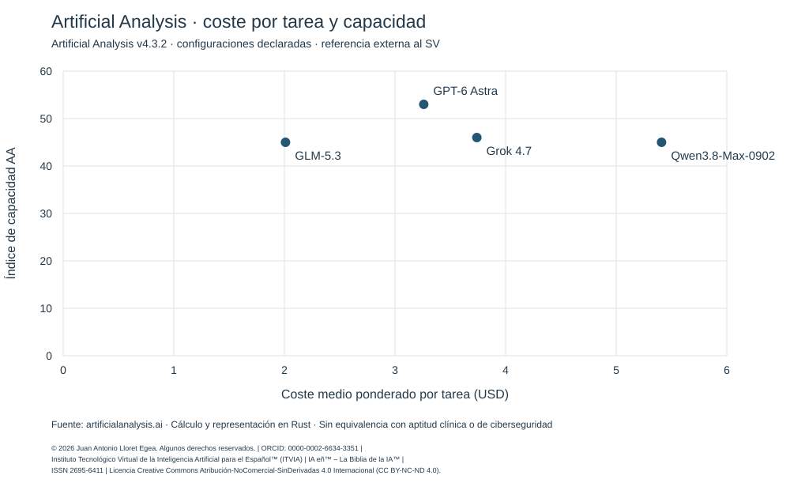

# Comparativa de costes de modelos de IA · Nodo 03

**Versión 1.0 · Consulta: 8 de octubre de 2026.** Esta comparación ordena los cuatro modelos por un criterio económico común y presenta junto a él su capacidad y sus condiciones de evaluación. Es una referencia de mercado para interpretar costes; la aptitud para un contrato del SV sigue correspondiendo a su examen y al Árbitro-Director.

## Ranquin principal: menor coste por tarea

Se utiliza el **coste medio ponderado por tarea del Artificial Analysis Intelligence Index v4.3.2**, en las configuraciones declaradas abajo. Se ordena de menor a mayor; los empates se conservan. El coste incluye el consumo considerado por esa fuente, por lo que distingue modelos que necesitan cantidades diferentes de tokens. **Es coste por tarea evaluada, no por tarea acertada.** [Metodología de la fuente](https://artificialanalysis.ai/methodology).

| Puesto económico | Modelo y ficha justificativa | Configuración externa | USD por tarea | Índice de capacidad AA¹ |
|---:|---|---|---:|---:|
| **1** | [Z.ai · GLM-5.3](glm-5.3/readme.md) | max | **2,01** | 45 |
| **2** | [OpenAI · GPT-6 Astra](gpt-6-astra/readme.md) | max | **3,26** | 53 |
| **3** | [xAI · Grok 4.7](grok-4.7/readme.md) | xhigh | **3,74** | 46 |
| **4** | [Alibaba Cloud · Qwen3.8-Max-0902](qwen3.8-max-0902/readme.md) | 0902, con razonamiento² | **5,41** | 45 |

¹ Un valor mayor indica mejor resultado en el índice externo. **No es un porcentaje de aciertos**, ni una puntuación del SV. ² La ficha Qwen no etiqueta un nivel de esfuerzo equiparable a `max` o `xhigh`. Esas etiquetas tampoco garantizan igual cómputo entre proveedores. Se conserva para cada modelo la entrada principal de la fuente, sin escoger retrospectivamente el ajuste más favorable.

Fuentes del corte: [GLM-5.3](https://artificialanalysis.ai/models/glm-5-3), [Astra](https://artificialanalysis.ai/models/gpt-6-astra), [Grok](https://artificialanalysis.ai/models/grok-4-7), [Qwen](https://artificialanalysis.ai/models/qwen3-8-max). Las cifras son las publicadas, redondeadas y fechadas; las diferencias no se presentan como significación estadística acreditada.

## Qué significa el orden

**GLM-5.3 obtiene el menor coste por tarea de esta referencia; Astra obtiene el mayor índice de capacidad entre los cuatro.** Astra precede económicamente a Grok y Qwen aunque sus tokens tengan mayor tarifa: precio unitario y consumo necesario son magnitudes diferentes. Este hallazgo amplía la comparación anterior de precios por token.

Por capacidad, el orden observado es Astra, Grok y un empate entre GLM y Qwen a la precisión publicada. La velocidad de generación y el tiempo hasta recibir respuesta constituyen otros órdenes, conservados en el informe. No se combinan mediante pesos elegidos sin una necesidad de uso definida, ni se divide el índice de capacidad por dólares para inventar una tasa de acierto.

## Informe y justificación reproducible

- [Informe comparativo: tarifas, consumo de referencia, velocidad, latencia y límites](INFORME.md).
- [Método común, reglas de actualización y criterio para un futuro examen SV comparable](METODO.md).
- [Datos fechados y fuentes](DATOS.json), [ranquin en JSON](RANQUIN.json) y [tabla descargable](RANQUIN.csv).
- [Cálculo en Rust y reproducción](calculo-rust/REPRODUCCION.md), con [manifiesto de integridad](MANIFIESTO.json).

Cada carpeta de modelo explica su posición, las reservas y el enlace a su expediente del nodo 03. La comparación pública conserva información de mercado; el archivo administrativo mantiene por separado las liquidaciones, saldos y justificantes de las cuentas. Ninguna promoción ni saldo disponible concede ventaja en este ranquin.

**Para seleccionar un modelo en el SV, un fallo crítico no puede compensarse con un menor coste o una mayor velocidad.** Esta publicación no recalifica los exámenes existentes, no acredita aptitud clínica u operativa y no ejecuta una nueva inferencia.

[Volver al nodo 03](../readme.md).

© 2026 Juan Antonio Lloret Egea. Algunos derechos reservados. | ORCID: 0000-0002-6634-3351 | Instituto Tecnológico Virtual de la Inteligencia Artificial para el Español™ (ITVIA) | IA eñ™ – La Biblia de la IA™ | ISSN 2695-6411 | Licencia Creative Commons Atribución-NoComercial-SinDerivadas 4.0 Internacional (CC BY-NC-ND 4.0).
