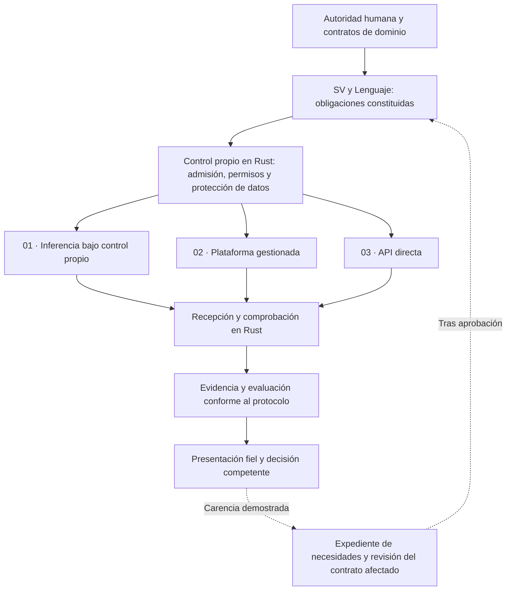

# Acoplamientos de modelos de inteligencia artificial con el Sistema Vectorial SV

**Versión documental 1.0 · 6 de octubre de 2026.**

**Estado:** organización y requisitos del trabajo experimental. La publicación de esta documentación no acredita una integración ejecutada ni la aceptación de un modelo.

## 1. Finalidad y pertenencia al sistema

Esta carpeta reúne el estudio y la realización experimental de los acoplamientos que permiten al Sistema Vectorial SV utilizar uno o varios modelos de inteligencia artificial. Pertenece al laboratorio de ensayo de IA y observabilidad de `SV-motor`. Las necesidades parten de las funciones, los dominios y las garantías del SV, se contrastan con los contratos del Lenguaje de Computación y se concretan en las realizaciones y pruebas del Motor.

La IA mantiene una función subordinada: puede contribuir a la consulta, interpretación, exposición o propuesta dentro de un alcance constituido. Su capacidad generativa no le permite alterar significados, constituir reglas de dominio, ampliar permisos o decidir su propia aceptación. El uso de Rust tampoco convierte por sí solo una respuesta probabilística en una operación determinista del SV.

Medicina, especialmente inmunología, y ciberseguridad son dominios centrales de este trabajo. Sus necesidades se conservan completas y se contrastan por separado. Una limitación de un modelo, servidor o proveedor se documenta como condición de esa realización; no justifica reducir silenciosamente el conocimiento o las garantías que requiere el dominio.

Se continúa sobre la estructura existente. La [guía del sistema conjunto][conjunto] relaciona objetivos, competencias y retorno al Lenguaje. El [expediente de necesidades de evolución][necesidades] conserva N-01–N-10 y su procedimiento de revisión. Este estudio los utiliza sin sustituirlos ni abrir una reorganización general.

## 2. Tres nodos experimentales

En esta documentación, **nodo experimental** designa una modalidad de acoplamiento con especificación, realización, pruebas y aceptación propias. No implica tres servidores, tres modelos concretos ni tres procesos físicos. Las modalidades pueden coexistir y cada una puede examinar varios modelos.

| Nodo | Modalidad y recorrido general | Responsabilidad que puede examinar el laboratorio |
|---|---|---|
| [01 · Inferencia bajo control propio](01-inferencia-bajo-control-propio/readme.md) | SV y controles en Rust ↔ motor admitido ↔ pesos de uno o varios modelos. | Configuración, motor, pesos, recursos y ejecución dentro del entorno administrado. |
| [02 · Plataforma gestionada](02-plataforma-gestionada/readme.md) | SV y controles en Rust ↔ adaptación exigida por la plataforma ↔ servicio gestionado ↔ modelo. Kaggle es el primer caso considerado. | Realización propia y comportamiento observable del servicio, con sus dependencias y límites. |
| [03 · API directa](03-api-directa/readme.md) | SV y controles en Rust ↔ adaptador del proveedor ↔ API ↔ modelo remoto. | Preparación de solicitudes, ejercicio autorizado, recepción y comprobación de resultados. |

La independencia de los nodos permite pruebas y decisiones separadas. Las obligaciones de autoridad, privacidad, fidelidad y trazabilidad proceden de las mismas fuentes competentes. Un resultado favorable en un nodo no habilita los otros ni permite sumar garantías parciales para declarar conforme el conjunto.

La modalidad depende del control efectivo y de las relaciones de servicio. Un motor administrado por el proyecto puede utilizar una API local o de red y seguir perteneciendo al nodo 01. El nodo 03 se refiere aquí al servicio de inferencia de un proveedor externo. La posición física del servidor, por sí sola, no resuelve esta clasificación.

La prioridad de evaluación acordada al abrir este estudio es OpenAI → Grok → Qwen → Claude → Z.ai. Se conservan como preferencias Sol 6.1, Grok 4.7, el candidato Qwen más alto disponible y Claude Opus 5.5; el candidato concreto de Z.ai se identificará antes de su prueba. Estas preferencias no acreditan disponibilidad, acceso, equivalencia de versiones ni conformidad. Cada encargo fijará el identificador efectivo y la modalidad compatible con sus condiciones. Kimi queda como candidato condicionado a disponibilidad, sin incorporarlo como prestación existente.

## 3. Planos de organización y sedes competentes

| Plano | Referencia y función | Tratamiento en esta carpeta |
|---|---|---|
| Matemático y semántico | Fundamentos del SV y [Programa de interfaces][interfaces]. | Referenciar condiciones de legitimidad y preservación del significado; no formular una semántica alternativa. |
| Conocimiento y dominio | Constituciones y operaciones de inmunología y ciberseguridad identificadas en la guía del sistema conjunto. | Conservar necesidad profesional, información suficiente, cobertura, restricciones y autoridad. |
| Lenguaje y arquitectura | [Arquitectura de núcleo, frontera y entorno operacional][arquitectura], [perfiles y ensamblaje][perfiles] y [contrato de enganche][enganche]. | Cotejar primero lo existente; justificar por separado cualquier insuficiencia del Lenguaje. |
| Realización experimental | Este estudio y los expedientes de cada modelo en el ensayo. | Especificar acoplamientos, preparar realizaciones Rust y conservar pruebas y límites. |
| Seguimiento y calidad | [Registro de sucesos][sucesos], [tiques técnicos][tiques] y [actas de continuidad y calidad][calidad]. | Relacionar hechos, problemas, decisiones y recepciones con sus registros vigentes. |

Las sedes ofrecen perspectivas complementarias. Se conserva una referencia competente y versionada para cada definición, requisito y decisión; una síntesis o una copia de consulta no adquiere autoridad por estar cerca del código. Las necesidades ya registradas reciben evidencia adicional en su expediente, sin crear duplicados por cambiar de modelo o proveedor.

## 4. Contrato de frontera, FFI y API

El **contrato de frontera** establece qué puede intercambiarse, por quién, con qué significado, permisos, versiones, límites y diagnósticos. Su cumplimiento exige representación, mecanismos de imposición y evidencia. No consiste únicamente en un texto de instrucciones dirigido al modelo.

Una **FFI** es un mecanismo de llamada entre lenguajes de programación. Una **API** expone operaciones de un componente o servicio y puede ser local o remota. Ambas pueden intervenir en una realización, pero ninguna sustituye al contrato. Una petición de Rust a un servicio remoto no requiere necesariamente una FFI.

También deben distinguirse dos relaciones: la frontera entre el Núcleo y su entorno operacional, y la conexión de ese entorno con el modelo. Sus obligaciones se relacionan sin confundir sus competencias. El modelo forma parte del sistema gobernado cuando su función está delimitada; no se convierte por ello en autoridad del Núcleo.

La parte común que se busca reutilizar comprende identidad, procedencia, finalidad, permisos, representación de solicitudes y resultados, tratamiento de fallos y evidencia. Cada realización declara además las capacidades y restricciones de su motor o proveedor. Una función ausente o una incompatibilidad se diagnostica; no se encubre mediante sustitución silenciosa, truncamiento o cambio de modelo.

El recorrido funcional previsto es el siguiente; las conexiones no acreditan una implementación:

## 5. Correspondencia con necesidades existentes

El expediente N-01–N-10, en la revisión citada, mantiene pendientes el cotejo y la aprobación de integración. La tabla siguiente concreta qué debe relacionar cada acoplamiento; no crea requisitos nucleares nuevos ni declara cerrados los anteriores.

| Necesidad existente | Correspondencia en los acoplamientos |
|---|---|
| N-01 · Identidad y autoridad | Realización, modelo, fuentes y operaciones efectivamente utilizadas; facultades propias y del servicio remoto. |
| N-02 · Recepción documental | Documentos y localizadores, integridad de la entrada, orden, excepciones y control del contexto entregado. |
| N-03 · Incidencias y continuación | Interrupción, respuesta parcial, repetición, recuperación y ausencia de duplicación o efectos supuestos. |
| N-04 · Retroalimentación SV | Antecedentes propios completos, revisiones acotadas y separación de las claves externas. |
| N-05 · Adjudicación y criticidad | Corrección independiente, criterios previos, posiciones críticas y decisión competente de continuidad. |
| N-06 · Vector y frame | Correspondencia con el estado y las posiciones; fidelidad de la presentación al profesional. |
| N-07 · Configuración y recursos | Modelo y configuración solicitados y aplicados, contexto, caché, memoria, consumo y límites observables. |
| N-08 · Procedencia documental | PDF, extracción y fragmentos cuando ese recorrido intervenga; límites de lectura y transformación declarados. |
| N-09 · Privacidad y permisos | Finalidad, destinatarios, mediación, vigencia y tratamiento de información y derivados. |
| N-10 · Conservación y aceptación | Configuración, resultados y evidencias recuperables; funcionamiento restaurado sólo cuando se haya probado. |

Las obligaciones específicas se vinculan a su fuente, versión, mecanismo, caso de prueba, resultado y decisión. Cuando una necesidad no esté cubierta, se justificará su incorporación al expediente competente antes de atribuirle condición constituida.

## 6. Protección de datos y límites tecnológicos

El [estudio BIS-03][privacidad] exige determinar origen, categorías de información, finalidad, permisos, destinatarios, conservación, derivados, errores y condiciones de habilitación. Estas obligaciones se concretan antes de activar la conexión correspondiente. La carga de información en un cuaderno remoto ya es comunicación a un tercero, aunque todavía no se haya llamado al modelo.

El alcance inicial utiliza datos completamente artificiales, revisados antes de transmitirlos. Los datos de salud seudonimizados, las historias clínicas y los registros privados de ciberseguridad quedan fuera de esa primera fase. Una declaración de anonimización requiere evidencia contextual; cifrar, eliminar nombres o conservar una huella no basta por sí solo. Un tratamiento ulterior necesitará su evaluación jurídica contextual, autorización y pruebas propias.

Se examinan también instrucciones, respuestas, adjuntos, registros, cachés, copias, restauraciones y supresiones. La devolución de una respuesta no autoriza su incorporación al conocimiento del dominio. Las evidencias deben permitir revisión sin divulgar datos protegidos ni credenciales.

El gobierno, la semántica, las decisiones y las comprobaciones propios se realizan en Rust. En el nodo 02 sólo se admite Python como adaptación instrumental mínima cuando la plataforma lo exija y su frontera haya sido delimitada y comprobada. La implementación del motor remoto en los nodos 02 y 03 permanece fuera del control propio; se distingue expresamente de los componentes Rust del SV.

Una biblioteca o enlace Rust no demuestra que todas sus dependencias estén realizadas en Rust ni que una dependencia nativa quede aislada. Esto se aplica también a DuckDB cuando intervenga como medio de consulta o persistencia: deberán declararse su realización, ubicación, permisos, extensiones y acceso a datos. Su disponibilidad no acredita anonimización ni protección integral.

## 7. Método experimental y condiciones de aceptación

Cada ensayo identifica previamente función y dominio, contratos aplicables, candidato y versión, fuentes, entrada efectiva, criterios de contenido y forma, criticidad, límites de ejecución y causas de parada. La disponibilidad comercial o el tamaño de un modelo no sustituyen estas condiciones.

Las pruebas de acoplamiento y las pruebas del modelo responden a preguntas diferentes. Primero se demuestra que las entradas, salidas, permisos, límites y diagnósticos se comportan como se especificó. Después se examina la corrección del candidato con una clave externa reservada. La aceptación de una realización se limita a la configuración y función acreditadas.

Cuando se aplique revisión adversarial documental, se hará sobre el conjunto completo previsto, con una política uniforme y fijada de antemano. No se seleccionan únicamente las respuestas erróneas ni se revela al candidato la clave de evaluación. Se conservan mantenimientos, correcciones y regresiones, incluidas 0→1 y 0→U. La revisión no implica modificar pesos.

Los valores de evaluación 0, 1 y U se aplican conforme al protocolo competente; una respuesta correctamente fundada en insuficiencia de evidencia puede recibir 0. Falta de ejecución, fallo de transporte, rechazo del servicio y respuesta incompleta conservan su diagnóstico propio. No se transforman automáticamente en U ni permiten calcular una puntuación de conjunto como si todas las posiciones fueran evaluables. En los servicios remotos se confirma además el ámbito de pruebas permitido.

Se distinguen cuatro comprobaciones: identidad y conservación; conformidad instrumental; conformidad semántica; y conformidad del candidato. Ninguna sustituye a las restantes. Las comparaciones entre nodos declaran las diferencias de modelo, formato, contexto, herramientas y servicio; no atribuyen causalidad al transporte si también cambian esas condiciones.

## 8. Documentación y retorno al SV

Cada nodo conservará, cuando exista trabajo material, su especificación experimental, realización identificada, pruebas positivas y negativas, resultados, incidencias y decisión de aceptación con límites explícitos. Esta edición sólo constituye su organización documental y las obligaciones de preparación.

Los hechos comprobados se relacionan con el registro de sucesos; las deficiencias y sus condiciones de resolución, con el tique correspondiente; las valoraciones y decisiones, con las actas de calidad. Se reutilizan las referencias existentes y se identifica cualquier alta que proceda. Este README no crea un registro paralelo ni asigna números de sucesos, tiques o actas.

El retorno sigue el procedimiento existente: necesidad observada → cotejo de contratos y capacidades → localización de la insuficiencia → corrección de la realización o propuesta mínima de evolución → revisión y autorización competentes → pruebas y recepción. Un fallo del candidato no demuestra automáticamente una carencia del Lenguaje. Una carencia del Lenguaje tampoco debe ocultarse como limitación del candidato.

La apertura de una carpeta, la aceptación de una solicitud de recursos o una prueba aislada no acreditan una integración. Esta documentación no reanuda por sí sola fases nucleares, habilita datos reales ni autoriza contratación. Los permisos y presupuestos de una ejecución se concretarán en su encargo.

## 9. Fuentes, versiones y mantenimiento

| Referencia | Corte utilizado y función |
|---|---|
| [Guía del sistema conjunto][conjunto] | Revisión 2, 27/09/2026; texto consultado en Motor `9a3bfb73210904e44dbcd1492eb39dfc553f418e`. Relación de objetivos, sedes y retorno. Los estados históricos de modelos conservan su fecha. |
| [Necesidades N-01–N-10][necesidades] | Versión 1.0, 04/10/2026, revisión aportada `433d56195b47ec67d702c0bb6eed769641763a0b`; texto coincidente con el corte del Lenguaje consultado. |
| [Arquitectura][arquitectura], [perfiles][perfiles] y [enganche][enganche] | Fuentes técnicas subordinadas a fundamentos y restricciones del SV. Corte del Lenguaje: `cf32c5488dd0f1b2cf25b22121575f80de00dd74`. |
| [BIS-03][privacidad] | Estudio del 15/09/2026 consultado en ese mismo corte. Requisitos y condiciones de habilitación; no certificación de cumplimiento. |
| [Programa de interfaces][interfaces] | Sede científica en Matemática-Semántica; corte `b8fd32978292d25adf9b87cf71e409005dce642c`. |
| [Sucesos][sucesos], [tiques][tiques] y [calidad][calidad] | Enlaces de seguimiento vigente; sus revisiones deben identificarse al utilizar una decisión concreta. |

Las referencias fijas permiten reconstruir esta edición. Una decisión posterior recibida se incorporará con su alcance y procedencia, preservando el antecedente. No se deduce vigencia del nombre de una carpeta ni del título fechado de un documento. Los README particulares desarrollan lo específico de cada nodo y remiten a este marco común.

Esta documentación conserva la licencia indicada al pie. Las dependencias de terceros mantienen sus licencias. El eventual paquete abierto de evaluación destinado al programa de Kaggle tendrá una delimitación propia de archivos y permisos; su compromiso de apertura no modifica automáticamente las licencias del Núcleo, la DSL o estos documentos.

[conjunto]: https://github.com/juantoniolloretegea/SV-motor/blob/9a3bfb73210904e44dbcd1492eb39dfc553f418e/laboratorio/sistema-conjunto-lenguaje-computacion-ia-gobernada/README.md
[necesidades]: https://github.com/juantoniolloretegea/SV-lenguaje-de-computacion/blob/433d56195b47ec67d702c0bb6eed769641763a0b/docs/evoluciones-desde-el-nucleo-no-cotejadas-generadas-por-pruebas-con-la-ia-sin-aprobacion-aun/readme.md
[arquitectura]: https://github.com/juantoniolloretegea/SV-lenguaje-de-computacion/blob/cf32c5488dd0f1b2cf25b22121575f80de00dd74/docs/calidad/ACTA_TECNICA_DE_ARQUITECTURA_DE_SOFTWARE_NUCLEO_FRONTERA_Y_HOST_SV_2026_09_04.md
[perfiles]: https://github.com/juantoniolloretegea/SV-lenguaje-de-computacion/blob/cf32c5488dd0f1b2cf25b22121575f80de00dd74/docs/calidad/ACTA_TECNICA_DE_PERFILES_CONTRATOS_Y_ENSAMBLAJE_DEL_LENGUAJE_SV_2026_09_06.md
[enganche]: https://github.com/juantoniolloretegea/SV-lenguaje-de-computacion/blob/cf32c5488dd0f1b2cf25b22121575f80de00dd74/docs/arquitectura/CONTRATO_DE_ENGANCHE_DE_INTERFACES_FUTURAS_Y_ABI_SEMANTICO_DIAGNOSTICO_MINIMO.md
[privacidad]: https://github.com/juantoniolloretegea/SV-lenguaje-de-computacion/blob/cf32c5488dd0f1b2cf25b22121575f80de00dd74/docs/calidad/tuberias-ia/continuacion-15-09-2026/ESTUDIO_PRIVACIDAD_BIS03_2026_09_15.md
[interfaces]: https://github.com/juantoniolloretegea/SV-matematica-semantica/tree/b8fd32978292d25adf9b87cf71e409005dce642c/documentos/programa_interfaces_sv
[sucesos]: https://github.com/juantoniolloretegea/SV-lenguaje-de-computacion/blob/main/docs/calidad/Inventario-sv/sucesos/SUCESOS_SV.md
[tiques]: https://github.com/juantoniolloretegea/SV-lenguaje-de-computacion/tree/main/docs/calidad/Inventario-sv/tiques-tecnicos
[calidad]: https://github.com/juantoniolloretegea/SV-lenguaje-de-computacion/tree/main/docs/calidad/tuberias-ia/continuacion-15-09-2026

© 2026 Juan Antonio Lloret Egea. Algunos derechos reservados. | ORCID: 0000-0002-6634-3351 | Instituto Tecnológico Virtual de la Inteligencia Artificial para el Español™ (ITVIA) | IA eñ™ – La Biblia de la IA™ | ISSN 2695-6411 | Licencia Creative Commons Atribución-NoComercial-SinDerivadas 4.0 Internacional (CC BY-NC-ND 4.0).
