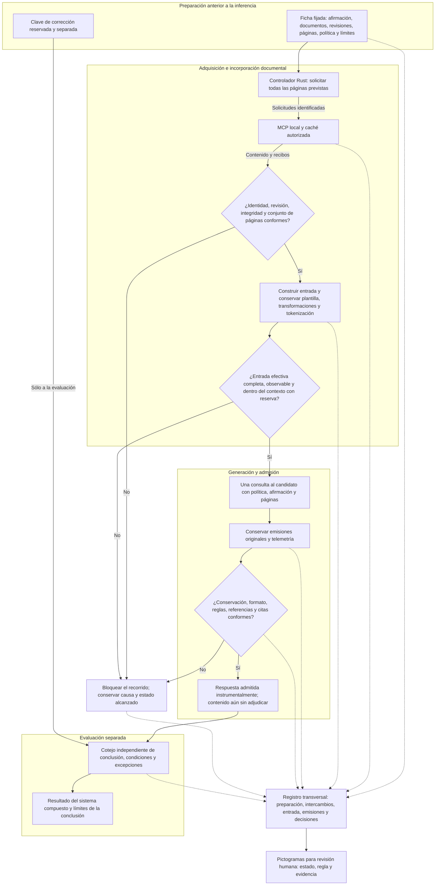

# Diseño del sistema de clasificación con control documental

**Edición 1 · 2 de octubre de 2026.** Especificación propuesta, no implementación acreditada. [Presentación y alcance](README.md) · [Comprobaciones exigidas](VERIFICACION.md).

## 1. Objeto y responsabilidad

El sistema compuesto debe permitir distinguir una entrega documental defectuosa de una interpretación incorrecta aun disponiendo de las fuentes pertinentes. El controlador ejecutará obligaciones verificables; el modelo conservará la responsabilidad de clasificar y fundamentar su respuesta.

**En esta primera versión, el controlador obtiene e incorpora todas las páginas fijadas para el caso antes de consultar al modelo.** No se examina búsqueda autónoma ni descubrimiento de páginas por el candidato. Esa asistencia forma parte del objeto evaluado y debe figurar en sus resultados.

La suficiencia del conjunto documental se revisa antes de la ejecución. «Todas las páginas previstas» no equivale a «todas las fuentes pertinentes de cualquier problema abierto». El primer alcance utiliza un corpus pequeño y cerrado.

| Componente | Responsabilidad | Evidencia o producto |
| --- | --- | --- |
| Preparación del contraste | Fijar afirmación, fuentes, revisiones, páginas, política, criterios, criticidad y límites. Separar la clave de corrección. | Ficha del caso y referencia reservada, ambas identificadas antes de inferir. |
| Caché documental | Conservar los originales autorizados y sus versiones. | Documentos y manifiesto de identidad. |
| Servicio MCP | Responder a las lecturas autorizadas, sin acceso documental exterior durante el contraste. | Solicitudes, devoluciones, errores y referencias de página. |
| Controlador Rust | Ejecutar las lecturas, comprobar la entrada efectiva, conservar el recorrido y gobernar la admisión. | Recibos documentales, entrada cotejada, decisiones y motivos. |
| Motor y modelo | Recibir la entrada identificada, generar la clasificación y expresar su fundamento. | Emisiones originales y telemetría disponible. |
| Evaluación independiente | Contrastar clasificación, fundamento, condiciones y excepciones con la referencia reservada. | Resultado motivado, terna y alcance aplicables. |
| Registro de evidencias | Vincular y conservar todos los objetos observables del recorrido. | Secuencia de acontecimientos y objetos cotejados. |
| Presentación mediante pictogramas | Mostrar obligaciones y estados a partir del registro. | Símbolo, texto, identificador de regla y enlace a la evidencia. |

## 2. Diagrama funcional



**Lectura del diagrama.** Las flechas continuas muestran el recorrido y sus dependencias. Las discontinuas representan conservación de evidencias, sin intervención sobre el contenido del candidato. La clave reservada no tiene conexión con la entrada del modelo. El registro abarca cada petición y devolución, aunque el dibujo agrupe operaciones para facilitar su lectura.

El bloqueo detiene el recorrido afectado. Si falla identidad, aislamiento, integridad, control o custodia del conjunto, se detiene la ejecución completa. Un fallo acotado sólo permite continuar otro caso cuando se acredita su independencia y se conserva íntegramente el incidente. No existe una salida alternativa que permita presentar una emisión como admitida eludiendo los controles.

## 3. Diagrama de intercambio y puntos de comprobación

```mermaid
sequenceDiagram
    participant C as Controlador Rust
    participant D as MCP y caché local
    participant M as Motor y candidato
    participant R as Registro de evidencias
    participant E as Evaluación independiente
    C->>R: Conservar ficha, política, configuración y versiones
    loop Cada página fijada en la ficha
        C->>R: Registrar solicitud y su identidad
        C->>D: Pedir documento, revisión y página
        D-->>C: Devolver contenido, identidad y estado
        C->>R: Conservar respuesta original y cotejo
    end
    C->>C: Verificar conjunto completo y ausencia de sustituciones
    C->>C: Construir y cotejar la entrada efectiva y su capacidad
    C->>R: Conservar entrada, transformaciones y resultado de controles
    alt Alguna precondición no se acredita
        C->>R: Bloqueo anterior a la inferencia; causa y alcance
    else Precondiciones comprobadas
        C->>M: Política, afirmación y páginas completas; sin clave reservada
        loop Durante la única generación prevista
            M-->>C: Emisiones por canal y datos observables
            C->>R: Conservar originales y telemetría
        end
        C->>C: Validar finalización, estructura, referencias y citas
        C->>R: Conservar decisión de admisión y motivos
        alt Requisitos instrumentales conformes
            C->>E: Respuesta original y expediente instrumental
            Note over E: Recibe por vía separada la clave fijada antes de inferir
            E->>R: Cotejo semántico, adjudicación y reservas
        else Requisito incumplido o no comprobable
            C->>R: Bloqueo posterior a generación; original conservado
        end
    end
```

El motor debe ofrecer un punto de observación suficiente para vincular la entrada cotejada con la generación efectiva. Conservar el texto que se quiso enviar no demuestra que se utilizara íntegro. Si la integración no permite comprobar esta frontera, el diseño no está listo para el contraste.

## 4. Contrato de entrada y autoridad

La ficha del caso contendrá, como mínimo: identidad y revisión del contraste; identidad del caso; afirmación; documentos y revisiones; conjunto exacto de páginas; política y reglas con identificadores; formato esperado; criticidad; límites de contexto, memoria, tiempo técnico y generación; y criterio de conservación. La clave científica se conserva por separado y no será accesible al recorrido de generación.

Cada página se vinculará a un documento y una revisión, con numeración y convención de índices expresas, contenido y huella. El conjunto recibido debe coincidir con el exigido; contar páginas no basta. Una página repetida no sustituye a otra ausente. Toda transformación de representación debe quedar definida, conservada y cotejada; no se permite una normalización que altere sentido, condiciones, cifras o excepciones.

La incorporación se comprueba después de construir la representación conversacional efectiva, incluidas plantilla y tokenización. Debe caber el contenido íntegro con las reservas de generación y recursos fijadas. Si no cabe, falta contenido o existe truncamiento, se detiene antes de inferir; no se recorta, resume, sustituye ni amplía el contexto silenciosamente.

Los documentos y las emisiones del candidato son datos. No pueden cambiar el catálogo, la política, los criterios, la criticidad ni los estados del controlador. Instrucciones incrustadas en un documento no adquieren autoridad. El modelo y el servicio documental deben carecer de rutas de acceso a Internet o a otras fuentes durante el contraste; esta condición se comprueba en el entorno y en la interfaz, además de expresarse en la política.

## 5. Obligaciones comprobables

Los identificadores siguientes corresponden a esta edición de diseño; su realización deberá conservar una correspondencia inequívoca entre regla, comprobación y evidencia.

| Regla | Condición exigida | Evidencia propia del controlador | Consecuencia si no se acredita |
| --- | --- | --- | --- |
| O01 · Autoridad e identidad | Caso, política, configuración y corpus coinciden con las revisiones fijadas. | Fichas y cotejos de identidad. | No admitir la consulta. |
| O02 · Cobertura | Conjunto exacto de páginas recibido, íntegro y sin sustituciones. | Solicitudes, devoluciones y cotejo del conjunto. | No admitir la consulta. |
| O03 · Incorporación | Todo el contenido exigido pertenece a la entrada efectiva y cabe con reserva. | Entrada, plantilla, transformaciones, tokenización y punto de admisión del motor. | No admitir la consulta. |
| O04 · Aislamiento y control | Se conservan las fuentes permitidas, los límites y una sola secuencia prevista por caso. | Configuración comprobada y acontecimientos de ejecución. | Detener con el alcance que corresponda. |
| O05 · Salida identificable | Existe finalización comprobada y la estructura y categorías son válidas. | Original y resultado de validación. | No admitir la salida; no repararla. |
| O06 · Referencias y fragmentos | Identificadores autorizados y citas literales localizables en lo incorporado. | Cotejo de referencias y fragmentos. | No admitir la salida como conforme. |
| O07 · Custodia | Los objetos exigidos y sus relaciones están conservados y cotejados. | Manifiesto, huellas y recuperación verificada. | No declarar recepción conforme; detener si la pérdida compromete el control. |
| O08 · Evaluación de contenido | Una recepción competente contrasta significado, condiciones y excepciones. | Adjudicación motivada frente a la clave reservada. | Mantener evaluación pendiente o registrar el resultado desfavorable; nunca presumir corrección. |

O01–O07 son obligaciones instrumentales. O08 pertenece a una función evaluadora separada. Un campo escrito por el modelo, como «he leído todas las páginas», no constituye evidencia para O02 u O03.

## 6. Salida del candidato, admisión y estados

La ficha de respuesta solicitará: identidad del caso; una clasificación entre `RESPALDADA`, `CONTRADICHA` y `EVIDENCIA_INSUFICIENTE`; identificadores de las reglas aplicadas; referencias a documentos, revisiones y páginas; fragmentos probatorios literales; y justificación breve. Cada referencia deberá señalar contenido efectivamente incorporado. La ausencia justificada de un fragmento probatorio positivo en la clase de insuficiencia se definirá en el criterio previo, sin fabricar citas ni exigir una prueba textual de inexistencia.

Para el primer formato se usarán fragmentos continuos literales. Una conclusión que dependa de varias partes deberá referenciarlas por separado. La justificación puede reformular el texto, siempre que conserve contenido, condiciones, negaciones, unidades, ámbito y excepciones. La coincidencia literal de una cita es una comprobación de procedencia, no una prueba de que respalde la conclusión.

La validación del formato es obligatoria. Una gramática que restrinja la generación será opcional y sólo se incorporará tras acreditar compatibilidad con el motor, el formato conversacional y todos los canales observables. La restricción de forma no hace determinista la interpretación ni garantiza verdad.

| Estado del recorrido | Condición para alcanzarlo | Salida autorizada |
| --- | --- | --- |
| Preparado | Ficha y autoridad fijadas. | Solicitudes documentales previstas. |
| Documentación cotejada | O01 y O02 conformes. | Construcción de la entrada. |
| Entrada admitida | O03 y controles previos O04 conformes. | Una consulta prevista. |
| Generación en curso | Entrada admitida y conservación activa. | Emisiones originales para auditoría, todavía no respuesta admitida. |
| Original conservado | Finalización y originales disponibles. | Validación de O05–O07. |
| Admitido instrumentalmente | Requisitos de salida y custodia conformes. | Evaluación independiente del contenido. |
| Evaluado | Cotejo independiente documentado. | Resultado motivado con alcance y reservas. |
| Bloqueado | Requisito incumplido o no comprobable. | Causa, atribución provisional y originales disponibles; sin corrección automática. |

No se generará otra respuesta para mejorar una fallida, ni se corregirá el original antes de conservarlo. La posible atribución será instrumental, del candidato o no determinada, con su evidencia. La existencia de un bloqueo no asigna automáticamente un valor científico.

La clasificación `EVIDENCIA_INSUFICIENTE` puede ser correcta para el caso y no equivale por sí sola a U. La terna SV, la puntuación y la declaración de aptitud pertenecen al criterio de evaluación del contraste. Un impedimento técnico se conserva aparte. La admisión instrumental tampoco significa «Apto».

## 7. Pictogramas asociados a obligaciones

En la primera versión, los pictogramas se destinan a la revisión humana. Se obtienen del registro del controlador y de la evaluación, nunca del testimonio del modelo. Su función es hacer visible qué se exigía, qué se comprobó y dónde está la evidencia.

| Representación prevista | Obligaciones representadas | Texto de interpretación |
| --- | --- | --- |
| Documento identificado | O01 | Documento y revisión cotejados. |
| Conjunto de páginas | O02 y O03, mostradas por separado | Páginas recibidas; páginas incorporadas a la entrada efectiva. |
| Acceso restringido | O04 | Fuentes y límites comprobados para esta ejecución. |
| Ficha de respuesta | O05 | Finalización y estructura conformes. |
| Cita vinculada | O06 | Fragmento localizado en el contenido incorporado. |
| Archivo de evidencias | O07 | Conservación y recuperación cotejadas. |
| Examen del contenido | O08 | Evaluación realizada; mostrar además su resultado y alcance. |

Cada elemento incluirá regla y versión, estado, fecha del acontecimiento, identidad del caso y enlace a su evidencia. Estados operativos: **pendiente, comprobado, incumplido o no comprobable**. Color, símbolo y texto se complementan; el color no será el único portador del significado. No se mostrará conformidad general mientras el contenido permanezca pendiente, ni un símbolo de éxito por el solo hecho de haberse realizado una evaluación desfavorable.

Los pictogramas no son valores 0/1/U ni dictámenes. No se transmiten imágenes o braille al modelo en este primer alcance. Una eventual utilidad de esas representaciones para el candidato exigiría otro contraste de contenido equivalente y una entrada compatible, sin deducir mejora de comprensión por su apariencia.

## 8. Contraejemplo que debe poder distinguirse

Ejemplo ilustrativo, excluido de los casos reservados:

- Página 0: el intervalo ordinario de inspección es de doce meses.
- Página 1: con señal R, el intervalo es de tres meses; esta excepción prevalece.
- Dato: R está presente. Afirmación: «El intervalo aplicable es de doce meses».

Si falta la página 1, el controlador debe impedir la consulta. Si ambas páginas están incorporadas y el modelo responde «respaldada» citando literalmente la página 0, puede cumplir estructura y procedencia, pero su conclusión es incorrecta. La evaluación semántica debe identificar la excepción ignorada. Así se distingue entrega insuficiente de interpretación incorrecta sin convertir una cita auténtica en prueba de verdad.

Si las premisas y una regla de dominio se formalizan y validan, un programa podrá comprobar esa conclusión concreta. No se presupone un comprobador universal del significado ni se introduce otro modelo como juez infalible.

## 9. Conservación y reconstrucción

Conservar, vinculados por identidad y secuencia: caso y política; configuración y versiones del controlador, MCP, motor, modelo y tokenizador; corpus original y páginas; solicitudes y devoluciones MCP; transformaciones; entrada efectiva; parámetros y condiciones de generación; emisiones originales por canal; finalización, errores e interrupciones; decisiones de admisión; evaluación; y telemetría de tiempo, memoria y control disponible.

El registro será acumulativo. Las correcciones documentales se incorporarán como revisiones relacionadas, sin sobrescribir el original. Debe acreditarse la conservación previa a la admisión y verificarse su recuperación para la entrega. Un fallo del propio registro exige detener y conservar por un medio independiente disponible la evidencia del fallo; si ni siquiera puede acreditarse esa conservación, se declara la carencia y no se presenta el expediente como completo.

Se conservará la emisión de análisis cuando el motor la produzca y sea observable. Esto no equivale a observar todo el cálculo interno ni a probar que el texto de análisis explique fielmente sus causas. La frontera que debe ser auditable abarca las operaciones instrumentales y todas las emisiones accesibles; no se promete acceso a estados internos no instrumentados.

Un tercero deberá poder reconstruir qué se proporcionó, qué ocurrió, qué controles se aplicaron y por qué se admitió o bloqueó la respuesta. Una ejecución experimental similar exige las mismas identidades y condiciones declaradas, pero no presupone palabras idénticas. Las diferencias de significado se evaluarán; no se aceptarán por conservar la estructura. Las huellas acreditan identidad de objetos, no verdad científica.

## 10. Realización y retorno

El desarrollo y las comprobaciones propias se realizarán en Rust. Se conservará el MCP disponible si satisface el contrato. Un cambio de SDK requerirá demostrar su necesidad y comprobarlo; no se adopta por actualidad o por incorporar más funciones. La primera realización no incluirá Stateright, Regorus, un editor visual general, entrenamiento ni cambios de pesos.

La secuencia de continuación es: **controlador comprobado sin modelo → integración efectiva acreditada → contraste nuevo finito → decisión sobre la utilidad del sistema compuesto**. Los requisitos de cada etapa y las condiciones para detenerla figuran en [VERIFICACION.md](VERIFICACION.md). Los resultados y dictámenes de experimentos anteriores permanecen intactos.

---

Sistema Vectorial SV · [CC BY-NC-ND 4.0](https://creativecommons.org/licenses/by-nc-nd/4.0/deed.es). Los componentes de terceros conservan sus licencias.
