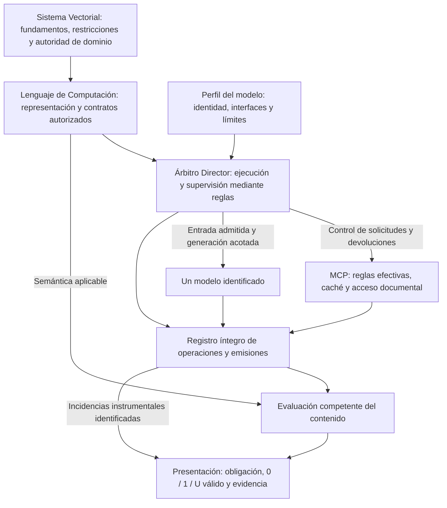
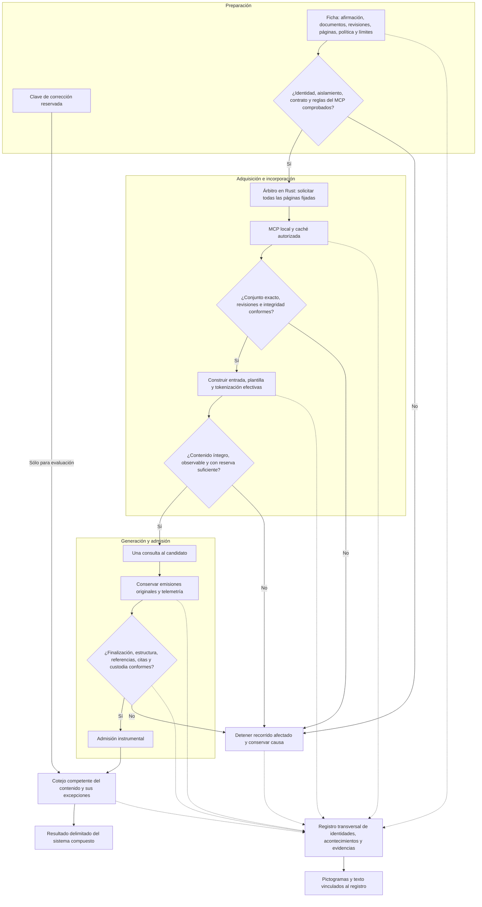
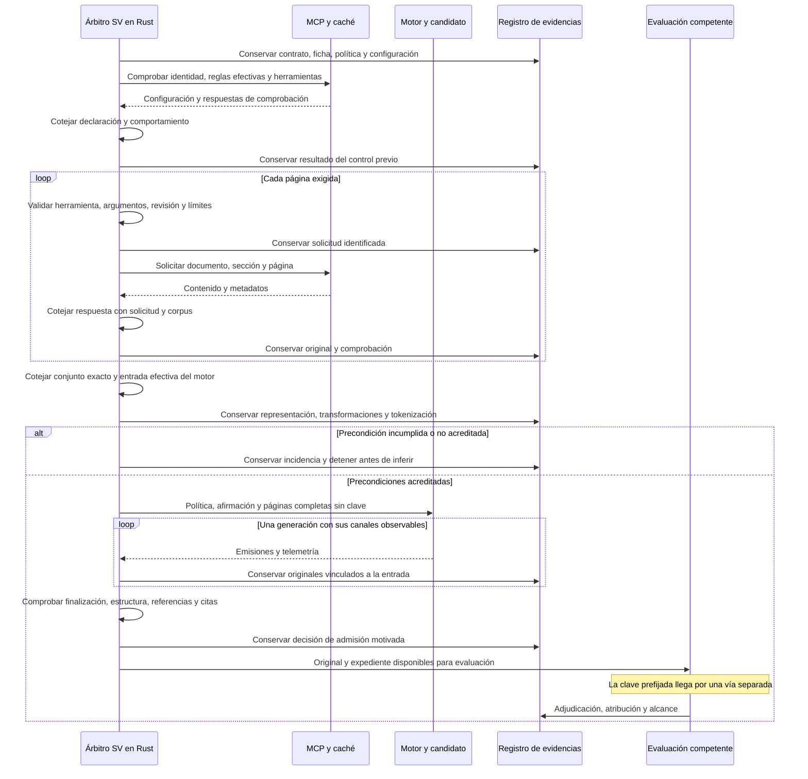
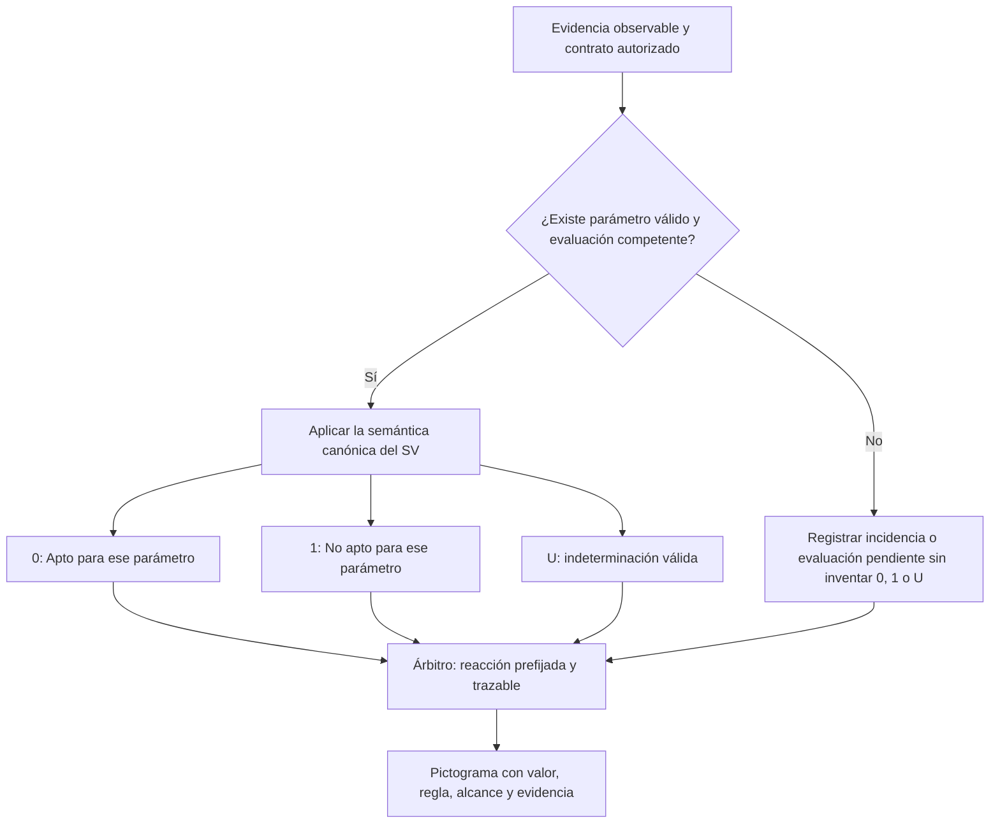

# Diseño del Árbitro Director del Lenguaje de Computación SV

**Diseño definido · 2 de octubre de 2026.** [Presentación](README.md) · [Verificación](VERIFICACION.md).

## 1. Gobierno y responsabilidad

El Árbitro Director es un componente previsto del Lenguaje de Computación SV, gobernado por los contratos, las restricciones y la semántica del SV. Dirige la ejecución de un modelo identificado y reacciona a incidencias mediante reglas explícitas. Su función comprende la preparación documental, el servicio MCP y sus reglas, la entrada efectiva del motor, la generación, la conservación y la admisión de resultados.

La autoridad de dominio constituye las obligaciones y los criterios aplicables. El Lenguaje comprueba y conserva esa representación. El Árbitro ejecuta las operaciones permitidas y presenta sus evidencias. El candidato y los documentos no pueden modificar dichas autoridades.

La implementación deberá identificar qué elementos del Lenguaje están realmente representados y disponibles. No basta denominar «contrato SV» a un texto de instrucciones ni atribuir a un componente declarado capacidades todavía no compiladas o utilizadas.

### Diagrama de gobierno

El perfil adapta el recorrido a un candidato sin alterar los fundamentos del SV. El Árbitro no selecciona automáticamente modelos, no delega su dirección en otra IA y no establece una segunda álgebra en el alojamiento o en el transporte.

## 2. Diagrama funcional

Las flechas continuas expresan el recorrido. Las discontinuas expresan conservación. La clave de corrección queda fuera de la entrada y de las herramientas del modelo.

Una pérdida de identidad, aislamiento, integridad, control o custodia detiene la ejecución afectada. Las emisiones producidas antes de un bloqueo se conservan como originales, aunque no sean admitidas. No existe una vía de publicación que eluda la admisión.

## 3. Intercambios y fronteras observables

El punto de observación de la entrada debe corresponder a lo que el motor admite realmente, después de aplicar plantilla y tokenización. El texto preparado para enviar no demuestra por sí solo su incorporación. Si esta frontera no puede cotejarse, la integración no está preparada para el contraste.

## 4. Contrato, algoritmo y reacción

La ficha identifica el caso, su revisión, la afirmación, las fuentes y sus revisiones, el conjunto exacto de páginas, la política, el formato esperado, las obligaciones, la criticidad, los recursos y el criterio de cierre. La clave de corrección se conserva en un ámbito inaccesible al candidato.

La secuencia mínima es:

1. Verificar autoridad, identidad, configuración efectiva y aislamiento.
2. Obtener mediante MCP cada página fijada y cotejar su identidad y contenido.
3. Comprobar la igualdad del conjunto esperado y el recibido. Una página duplicada no sustituye a una ausente.
4. Construir la entrada completa y cotejar su representación efectiva, contexto y reserva.
5. Admitir una generación sólo cuando sus precondiciones estén acreditadas.
6. Conservar todas las emisiones originales y la telemetría durante el cálculo.
7. Validar el resultado sin reescribirlo y conservar las decisiones de admisión.
8. Someter el contenido a la evaluación competente y presentar resultado y evidencias.

Cada reacción queda prefijada por la regla correspondiente: continuar una operación autorizada, obtener evidencia pendiente por una ruta permitida, mantener la decisión sin resolver o detener. El Árbitro no suaviza obligaciones, altera el corpus ni repite generaciones para obtener un resultado favorable.

Si el conjunto no cabe con la reserva necesaria, se detiene antes de inferir. No se permite recortar, resumir o sustituir páginas, ni ampliar silenciosamente el contexto. La recuperación de una incidencia exige conservar su causa y acreditar una nueva condición de admisión; no constituye permiso general de reintento.

### Control del MCP

Antes de comenzar se cotejan su realización, configuración cargada, reglas, herramientas expuestas y acceso efectivo a archivos y red. Las huellas acreditan identidad; las pruebas de comportamiento acreditan que las reglas se aplican.

Antes de cada solicitud se comprueban identidad del caso, herramienta permitida, argumentos, localizadores y límites. Después de cada devolución se cotejan correspondencia, revisión, contenido, formato e incidencias. Ambas fronteras conservan sus originales.

Las pruebas deben incluir solicitudes legítimas y solicitudes prohibidas. Bloquear todo no demuestra un servicio correcto. Ningún acceso directo del candidato, una ruta alternativa o una instrucción documental puede eludir al Árbitro. El aislamiento se aplica también en el entorno de ejecución.

## 5. Obligaciones y evidencias

| Obligación | Exigencia | Evidencia |
| --- | --- | --- |
| O01 · Autoridad e identidad | Coincidencia de caso, reglas, corpus y realizaciones con lo fijado. | Referencias y cotejos de identidad. |
| O02 · Cobertura | Conjunto completo de páginas, sin sustituciones. | Solicitudes, devoluciones y comparación del conjunto. |
| O03 · Incorporación | Contenido íntegro en la entrada efectiva y con reserva. | Representación, tokenización y admisión del motor. |
| O04 · Reglas y aislamiento | Aplicación efectiva de límites y reglas, incluido el MCP. | Configuración, pruebas externas y control de operaciones. |
| O05 · Salida | Finalización y estructura válidas. | Emisión original y comprobación. |
| O06 · Referencias y citas | Procedencia comprobada de referencias y fragmentos. | Cotejo con lo incorporado. |
| O07 · Custodia | Objetos y relaciones conservados y recuperables. | Manifiesto, huellas y recuperación cotejada. |
| O08 · Contenido | Conclusión fiel, con condiciones y excepciones pertinentes. | Evaluación competente frente a referencia reservada. |

La tabla identifica obligaciones; **no constituye por sí misma una célula SV ni autoriza asignar n = 8**. O01–O07 describen comprobaciones instrumentales. O08 requiere adjudicación del contenido. El testimonio del modelo sobre lo que leyó no acredita O02 ni O03.

## 6. Terna del SV, incidencias y aptitud

Los [pilares del Lenguaje](https://github.com/juantoniolloretegea/SV-lenguaje-de-computacion/blob/main/docs/calidad/PILARES_Y_RESTRICCIONES_DE_DISENO_DEL_LENGUAJE_DE_COMPUTACION_SV_2026_09_05.md) y los [fundamentos del SV](https://github.com/juantoniolloretegea/SV-matematica-semantica/blob/b8fd32978292d25adf9b87cf71e409005dce642c/documentos/fundamentos/README.md) gobiernan su interpretación:

| Valor | Significado | Condición de uso |
| --- | --- | --- |
| 0 | Apto respecto del parámetro constituido. | Evaluación válida que acredita el cumplimiento exigido. |
| 1 | No apto respecto del parámetro constituido. | Evaluación válida que acredita el incumplimiento. |
| U | Indeterminado. | Parámetro válidamente constituido cuya evaluación permanece indeterminada. |

Los acontecimientos técnicos y las fases del recorrido se registran con su descripción y evidencia. Un error de red, memoria, referencia, conservación o representación no es una evaluación U. Tampoco «operación terminada» implica 0. Una falta documental causada por el instrumento es una incidencia; una omisión del candidato evaluada sobre un requisito válido puede justificar 1. La atribución exige evidencia.

La terna expresa la evaluación; no prescribe por sí sola una acción universal. Una regla autorizada vincula cada resultado con la operación permitida. El Árbitro no resuelve U por conveniencia ni convierte una carencia instrumental en valoración de dominio.

La clasificación de una célula completa exige **n = b², b ≥ 3**, orden posicional fijado y valores válidos en todas sus posiciones. El umbral es **T(n) = ⌊7n/9⌋** conforme a la función canónica: N1 ≥ T(n) determina No apto, N0 ≥ T(n) determina Apto y los restantes casos son indeterminados. No se completan posiciones ausentes con U ni se aplica esta regla a una colección arbitraria de comprobaciones.

Las relaciones de compuerta y supervisión del SV pueden fundamentar el condicionamiento de operaciones, pero su uso exige representación y realización acreditadas. El alojamiento del modelo no debe reproducir una función soberana alternativa de clasificación.

La [puntuación de modelos](../../CRITERIO-PUNTUACION-MODELOS-20261001.md) y la regla adicional de exclusión por error crítico conservan su función propia. Un resultado crítico no queda compensado por otros aciertos. Una puntuación elevada, una estructura correcta o una admisión instrumental no bastan para declarar aptitud.

## 7. Respuesta, significado y representación visual

El candidato produce la clasificación documental prevista en su política, las referencias, las citas y la justificación. Esas categorías no son una autoevaluación en la terna SV: una respuesta `EVIDENCIA_INSUFICIENTE` puede ser correcta si así lo exige el caso.

Las citas se cotejan contra el contenido efectivamente incorporado. Una cita auténtica puede acompañar una conclusión incorrecta. La justificación admite paráfrasis fieles, conservando condiciones, negaciones, cifras, unidades, ámbito, temporalidad, excepciones y grado de incertidumbre. No se exige identidad verbal donde no se haya pedido cita literal.

Una restricción de formato o gramática sólo se incorpora si está prevista y es compatible con el motor y sus canales. No acredita corrección semántica y no autoriza reparar una salida después de observarla.

Los pictogramas muestran la obligación, su identificador, el valor válido `0`, `1` o `U`, la fecha, el caso y la evidencia. Su rótulo siempre explicita el alcance. Cuando no existe valoración válida, muestran «sin evaluación» o la incidencia concreta **sin atribuirle un valor de la terna**. No se introduce un código de colores con significado alternativo.

Los signos proceden del registro y de la evaluación, no de la afirmación del modelo. En este alcance son una presentación humana; no se envían imágenes o braille al candidato.

## 8. Contraejemplo de comprobación

Un documento de prueba indica en su página 0 un intervalo ordinario de doce meses; su página 1 establece tres meses si concurre la señal R. La afirmación sostiene que, existiendo R, el intervalo es de doce meses.

- Si falta la página 1, la consulta debe quedar impedida antes de inferir.
- Si ambas páginas llegan al modelo y éste acepta la afirmación citando la página 0, estructura y procedencia pueden ser conformes mientras el contenido es incorrecto.
- Si existe una regla de dominio formalizada y validada para ese intervalo, puede cotejarse esa conclusión concreta mediante un algoritmo. No se presupone un verificador universal del significado.

Este ejemplo pertenece a la comprobación instrumental y no sustituye el caso reservado de evaluación.

## 9. Custodia y reconstrucción

Se conservan vinculados por identidad y secuencia: contrato, política, fichas, corpus, realizaciones, configuración efectiva, reglas del MCP, solicitudes, devoluciones, transformaciones, entrada real, tokenización, parámetros, emisiones por canal, finalización, errores, decisiones, evaluación y telemetría.

El registro es acumulativo y precede a la admisión. Las correcciones documentales se relacionan con el original sin sobrescribirlo. La entrega requiere comprobar su recuperación.

Se conserva el canal de análisis emitido cuando sea observable. Esto no acredita observar todo el cálculo interno ni que su texto explique fielmente las causas de una respuesta. La exigencia instrumental es no dejar sin evidencia ninguna frontera del recorrido definido. Si una frontera obligatoria no puede observarse, se declara la carencia y no se inicia el contraste.

La reconstrucción permite determinar qué se proporcionó, qué ocurrió y por qué se admitió o detuvo la ejecución. Una realización experimental similar conserva las condiciones declaradas; sus diferencias de contenido requieren evaluación aunque cambien las palabras. Las huellas acreditan identidad de los objetos, no verdad científica.

## 10. Realización y reutilización

El componente se desarrolla y comprueba en Rust, reutilizando los contratos y componentes efectivos del Lenguaje. Se documentan sus identificadores y revisiones. La falta de una representación necesaria se comunica como limitación concreta antes de inferir; no se simula integración mediante rótulos o duplicación de la semántica.

El recorrido de admisión es: **comprobación sin modelo → comprobación de integración efectiva → contraste delimitado → evaluación**. El diseño es transversal; cada candidato exige un perfil comprobado y conserva resultados propios. No se trasladan automáticamente a otro modelo los resultados favorables o desfavorables de una realización.

### Realización experimental comprobada · L01-ARBITRO · 02/10/2026

[Realización y 47 comprobaciones Rust](https://github.com/juantoniolloretegea/SV-sala-de-maquinas/blob/fc02eee0abfb49b9e653dc21e4540c8467a62e7e/respuestas-ejecucion/ARBITRO-SV-SAFEGUARD-20261002/entrega-01/REALIZACION-Y-COMPROBACIONES.md) y [entrega cotejada](https://github.com/juantoniolloretegea/SV-sala-de-maquinas/blob/fc02eee0abfb49b9e653dc21e4540c8467a62e7e/respuestas-ejecucion/ARBITRO-SV-SAFEGUARD-20261002/entrega-01/INFORME-FINAL.md). Dos páginas incorporadas, una generación y resultado 0; condición asistida conforme. Se utilizan operaciones públicas documentales LIG/0.1 sin modificar núcleo, semántica ni IR ni constituir autoridad productiva R1. La adjudicación semántica es externa. Esta comprobación de un caso conocido no constituye una implementación general del Árbitro ni acredita aptitud clínica. Recepción independiente pendiente.

---

© 2026 Juan Antonio Lloret Egea. Algunos derechos reservados. | ORCID: 0000-0002-6634-3351 | Instituto Tecnológico Virtual de la Inteligencia Artificial para el Español™ (ITVIA) | IA eñ™ – La Biblia de la IA™ | ISSN 2695-6411 | Licencia Creative Commons Atribución-NoComercial-SinDerivadas 4.0 Internacional (CC BY-NC-ND 4.0).

Los componentes de terceros conservan sus licencias.
