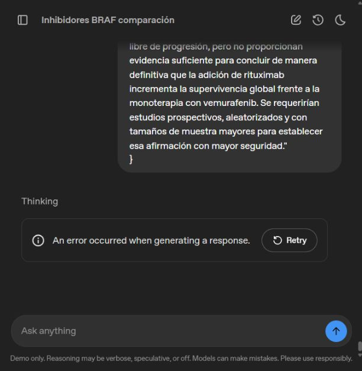

# Estado y resultados disponibles del ensayo 1

**GPTOSS-PLAYGROUND-E1-20261003 · 3 de octubre de 2026.**

**Ensayo abierto, con repetición autorizada y pendiente de recuperación del servicio.** La recepción documental quedó conservada con una reserva formal. La revisión adversarial no produjo una respuesta recibida: la demostración notificó un error. En este corte, el ensayo **no permite determinar si la relectura y la adversarial corrigen las respuestas anteriores**.

## Alcance y condiciones

Se utilizó la [demostración pública](https://gpt-oss.com/), con selección visible gpt-oss-120b y razonamiento High. Se mantuvieron la pregunta común a A/B y el pasaje documental de la exploración precedente. La consulta C quedó fuera. La primera entrada se envió en una conversación nueva; la segunda, en esa misma conversación, tras conservar la recepción. Hubo un envío en la primera fase y dos intentos de la segunda, al autorizarse una reanudación tras el fallo de servicio. No se entregó una solución de referencia.

El [protocolo y las entradas iniciales](https://github.com/juantoniolloretegea/SV-motor/tree/bedb85df8b043f8f18093c9a8bdf7ca396100f2e/laboratorio/ensayo-ia-y-observabilidad/modelos-de-ia/openai/gpt-oss-120b/prueba-playground/ensayo-1) se publicaron antes del primer envío. La [reserva de representación, su comprobación y la entrada efectiva](https://github.com/juantoniolloretegea/SV-motor/tree/f48073d9a4a7a9da163283894c5ff921b9c26093/laboratorio/ensayo-ia-y-observabilidad/modelos-de-ia/openai/gpt-oss-120b/prueba-playground/ensayo-1) quedaron publicadas y cotejadas antes del segundo.

## Recepción documental

| Comprobación | Resultado |
|---|---|
| JSON original recuperado | Válido. |
| Segmentos presentes y en orden | 9 de 9. |
| Textos idénticos tras decodificar el JSON | 5 de 9. |
| Diferencias | F01, F06, F07 y F09 representan los saltos de línea mediante la secuencia literal barra inversa+n. |
| Comparación interpretando exclusivamente esa secuencia como LF | Coincidencia completa de los 9 segmentos; ninguna otra sustitución. |
| Síntesis documentales | Nueve, revisadas y compatibles con el contenido de sus segmentos. |
| Cálculo SHA-256 atribuido al candidato | No: declara no haberlo calculado y deja el campo nulo. |

El original copiado, [SALIDA-01.json](SALIDA-01.json), no se modificó. La presentación de la página omitía los valores booleanos y nulo al convertirlos en elementos de presentación; se conservan el [texto visible](SALIDA-01-VISIBLE.txt) y el [párrafo HTML](SALIDA-01-DOM.html). El botón de copia recuperó el JSON válido. Este defecto de presentación se distingue de la representación incorrecta de saltos en el JSON original.

**No se cumplió la condición inicial de igualdad binaria estricta.** La continuación fue exploratoria, con la reserva expresamente declarada antes del segundo envío. La interpretación de saltos permite comprobar que no falta contenido; no transforma el original en una transcripción binariamente idéntica ni demuestra comprensión.

## Revisión adversarial y respuesta final

La segunda entrada, de 24.217 caracteres, quedó comprobada en el cuadro de envío. El envío se observó a las 04:22:23.538 UTC y el error se registró a las 04:23:32.151 UTC. Son tiempos de observación de la interfaz, no medidas de duración de inferencia.

La demostración mostró literalmente **«An error occurred when generating a response.»** No se recibió la adversarial ni la respuesta revisada. No se activó el botón de reintento. La interfaz no identifica la causa ni permite determinar si existió cálculo remoto no entregado; no se atribuye el fallo al contenido de la pregunta, a la memoria o a una incapacidad de razonamiento.



El texto que precede al error en la captura pertenece a la entrada que contiene la respuesta anterior B; **no es una nueva respuesta del candidato**. Los textos observados se conservan en [ORIGINAL-FASE-01.txt](ORIGINAL-FASE-01.txt) y [ORIGINAL-FASE-02.txt](ORIGINAL-FASE-02.txt), junto con el [registro de ejecución](REGISTRO-EJECUCION.json).

## Puntuación y significado

La unidad prevista era una respuesta final revisada. Se recibieron **cero finales evaluables** y se registraron **dos intentos de la segunda fase impedidos por el servicio**. Los recuentos de aciertos, errores e indeterminaciones evaluadas son cero; ese recuento vacío no constituye una puntuación de 0/100. El resultado no se convierte en 0, 1 ni U. La puntuación y el dictamen de aptitud permanecen **no evaluables en este ensayo**. Las dos consultas técnicas fallidas se registran aparte y no son preguntas clínicas adicionales.

La única evidencia favorable obtenida es la reproducción completa del contenido documental, con la reserva formal descrita. No quedó observada la capacidad de refutar las afirmaciones anteriores, justificar su modificación ni elaborar una respuesta correcta. Los resultados de la exploración precedente permanecen intactos. Este expediente no acredita generalización, aptitud clínica ni una decisión de instalación.

## Consulta previa a la repetición

Antes de repetir la fase adversarial se preguntó al candidato, en una conversación separada, por la memoria asignada, las herramientas disponibles y los límites efectivos de entrada, contexto, salida y tiempo. La consulta fue breve y también produjo el error de generación. Tras recargar la página se solicitó responder a esa consulta pendiente; volvió a aparecer el mismo error. No se recibió ninguna declaración técnica del candidato.

Se conservan la [entrada](CONSULTA-LIMITES-ENTRADA.txt), el [original observado](CONSULTA-LIMITES-ORIGINAL.txt), la [petición tras la recarga](CONSULTA-LIMITES-REINTENTO.txt), su [original observado](CONSULTA-LIMITES-REINTENTO-ORIGINAL.txt) y el [registro](CONSULTA-LIMITES-REGISTRO.json). Estas consultas no forman parte de la puntuación clínica ni se incorporan al contexto de la pregunta examinada.

La [presentación oficial de GPT-OSS](https://openai.com/index/introducing-gpt-oss/) declara un contexto nominal de hasta 128 k para el modelo y funcionamiento con una GPU de 80 GB. Son características del modelo, **no mediciones de la memoria ni de los límites efectivos del Playground**. En este corte siguen sin verificarse la RAM/VRAM asignada, la longitud efectiva de contexto y salida, las herramientas del candidato y las cuotas del servicio. Un error ante una consulta breve impide atribuir sin más el fallo anterior a la extensión del ensayo.

El reintento se efectuó en la conversación original a las 04:40:31.016 UTC. La [petición de reanudación](ENTRADA-02-REINTENTO.txt), de 529 caracteres, remite a la entrada completa ya presente y exige declarar cualquier pérdida de acceso a ella, sin reconstruirla de memoria. Se evita duplicar el pasaje y los antecedentes. La continuidad real del contexto en el servicio no puede verificarse sólo por su presencia en la interfaz. El reintento volvió a mostrar el error, sin respuesta; se conserva su [texto observado](ORIGINAL-FASE-02-REINTENTO.txt) y su [captura](IMPEDIMENTO-REINTENTO.png).

La repetición no sustituye los antecedentes ni selecciona un resultado favorable. La ausencia de datos técnicos no permite prometer que un nuevo envío estará dentro de límites desconocidos. La siguiente acción depende de recuperar una respuesta efectiva de la demostración; **no se declara cerrado el ensayo**.

## Comprobación mínima con razonamiento bajo

Se abrió otra conversación, se seleccionó y verificó **Low** y se envió «¿Cuánto es 2 + 2? Responda sólo con la cifra.». El modelo seleccionado continuó siendo gpt-oss-120b. La demostración volvió a mostrar el mismo error y no entregó ninguna respuesta.

La [entrada](CONSULTA-MINIMA-ENTRADA.txt), el [texto observado](CONSULTA-MINIMA-ORIGINAL.txt), el [registro](CONSULTA-MINIMA-REGISTRO.json) y la [captura](CONSULTA-MINIMA.png) se conservan como comprobación de disponibilidad. Este resultado no es un error aritmético del modelo ni integra la puntuación clínica. La persistencia del fallo en una consulta mínima apunta a un impedimento del servicio; no demuestra su causa ni permite asignarla a la RAM, al tiempo de cálculo o a la longitud del contexto.

El selector queda en Low tras esta comprobación. Una reanudación de la fase clínica debe declarar su ajuste de razonamiento; no se asume que conserva High. El ensayo permanece abierto y no se activa otro intento automáticamente.

## Reproducción de los cotejos

El [manifiesto](MANIFIESTO.json) identifica por SHA-256 y tamaño los archivos conservados. El comprobador en Rust contrasta esos archivos, analiza el JSON original y reproduce por separado la igualdad estricta y la comparación de saltos. Desde una copia de esta carpeta puede ejecutarse:

```text
cargo run --locked --manifest-path cotejo-rust/Cargo.toml -- .
```

La salida describe las comprobaciones textuales y no adjudica veracidad científica. Las versiones de dependencias quedan fijadas en Cargo.toml y Cargo.lock. Las observaciones recuperables del servicio no acreditan la identidad de sus pesos, la ausencia de truncamiento interno, el uso exclusivo del pasaje ni la totalidad de sus operaciones. Un SHA-256 acredita identidad de bytes, no lectura interna.

La autoría y licencia de la carpeta principal se aplican al trabajo propio de este ensayo. Las fuentes y componentes de terceros conservan sus respectivos derechos y licencias.

© 2026 Juan Antonio Lloret Egea. Algunos derechos reservados. | ORCID: 0000-0002-6634-3351 | Instituto Tecnológico Virtual de la Inteligencia Artificial para el Español™ (ITVIA) | IA eñ™ – La Biblia de la IA™ | ISSN 2695-6411 | Licencia Creative Commons Atribución-NoComercial-SinDerivadas 4.0 Internacional (CC BY-NC-ND 4.0).
