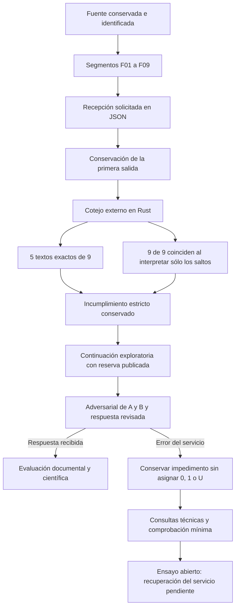

# Ensayo 1: revisión adversarial de una respuesta documental

**GPTOSS-PLAYGROUND-E1-20261003 · 3 de octubre de 2026. Estado: abierto, pendiente de recuperación del servicio para repetir la revisión adversarial.**

Se examina si una relectura obligatoria del pasaje suministrado, seguida de una crítica de las respuestas anteriores A y B, permite elaborar una respuesta documentalmente fiel a la misma pregunta. Se utiliza la [demostración pública de GPT-OSS](https://gpt-oss.com/), con selección visible gpt-oss-120b y razonamiento High.

La primera fase produjo un JSON válido con los nueve segmentos. Cinco coinciden exactamente; los otros cuatro coinciden al interpretar exclusivamente la secuencia literal barra inversa+n como salto de línea. Se conserva el incumplimiento del requisito binario inicial y la reserva declarada antes de continuar. Las huellas SHA-256 acreditan identidad de los textos; no constituyen una prueba de lectura interna o comprensión.

La segunda fase produjo un error de servicio tanto en el primer envío como en el reintento autorizado. La demostración mostró «An error occurred when generating a response» sin entregar la revisión adversarial ni la respuesta final. Una consulta técnica breve sobre sus límites también falló, tanto en conversación nueva como tras recargar la página. Finalmente, una pregunta mínima —«¿Cuánto es 2 + 2?»— en conversación nueva y con razonamiento Low produjo el mismo error. **El ensayo permanece abierto. No hay puntuación ni adjudicación 0, 1 o U de esta fase.** El impedimento no acredita incapacidad del modelo para resolver la pregunta ni una mejora respecto de sus respuestas anteriores.

| Documento | Objeto |
|---|---|
| [Protocolo](PROTOCOLO.md) | Hipótesis, condiciones, límites, criterios y puntuación. |
| [Resultados](RESULTADOS.md) | Balance del ensayo, reserva de representación y ausencia de respuesta revisada. |
| [Primera entrada](ENTRADA-01.txt) | Petición de recepción documental antes de responder. |
| [Segunda entrada efectiva](ENTRADA-02-EFECTIVA.txt) | Pregunta original, fuente, respuestas A/B y reserva declarada antes del envío. |
| [Segunda entrada inicial](ENTRADA-02-CONDICIONAL.txt) | Preparación original, conservada; no fue el texto enviado. |
| [Fuente segmentada](FUENTE-SEGMENTADA.json) | Texto con identificadores para el cotejo. |
| [Identidad de la fuente](IDENTIDAD-FUENTE.json) | Procedencia, huellas y regla de segmentación. |
| [Salida original de recepción](SALIDA-01.json) | JSON recuperado mediante el botón de copia, sin modificarlo. |
| [Cotejo estricto](COTEJO-RECEPCION.json) y [cotejo de representación](COTEJO-REPRESENTACION.json) | Resultados separados; el segundo no sustituye al primero. |
| [Admisión con reserva](ADMISION-REVISION.json) | Condición declarada antes de la segunda fase. |
| [Registro de ejecución](REGISTRO-EJECUCION.json) y [captura](IMPEDIMENTO-FASE-02.png) | Envíos, observaciones y fallo visible. |
| [Consulta sobre límites](CONSULTA-LIMITES-ENTRADA.txt) y [registro](CONSULTA-LIMITES-REGISTRO.json) | Comprobación previa a la repetición; no se obtuvo respuesta técnica. |
| [Petición de reanudación](ENTRADA-02-REINTENTO.txt), [original observado](ORIGINAL-FASE-02-REINTENTO.txt) y [captura](IMPEDIMENTO-REINTENTO.png) | Reintento de la segunda fase en la conversación conservada. |
| [Comprobación mínima](CONSULTA-MINIMA-REGISTRO.json) y [captura](CONSULTA-MINIMA.png) | Pregunta trivial con razonamiento Low; no se recibió respuesta. |
| [Comprobador Rust](cotejo-rust/comprobar.rs) | Reproducción de las comprobaciones de identidad y representación. |
| [Manifiesto](MANIFIESTO.json) | Tamaños y SHA-256 de los archivos conservados. |

Los resultados de la exploración anterior permanecen intactos. Este ensayo se realiza sobre una pregunta conocida y no acredita por sí mismo generalización ni aptitud clínica. No se incorporan datos de cuentas o de infraestructura.

## Pregunta, hipótesis y diseño

La pregunta examina la comparación entre los estudios de vemurafenib solo y con rituximab descritos en el pasaje suministrado del NCI: número de pacientes, respuesta completa, mediana de seguimiento y alcance de cualquier conclusión sobre supervivencia. A y B son dos respuestas anteriores a esa misma pregunta. Se suministran completas como objetos de refutación; no constituyen una fuente clínica adicional. La consulta anterior C queda excluida.

La hipótesis es que una relectura expresa, acompañada de una comprobación textual y una adversarial documental, puede corregir errores observados en las respuestas anteriores. Es una comprobación exploratoria sobre una pregunta conocida, sin grupo de control ni estimación de generalización. No modifica los pesos del modelo.

La fuente original se identifica por SHA-256 y se divide por líneas en blanco en F01–F09, conservando su orden y contenido interior. La primera fase exige reproducir íntegramente los nueve textos en JSON y añadir síntesis documentales. No se pide todavía una respuesta clínica. La segunda exige releer la fuente, revisar las afirmaciones de A/B, justificar cada decisión mediante citas localizadas y dar la respuesta final revisada. La prohibición de usar datos clínicos recordados, búsquedas selectivas o fuentes externas forma parte de ambas entradas; la demostración no permite certificar su cumplimiento interno.

## Recorrido y separación de responsabilidades



```mermaid
sequenceDiagram
    participant Fuente as Fuente documental
    participant Modelo as Modelo de la demostración
    participant Rust as Comprobador externo Rust
    participant Evaluacion as Evaluación externa
    Fuente->>Modelo: Pregunta y pasaje íntegro segmentado
    Modelo-->>Rust: JSON de recepción y síntesis
    Rust->>Rust: Igualdad estricta, cobertura y SHA-256
    Rust->>Rust: Comparación adicional de saltos de línea
    Rust-->>Evaluacion: Ambos resultados, sin sustituir el original
    Evaluacion->>Modelo: Reserva declarada, misma pregunta, fuente y A/B
    Note over Modelo,Evaluacion: La interfaz devuelve un error; no hay respuesta final recibida
    Evaluacion->>Modelo: Reanudación técnica autorizada en la misma conversación
    Note over Modelo,Evaluacion: Nuevo error; la evaluación final continúa pendiente
```

La comparación textual no decide la verdad de una afirmación. El comprobador calcula las huellas; el candidato declara no haberlas calculado. La evaluación externa debe distinguir extracción de datos, interpretación de desenlaces, respaldo de las conclusiones y fidelidad de la adversarial. El razonamiento que la interfaz expone se conserva como texto emitido, sin considerarlo una observación completa ni una explicación causal certificada del cálculo interno.

## Cadena de envíos y resultados observados

Las horas son UTC del 3 de octubre de 2026 y corresponden a observaciones de la interfaz. No son tiempos medidos de inferencia ni de procesamiento remoto.

| Orden | Envío observado | Consulta y condición | Resultado recibido |
|---|---|---|---|
| 1 | 04:10:26.334 | Recepción documental; 120b, High, conversación nueva | JSON válido, nueve textos y síntesis; cinco textos exactos y cuatro con diferencias exclusivamente de representación de saltos. |
| 2 | 04:22:23.538 | Revisión adversarial; misma conversación, High; 24.217 caracteres | Error del servicio; ninguna adversarial ni respuesta revisada recibida. |
| 3 | 04:30:51.064 | Consulta técnica sobre límites; conversación nueva, High; 922 caracteres | Mismo error; sin información técnica del candidato. |
| 4 | 04:36:58.789 | Solicitud de responder a la consulta técnica tras recargar; High; 199 caracteres | Mismo error. |
| 5 | 04:40:31.016 | Reanudación de la fase adversarial original; High; 529 caracteres adicionales | Mismo error; sin nueva respuesta. |
| 6 | 04:48:38.701 | «¿Cuánto es 2 + 2? Responda sólo con la cifra.»; conversación nueva, Low verificado | Mismo error; ninguna respuesta aritmética recibida. |

El primer envío tiene un final observado a las 04:12:20.773 UTC. La interfaz mostraba «Thought for 13 seconds»; ese indicador no acredita la duración total del servicio. Se conserva también el [texto de razonamiento desplegado](RAZONAMIENTO-01-PARRAFOS.json), con 63 párrafos anteriores al JSON final. La extracción registra su presentación observable; no se dispone de la transmisión original ni de telemetría del servidor.

Las dos fases clínicas, las consultas técnicas y la comprobación mínima mantienen registros diferenciados. Los cinco mensajes de error son sucesos del servicio, no cinco errores del modelo. La recuperación de una respuesta posterior deberá añadir su propio registro y conservar esta cadena.

## Criterios y resultados pendientes

La respuesta clínica revisada sería una única unidad evaluable. Los criterios establecidos exigen cifras documentales correctas, distinción entre desenlaces, ausencia de superioridad causal no demostrada y una adversarial fiel a las fuentes. La cautela correctamente fundada no se penaliza. Una respuesta recibida se adjudicaría con la terna 0, 1 o U y con los criterios críticos conservados en el [protocolo](PROTOCOLO.md).

Por ahora no existe una respuesta final revisada evaluable: la puntuación y el dictamen son nulos, no cero. No se aplica la regla de aptitud del SV a este único caso. La recepción textual tampoco acredita por sí sola comprensión, capacidad clínica o idoneidad de instalación. El incumplimiento binario inicial queda registrado aunque la interpretación de saltos restablezca el contenido completo.

## Información útil para una eventual evaluación en un servidor propio

| Observación de la demostración | Consecuencia metodológica para una evaluación controlada |
|---|---|
| No hay cifras verificadas de RAM, VRAM, contexto, salida o cuota. | Registrar recursos y configuración efectivos antes de inferir; las especificaciones nominales del modelo no sustituyen a esa medición. |
| La interfaz mostró un error genérico incluso ante una pregunta mínima con Low. | Distinguir admisión, cálculo, transmisión y presentación; conservar los errores de cada frontera sin adjudicarlos automáticamente al candidato. |
| El texto presentado ocultaba valores que sí estaban en el JSON copiado. | Conservar la salida recibida antes de presentarla; cotejarla con cualquier transformación de la interfaz. |
| Cuatro segmentos cambiaron la representación de los saltos. | Separar identidad exacta y equivalencias explícitamente permitidas; no corregir originales silenciosamente. |
| La relectura requirió reproducir toda la fuente y la revisión incluyó A/B completos. | Medir los tokens reales de entrada, historial, razonamiento y salida; fijar un margen conforme al motor utilizado, sin suponer que los caracteres equivalen a tokens. |
| La adversarial no llegó a recibirse. | Mantener pendiente su evaluación; no inferir mejora ni fracaso científico a partir del error de disponibilidad. |

Un despliegue propio permitiría configurar y medir estas condiciones, pero no eliminaría los límites físicos ni garantizaría exactitud. Esta experiencia no autoriza ni inicia una instalación. El selector de la demostración queda en Low tras la comprobación mínima; el ajuste de una próxima fase debe declararse y comprobarse antes de enviar.

## Custodia y punto de continuación

El [manifiesto](MANIFIESTO.json) identifica los archivos por tamaño y SHA-256. Se conservan entradas, salida original, presentación visible, razonamiento expuesto, fallos, capturas y cotejos reproducibles en Rust. Las revisiones anteriores permanecen accesibles mediante Git. Los materiales no contienen cuentas personales ni datos de infraestructura.

El ensayo permanece abierto. La continuación requiere recuperar una respuesta efectiva del servicio y mantener identificadas las condiciones de cualquier nuevo intento. No se inicia otra campaña, no se crea un ensayo posterior y no se convierte este registro de disponibilidad en un dictamen sobre el modelo.

La [autoría y licencia de la carpeta principal](../readme.md#autoría-licencia-y-alcance) se aplican al trabajo propio de este ensayo; los materiales de terceros conservan sus derechos.

© 2026 Juan Antonio Lloret Egea. Algunos derechos reservados. | ORCID: 0000-0002-6634-3351 | Instituto Tecnológico Virtual de la Inteligencia Artificial para el Español™ (ITVIA) | IA eñ™ – La Biblia de la IA™ | ISSN 2695-6411 | Licencia Creative Commons Atribución-NoComercial-SinDerivadas 4.0 Internacional (CC BY-NC-ND 4.0).
