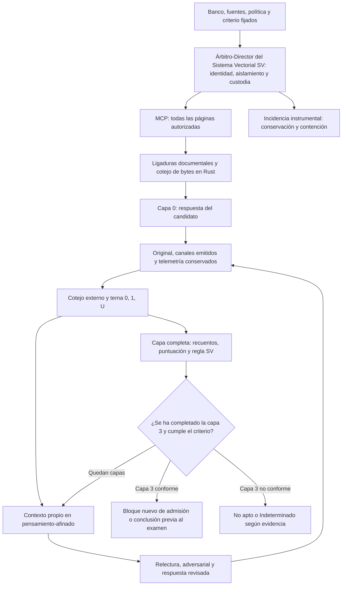
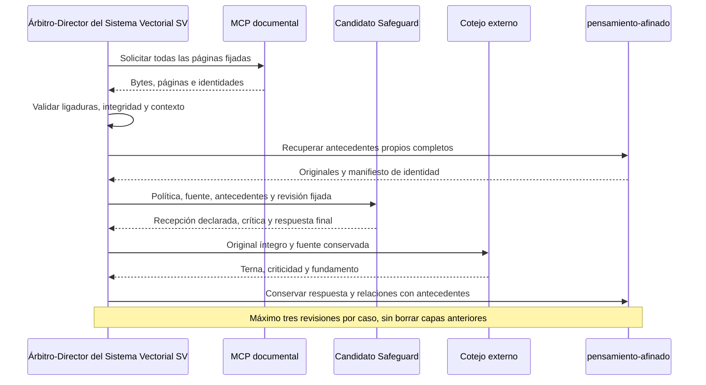
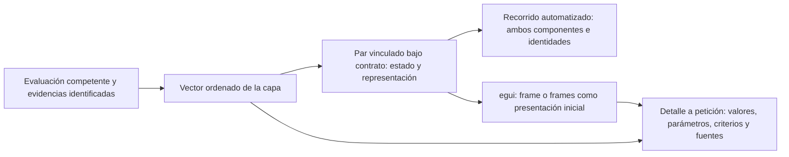

# Preevaluación de examen de 25 preguntas de tricoleucemia

**Candidato:** `openai/gpt-oss-safeguard-120b`. **Fecha de apertura:** 3 de octubre de 2026. **Estado:** preparación experimental; todavía sin resultados de esta condición.

## Objetivo y alcance

Determinar si el candidato, con suministro documental íntegro y revisiones adversariales organizadas por el Árbitro-Director del Sistema Vectorial SV, reúne las condiciones previas para realizar el examen de 25 preguntas. Se compara una respuesta inicial con hasta tres revisiones sucesivas, conservando todas las respuestas, sus fundamentos y sus valores en la terna **(0, 1, U)**. El examen general constituye una actuación posterior y separada.

El **Aprendizaje por Retroalimentación del Sistema Vectorial SV** consiste aquí en una revisión contextual acumulativa. Los pesos permanecen intactos: no se ejecutan entrenamiento, propagación de gradientes ni ajuste de parámetros. Una mejora observada corresponderá a la configuración y al procedimiento ensayados; no demostrará aprendizaje persistente del modelo ni aptitud clínica.

## Universo del candidato y universo experimental

OpenAI describe Safeguard como un modelo de razonamiento especializado en clasificación de seguridad conforme a políticas escritas aportadas por quien lo utiliza. Su taxonomía y criterios se especifican en la política, y su interfaz utiliza Harmony. Esta especialización no constituye una acreditación médica ni asegura el cumplimiento de cualquier política. [Guía de OpenAI y ROOST](https://developers.openai.com/cookbook/articles/gpt-oss-safeguard-guide).

El universo experimental comprende **clasificación documental de afirmaciones sintéticas**, incluidas condiciones, excepciones, negaciones, cantidades, temporalidad, causalidad, insuficiencia y discrepancia entre fuentes. Las categorías nativas de la tarea son `RESPALDADA`, `CONTRADICHA` y `EVIDENCIA_INSUFICIENTE`. **No son la terna de evaluación SV**: una respuesta correcta de insuficiencia recibe 0, mientras que una abstención genuina del candidato recibe U. La asignación de valores SV corresponde al cotejo externo, nunca a la autoevaluación del candidato.

Se reutilizan la instalación y las capacidades nativas del candidato. La revisión de pesos es `3c7391182603991a904031244e7822488c67796d`; la identidad efectiva de motor, plantilla, tokenizador, política, fuentes y controles deberá quedar acreditada antes de la primera generación. El modelo recibe exclusivamente la documentación autorizada y sus antecedentes explícitos; carece de acceso a Internet y a la clave de corrección.

## Diseño experimental fijado

| Elemento | Condición |
| --- | --- |
| Bloque de desarrollo | Nueve casos, identificadores A01–A09 |
| Bloque de admisión | Nueve casos nuevos, B01–B09, con fuentes y afirmaciones diferentes |
| Dificultad prevista por bloque | 1, 2, 2, 3, 3, 4, 4, 5, 5; escala ordinal de diseño, no dificultad empírica acreditada |
| Respuesta inicial | Capa 0, sin antecedentes de respuesta del caso |
| Revisiones | Capas 1, 2 y 3 como máximo; una sola generación por caso y capa |
| Primera fase | `ensayo-1`: respuesta inicial y primera revisión adversarial |
| Segunda fase | `ensayo-2`: incorporación acumulada de antecedentes y hasta dos revisiones adicionales |
| Contador | Único por caso; la segunda fase no reinicia el límite |
| Referencia | Política, banco, criticidad y clave fijados antes de observar respuestas |
| Selección de resultado | Última capa completa efectivamente recorrida, sin seleccionar retrospectivamente la mejor respuesta |

Cada bloque aporta un vector de nueve adjudicaciones por capa. Las capas se conservan como filas sucesivas de vectores; no se interpretan como una matriz de 3 × 3. Se ejecutan sus casos en orden antes de comparar una capa completa. Una incidencia instrumental suspende la ejecución afectada: no se imputa al modelo ni se sustituye por U. No se realizan reintentos de una respuesta concluida con la misma identidad.

El catálogo operativo agrupa las nueve fuentes de A en un documento `BANCO-A`, con secciones `A01`–`A09`. Cada sección conserva íntegro el texto original y sus dos páginas; el Árbitro-Director del Sistema Vectorial SV restringe las solicitudes a la sección del caso en curso. [La comprobación de identidad](protocolo/IDENTIDAD-FUENTES.json) permite relacionar estos localizadores con los del banco original. Esta agrupación respeta el máximo de ocho documentos del MCP conservado. La primera comprobación instrumental rechazó el catálogo de nueve documentos antes de cargar el modelo: no produjo respuesta ni valor SV. Se conserva la revisión precedente y se exige un recorrido instrumental conforme con la agrupación corregida antes de inferir.

La primera admisión de arranque detectó además una discordancia del identificador de sección al pasar de la preparación del primer caso al segundo. Tampoco cargó el modelo ni produjo respuesta. La transición corregida distingue el caso que se prepara del que se ejecuta y aplica las mismas restricciones de solicitud documental durante la comprobación instrumental y el arranque. Se conserva el intento y se exige igualdad íntegra con las nueve entradas previamente fijadas antes de admitir la recuperación.

El bloque A permite medir y diagnosticar la revisión. El bloque B sólo se admite cuando A cumple las condiciones. B no recibe respuestas, correcciones ni etiquetas de A: comienza con la misma política y el procedimiento de revisión ya fijado. Conserva únicamente sus propios antecedentes entre capas. Así se contrasta la aplicabilidad del procedimiento a problemas nuevos, sin presentar la reiteración del mismo caso como generalización. No se modifica el procedimiento al conocer las respuestas de B.

En cada bloque se fijan cuatro observaciones por caso: la respuesta inicial y las tres revisiones. Se recorre una capa completa antes de iniciar la siguiente. Este diseño permite medir tanto correcciones como pérdidas de aciertos, y evita detener la observación al encontrar una respuesta favorable. La admisión se decide sobre la capa 3, nunca sobre la mejor capa retrospectiva. El máximo absoluto es de 72 generaciones para los dos bloques; B queda sin ejecutar si A no satisface sus condiciones finales. Una cuarta revisión o un nuevo banco requieren una delimitación posterior expresa; no se activan por una pendiente favorable.

Un error crítico determina **No apto para la capa evaluada**. En el bloque de desarrollo o de admisión se permite observar su reparación dentro del máximo ya autorizado, sin borrar ese dictamen. La aptitud de la configuración con retroalimentación se juzga por su salida final completa y por el historial conservado. Sólo esa configuración podrá proponerse para el examen; no se atribuirá el resultado al modelo sin Árbitro-Director del Sistema Vectorial SV ni a su respuesta inicial.

## Recorrido del Árbitro-Director del Sistema Vectorial SV

1. El Árbitro-Director del Sistema Vectorial SV obtiene las fuentes completas mediante el MCP y valida las ligaduras documentales existentes del Lenguaje. Las páginas recibidas se cotejan antes de componer el contexto.
2. El candidato emite su clasificación, citas y explicación. Las revisiones añaden su crítica de la respuesta anterior y explican por qué se mantiene o cambia.
3. La evidencia conserva entrada efectiva, plantilla, tokens, páginas, antecedentes, salida íntegra de todos los canales emitidos y telemetría. El SHA-256 acredita la identidad de bytes; **no prueba lectura mental, comprensión ni veracidad**.
4. El cotejo externo examina la respuesta completa frente a la referencia. El Árbitro-Director del Sistema Vectorial SV conserva la decisión de evaluación y aplica el recorrido fijado. El evaluador no suministra al candidato etiquetas correctas, respuestas modelo ni pistas particulares.
5. La siguiente capa incorpora todas las respuestas finales previas del mismo caso, incluida su crítica, sin reemplazar ni resumir silenciosamente los originales. Se vuelve a aportar la fuente íntegra. Si el contexto íntegro excede la cota técnica admitida, se conserva el impedimento; no se recorta documentación o historial para producir una respuesta.

Cada ejecución material comprende una capa de nueve casos y una carga del modelo. Entre casos, un cotejador Rust comprueba la custodia, los intercambios MCP, la entrada efectiva y la emisión completa antes de permitir el siguiente. Esta continuación instrumental no adjudica la corrección semántica. Tras el noveno caso se cierra la inferencia y se evalúa la capa conservada antes de preparar la siguiente. No existe un recorrido automático que abra indefinidamente nuevos casos, capas o campañas.

La configuración conserva el esfuerzo de razonamiento `medium`, selección `argmax`, semilla 42 y una sola secuencia activa. Se admite una entrada y salida conjuntas de hasta 32.768 tokens, con salida máxima de 8.192 y reserva mínima adicional de 2.048; la entrada efectiva debe cumplir estas cotas antes de inferir. Son límites de este contraste, no capacidades máximas atribuidas al modelo. La cota de salida amplía la del antecedente y queda declarada antes de la nueva ejecución. No se aplica un vencimiento horario de campaña mientras exista progreso. Una hora consecutiva sin hitos observados de carga, cálculo, emisión o comunicación activa el cierre técnico; la mera producción de muestras del observador no cuenta como progreso del modelo.

## Terna, regla primitiva y puntuación

La célula canónica **(9,3)** comprende vectores de nueve componentes con valores en **{0, 1, U}**. Su universo de estados contiene **3⁹ = 19.683 vectores posibles**. No es una matriz de 3 × 3. El presente contraste observa una fila de nueve valores por capa, no recorre los 19.683 estados posibles ni representa por sí solo toda la familia de células del SV. Esta elección experimental no establece una dimensión predeterminada para otros usos del Lenguaje.

Los [Fundamentos algebraico-semánticos, §5.2](https://github.com/juantoniolloretegea/SV-matematica-semantica/blob/b8fd32978292d25adf9b87cf71e409005dce642c/documentos/fundamentos/README.md#52-umbral-can%C3%B3nico) recogen el umbral **T(n) = ⌊7n/9⌋**. Se aplica al vector completo de resultados: primero se comprueba N₁ ≥ T(n), que determina No apto; después N₀ ≥ T(n), que determina Apto; en otro caso, Indeterminado. Para este bloque de n = 9, T(9) = 7. No se calcula κ si falta alguna adjudicación válida. Los fallos técnicos y los casos no ejecutados quedan fuera de la terna. La puntuación auxiliar no cambia el significado de estos valores.

La evolución se representa mediante **v⁽⁰⁾, v⁽¹⁾, v⁽²⁾ y v⁽³⁾**: cuatro filas posibles con las mismas nueve posiciones, una por caso. Las comparaciones conservan la correspondencia entre posiciones y entre capas; no convierten U en un número ni crean una geometría nueva para la célula.

La puntuación auxiliar sigue el [criterio común publicado](https://github.com/juantoniolloretegea/SV-motor/blob/e5adb61ad4481d5529e1e9af9bcaf27c32957cde/laboratorio/ensayo-ia-y-observabilidad/modelos-de-ia/CRITERIO-PUNTUACION-MODELOS-20261001.md): **100 × (aciertos − errores no críticos) / 9**. Los errores críticos se registran aparte y tienen efecto eliminatorio sobre el dictamen de la capa. U y blanco no aportan ni restan puntos. No se altera el denominador ni se recortan saldos negativos.

**Condiciones conjuntas de conformidad del bloque:** nueve respuestas con evidencia evaluable, clasificación general Apto, todos los casos críticos en 0, ninguna incidencia pendiente y custodia conforme. La revisión externa aplica la criticidad prefijada a errores sustantivos; los defectos exclusivamente formales se distinguen de alteraciones del significado. Una U crítica impide la conformidad aunque la puntuación sea alta. El informe separará siempre puntuación, clasificación κ, condición de criticidad y dictamen.

La propuesta de **Apto para realizar el examen** exige conformidad del bloque B y sus controles, después de la conformidad de A. El examen de 25 preguntas conserva su propio banco, umbral T(25) = 19 y criticidad. Este ensayo no lo sustituye.

## Medidas y análisis

### Correspondencia entre vector, frame y presentación humana

El [estudio (p1+p3)-Bis, §§2.2 y 3](https://github.com/juantoniolloretegea/SV-lenguaje-de-computacion/blob/f98961050bcf1c9037e0a831911df580644741b5/docs/calidad/tuberias-ia/paridad-imagen-celula-matematica/CELULA_IMAGEN_Y_AGENTES_EN_EL_SV_P1_P3_BIS_2026_09_13_V2.md#22-frame-tipado-y-correspondencia-entre-sus-componentes) establece la vinculación conceptual **Frame_C = (frmat, frvis)**: estado matemático y representación visual bajo un mismo contrato. El par vector–frame conserva la identidad de la instancia, el orden y significado de sus posiciones, la capa evaluada, las fuentes y la revisión aplicable. No basta con asociar una imagen legible a un vector: la correspondencia debe comprobarse.

La presentación futura mediante **egui** mostrará inicialmente el frame o los frames pertinentes, con identificación y leyenda comprensibles. La consulta de detalle permitirá recuperar los valores, parámetros, criterios y evidencias asociados cuando el especialista lo solicite. La imagen se obtiene del vector completo, no sólo de su resultado Apto, No apto o Indeterminado. Los radios 1, 2 y 3 representan respectivamente 0, 1 y U; no constituyen una escala de gravedad. Una incidencia de representación se comunica como tal y no se convierte en U ni se oculta mostrando un estado anterior.

El diagrama expresa el requisito de presentación y de correspondencia; no acredita una interfaz egui ya realizada ni amplía el Núcleo. El tipo `Frame` existente y la representación visual del estudio Bis se distinguen hasta comprobar su integración efectiva. Este contraste utiliza el canal textual de Safeguard: entregar datos estructurados no equivale a entregar píxeles ni demuestra una capacidad visual del candidato. El vector de adjudicación y su representación pertenecen al seguimiento externo; no se introducen como etiquetas correctoras encubiertas en el contexto de las revisiones. La GUI no es condición de inicio del presente contraste.

### Mediciones por caso y por capa

Por caso y capa: terna, clasificación emitida, exactitud sustantiva, fidelidad y pertinencia de citas, cobertura documental, correspondencia entre recepción declarada y contexto efectivo, justificación del cambio, error formal o sustantivo, criticidad y estado instrumental. Se conservan dificultad prevista y fuente.

Por bloque y capa: N₀, N₁, Nᵤ, errores críticos y no críticos, blancos, impedimentos, no ejecutados, puntuación sobre 100, T(n), κ y dictamen. Entre capas: matriz completa de transiciones 0/1/U, aciertos ganados y perdidos, abstenciones y nuevas afirmaciones incorrectas. **No se resta aritméticamente 0, 1 o U como si fueran notas ordinales.**

Se informan diferencias de puntuación y pendiente descriptiva entre las capas recorridas, con idénticos casos y denominador. La pendiente no prueba convergencia estadística, aprendizaje de pesos ni seguridad futura. Una disminución de errores por sustitución con U se distingue de un aumento de aciertos. No se ocultan regresiones detrás del promedio.

Se mantienen las medidas instrumentales: tiempos de carga, entrada y generación; tokens de entrada y salida por canal; memoria corriente y máxima; presión, intercambio y agotamiento; CPU; comunicaciones MCP; incidencias; huellas de todos los objetos y cotejo de recuperación. Se informa lo efectivamente observable sin atribuir acceso completo al cálculo interno del modelo.

## Organización y custodia

| Ruta | Contenido |
| --- | --- |
| `protocolo/` | Banco, fuentes, política, criterios y manifiestos fijados antes de inferir |
| `ensayo-1/` | Respuesta inicial y primera revisión con sus resultados |
| `ensayo-2/` | Revisiones acumulativas segunda y tercera, cuando procedan |
| `ensayo-2/pensamiento-afinado/` | Antecedentes propios por bloque, caso y capa; manifiestos del contexto efectivo |
| `realizacion-rust/` | Fuentes propias, referencias de dependencias y comprobaciones |
| `resultados/` | Mediciones y dictámenes en Markdown y JSON, con referencias inmutables a originales |

La clave externa se custodia por separado y nunca se monta en el recinto del modelo. Las copias públicas contendrán lo necesario para reconstruir el contraste, sin cuentas, credenciales ni datos administrativos del servidor. La publicación y su recuperación se cotejan en Rust. Una carpeta preparada no acredita ejecución: los estados de preparación, admisión, cálculo, evaluación y cierre se distinguen expresamente.

## Antecedentes y frontera con el Núcleo

El [contraste N01–N06 y diagnóstico D01](https://github.com/juantoniolloretegea/SV-sala-de-maquinas/blob/19778e3692802316c86b3a6107d625e0042cf95c/respuestas-ejecucion/ARBITRO-SV-SAFEGUARD-20261002/entrega-03/INFORME-FINAL.md) conserva su resultado de No apto. La [exploración pública GPT-OSS-120B](../../gpt-oss-120b/prueba-playground/readme.md) corresponde a otro modelo y entorno, y sus impedimentos no se atribuyen a Safeguard. El presente contraste tiene identidad propia.

El Árbitro-Director del Sistema Vectorial SV organiza el suministro y la retroalimentación; no es otro modelo de IA ni adquiere autoridad constituyente. El Núcleo, la semántica V0.2 y la IR 0.3 permanecen intactos. Se reutilizan únicamente sus interfaces públicas aplicables, sin fabricar autoridad productiva R1. El cómputo experimental de resultados no constituye una nueva semántica del Núcleo. Las necesidades que no puedan representarse se documentarán con evidencia y un caso discriminante, para su eventual recepción competente; no se subsanan mediante correcciones silenciosas. [Sistema conjunto](https://github.com/juantoniolloretegea/SV-motor/tree/b8ff9198275ee0139dad7565d23733667aadb066/laboratorio/sistema-conjunto-lenguaje-computacion-ia-gobernada).

La memoria conjunta, el aislamiento, la custodia y el control mantienen sus guardas. No se amplían recursos ni se generan nuevos gastos. Al concluir se detiene la inferencia y se deshabilita la carga, conservando la instalación y los accesos administrativos.

---

© 2026 Juan Antonio Lloret Egea. Algunos derechos reservados. | ORCID: 0000-0002-6634-3351 | Instituto Tecnológico Virtual de la Inteligencia Artificial para el Español™ (ITVIA) | IA eñ™ – La Biblia de la IA™ | ISSN 2695-6411 | Licencia Creative Commons Atribución-NoComercial-SinDerivadas 4.0 Internacional (CC BY-NC-ND 4.0).
