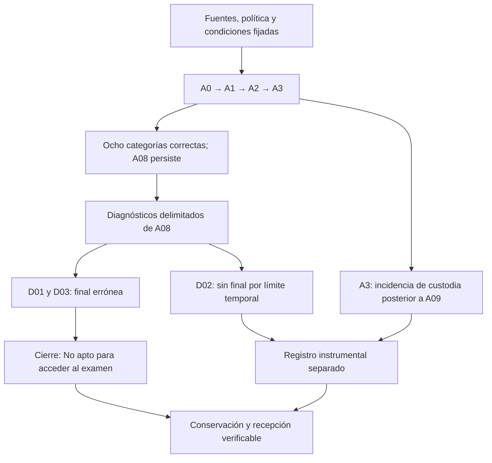

# Cierre de la preevaluación documental de GPT-OSS Safeguard

**Fecha:** 4 de octubre de 2026. **Identidad:** `openai/gpt-oss-safeguard-120b`, revisión `3c7391182603991a904031244e7822488c67796d`.

**Dictamen final: No apto para acceder al examen en esta evaluación.** La preevaluación ha terminado. No se habilitan A4, el bloque B, el examen de 25 preguntas ni nuevas inferencias por continuidad de este expediente. Se conservan los antecedentes y sus resultados con su alcance original.

## 1. Objeto y procedimiento efectivo

El contraste estudió clasificación documental de afirmaciones sintéticas conforme a una política explícita y fuentes delimitadas. Las categorías de respuesta fueron `RESPALDADA`, `CONTRADICHA` y `EVIDENCIA_INSUFICIENTE`. El suministro documental, la generación, la custodia y la evaluación externa tuvieron controles diferenciados. La clasificación del modelo no constituye por sí sola una decisión del Sistema Vectorial SV.

El bloque A comprendió nueve casos. Se obtuvieron una capa inicial A0 y tres revisiones contextuales acumulativas A1–A3, sin modificación de pesos. A0–A2 utilizaron esfuerzo medio; A3 incorporó esfuerzo alto junto con los 27 antecedentes propios completos. Esta variación conjunta impide atribuir por separado un efecto causal al esfuerzo y a la revisión adicional.

Las capas utilizaron una cota conjunta de 32768 tokens, salida máxima de 8192 y reserva mínima adicional de 2048. Los diagnósticos posteriores de A08 tuvieron su propia configuración: D03 conserva una entrada de 2774 tokens, salida máxima de 4096 y 25898 posiciones de reserva después de esa salida máxima. Las dos páginas y los antecedentes se cotejaron; no se constató truncamiento en D03. Las condiciones completas y sus diferencias permanecen en los originales.

El [protocolo histórico](../../readme.md) conserva el diseño y sus diagramas. Sus posibilidades condicionales de continuación describen lo previsto durante la preparación; el presente cierre determina el recorrido efectivamente realizado.

## 2. Secuencia de resultados

| Condición | Resultado observado | Alcance de la interpretación |
|---|---|---|
| [A0](../A0/INFORME-A0.md), [A1](../A1/INFORME-A1.md) y [A2](../A2/INFORME-A2.md) | Ocho clasificaciones documentales correctas de nueve; error crítico A08; omisiones formales comunes | Cada capa obtuvo −88,89/100 con la rúbrica completa y dictamen No apto. |
| A3 | Nueve respuestas finales conservadas; ocho clasificaciones correctas; mismo error A08 y mismas omisiones | No hubo correcciones ni regresiones respecto de A2. El custodio agotó memoria después de A09; no se acredita cierre normal de esa ejecución. |
| D01, diagnóstico de A08 | Final completa, 905 tokens; `CONTRADICHA` en vez de `EVIDENCIA_INSUFICIENTE` | Persisten el error de clasificación y las omisiones de recepción documental y revisión. |
| D02, diagnóstico de A08 | 1982 tokens generados; interrupción por cota temporal, sin respuesta final | Incidencia instrumental: no se asignan clasificación, puntuación ni U. |
| D03, diagnóstico de A08 | Final completa, 2057 tokens; cierre normal a las 09:40:16 UTC del 04/10/2026 | Persiste la misma clasificación errónea. Se agotan los tres intentos diagnósticos delimitados. |

Los identificadores D01–D03 de esta tabla pertenecen al diagnóstico de A08 de la campaña de retroalimentación; no deben confundirse con el diagnóstico D01 del contraste anterior del 2 de octubre.

La diferencia entre A0 y A3 es **cero puntos porcentuales** de clasificaciones correctas y **cero puntos** de puntuación completa. La puntuación negativa depende de una rúbrica que incluye obligaciones formales; **no expresa un porcentaje de comprensión negativa**. El vector adjudicado de A3 es `(1,1,1,1,1,1,1,1,1)`, con umbral declarado `T(9)=7`. Sus nueve posiciones constituyen un vector, no una matriz de 3 × 3. El error crítico conserva su efecto eliminatorio independiente.

## 3. Naturaleza del error A08

Las fuentes contienen una autorización y una negación para el mismo acceso, fecha y recinto. Ambas están vigentes y no existe regla de precedencia. La política exige `EVIDENCIA_INSUFICIENTE` ante esa discrepancia no resuelta. Safeguard reconoce el conflicto y la ausencia de precedencia en su justificación, pero selecciona `CONTRADICHA`.

Por tanto, el resultado acredita una discordancia entre la regla aplicable y la categoría emitida. No justifica afirmar que el modelo no recibió el texto o que fue incapaz de identificar el conflicto. Tampoco demuestra incapacidad general de comprensión o de revisión contextual fuera de estas condiciones.

La salida original de D03 se identifica mediante SHA-256 `00d24dbd8053d7744fe8caa3a0bcc7bd4dd4ececb628471d8ed3fc803428147d`. La recepción final quedó registrada por separado, sin nueva inferencia. En esa comprobación no se observaron agotamiento de memoria, intercambio ni reinicios de D03.

## 4. Incidencias y reservas metodológicas

1. **A3:** el agotamiento de memoria afectó al custodio después de la novena respuesta. Se conservan las nueve emisiones y sus adjudicaciones, junto con la ausencia de cierre normal. El incidente no se atribuye a razonamiento del modelo.
2. **D02:** el límite temporal impidió obtener una respuesta final. D03 amplió exclusivamente esa cota respecto de D02 y terminó, sin corregir A08. La falta de final en D02 no se convierte en respuesta equivocada ni en abstención.
3. **Formato:** la presentación inicial y los ejemplos de la política ilustraban cuatro campos, mientras que las obligaciones posteriores añadían recepción documental y revisión. Esta falta de uniformidad está comprobada; no está demostrada su causalidad sobre las omisiones o el error A08. Debe corregirse prospectivamente sin alterar el original evaluado.
4. **Alcance estadístico:** una realización por condición no estima una tasa de éxito. La reiteración de casos conocidos no acredita generalización a casos nuevos.
5. **Identidad instrumental:** las huellas y los cotejos acreditan identidad de archivos, transporte y entradas. No sustituyen una validación numérica independiente del motor.
6. **Comparación entre candidatos:** una corrección obtenida con otro modelo y otra conversación no identifica la causa del resultado de Safeguard ni garantiza el comportamiento de Qwen3.5-122B-A10B Q8_0.

## 5. Conservación y trazabilidad

Las adjudicaciones originales de A3 y D01–D03, la entrega técnica, los cotejos y las incidencias forman parte de la recepción final. Los originales remotos se identifican como `retro-A3-01`, `diag-A08-01`, `diag-A08-02` y `diag-A08-03`. Las ediciones precedentes de A0–A2 y la preparación de A3 conservan su identidad; este cierre las referencia y no sustituye sus archivos.

| Antecedente | Edición de conservación |
|---|---|
| A0 | [safeguard-retroalimentacion-20261003-a0](https://github.com/juantoniolloretegea/SV-sala-de-maquinas/releases/tag/safeguard-retroalimentacion-20261003-a0) |
| A1 | [safeguard-retroalimentacion-20261003-a1](https://github.com/juantoniolloretegea/SV-sala-de-maquinas/releases/tag/safeguard-retroalimentacion-20261003-a1) |
| A2 | [safeguard-retroalimentacion-20261003-a2](https://github.com/juantoniolloretegea/SV-sala-de-maquinas/releases/tag/safeguard-retroalimentacion-20261003-a2) |
| Preparación de A3 | [safeguard-retroalimentacion-20261003-preparacion-a3](https://github.com/juantoniolloretegea/SV-sala-de-maquinas/releases/tag/safeguard-retroalimentacion-20261003-preparacion-a3) |

La [conservación cifrada sin pesos](https://github.com/juantoniolloretegea/SV-sala-de-maquinas/releases/tag/safeguard-imagen-20261004-v1), de acceso restringido, está publicada y recuperada íntegramente. El cotejo Rust acredita reconstrucción, descifrado, inventario y contenido: 281.859 entradas y 160 entradas de adjudicaciones conformes. Se conserva una corrección instrumental de tres nombres Linux, con sus antecedentes. [Procedimiento y comprobantes](https://github.com/juantoniolloretegea/SV-sala-de-maquinas/tree/1abbaf1a50133938f92baa9cd1826c0f6a962c33/respuestas-ejecucion/SAFEGUARD-CONSERVACION-20261004). No se ha ensayado arranque restaurado; la recepción del archivo no acredita retirada administrativa ni habilita inferencias.

Estas ediciones tienen acceso restringido. El resultado científico, la publicación documental, la recepción de la imagen y un eventual arranque restaurado son hechos distintos. Su acreditación se conserva por separado. La recuperación de archivos no se presentará como arranque de una máquina restaurada.

## 6. Continuidad delimitada

Qwen3.5-122B-A10B Q8_0 permanece como candidato con identidad, configuración y recepción propias. El cierre de Safeguard no habilita automáticamente otro examen ni atribuye a Qwen capacidad para resolver los errores observados.

La preparación MCP 0.1.4-pdf.1 corresponde al servidor posterior. Su recepción deberá comprobar extracción, localizadores, transporte, integridad, límites y aislamiento; no acredita comprensión del PDF por un modelo. El Núcleo del SV, la semántica V0.2 y la IR 0.3 permanecen intactos. Las necesidades de integración se documentarán para su recepción competente.

---

Sistema Vectorial SV · [CC BY-NC-ND 4.0](https://creativecommons.org/licenses/by-nc-nd/4.0/deed.es). Los componentes de terceros conservan sus licencias.
