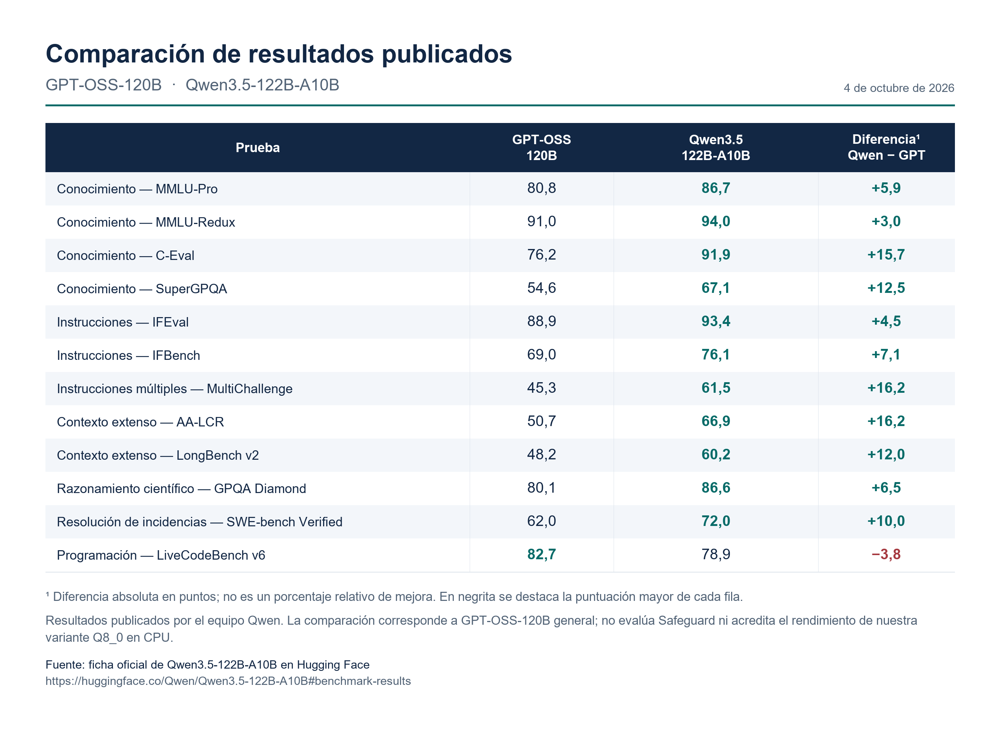

# Comparativa de resultados publicados

**Versión 1.0 · Consulta: 04/10/2026**

La tabla reproduce una selección de doce pruebas de la [ficha oficial de Qwen3.5-122B-A10B](https://huggingface.co/Qwen/Qwen3.5-122B-A10B/blob/dc4d348443bc740c68e2d77492492c11606384d5/README.md). La fuente de los resultados es el equipo Qwen; su alojamiento en Hugging Face no constituye evaluación independiente de esa plataforma.

El comparador es **GPT-OSS-120B general**. Las puntuaciones no pertenecen a Safeguard ni a una prueba de los archivos Q8_0 seleccionados en nuestro entorno.

| Prueba | GPT-OSS-120B | Qwen3.5-122B-A10B | Diferencia Qwen − GPT, en puntos |
|---|---:|---:|---:|
| Conocimiento — MMLU-Pro | 80,8 | **86,7** | +5,9 |
| Conocimiento — MMLU-Redux | 91,0 | **94,0** | +3,0 |
| Conocimiento — C-Eval | 76,2 | **91,9** | +15,7 |
| Conocimiento — SuperGPQA | 54,6 | **67,1** | +12,5 |
| Instrucciones — IFEval | 88,9 | **93,4** | +4,5 |
| Instrucciones — IFBench | 69,0 | **76,1** | +7,1 |
| Instrucciones múltiples — MultiChallenge | 45,3 | **61,5** | +16,2 |
| Contexto extenso — AA-LCR | 50,7 | **66,9** | +16,2 |
| Contexto extenso — LongBench v2 | 48,2 | **60,2** | +12,0 |
| Razonamiento científico — GPQA Diamond | 80,1 | **86,6** | +6,5 |
| Resolución de incidencias — SWE-bench Verified | 62,0 | **72,0** | +10,0 |
| Programación — LiveCodeBench v6 | **82,7** | 78,9 | -3,8 |

Las diferencias son restas absolutas de las puntuaciones publicadas. No expresan mejora porcentual relativa, significación estadística ni probabilidad de acierto en otro banco. Los datos se ofrecen también como [CSV](RESULTADOS_PUBLICADOS.csv).

## Interpretación para la selección

Los resultados de instrucciones y contexto justifican priorizar el estudio de Qwen para la función documental. No demuestran que aplique correctamente una política SV concreta ni que conserve toda la información relevante en cada respuesta.

La selección de doce filas no representa toda la ficha. En otros indicadores publicados, GPT-OSS-120B también supera a Qwen: CodeForces (2157 frente a 2100), OJBench (41,5 frente a 39,5) y Seal-0 (45,1 frente a 44,1). No se calcula una media entre pruebas heterogéneas ni se afirma superioridad universal. [Tabla completa](https://huggingface.co/Qwen/Qwen3.5-122B-A10B/blob/dc4d348443bc740c68e2d77492492c11606384d5/README.md).

La ficha FP8 presenta esa misma familia de resultados, pero FP8 y Q8_0 no son realizaciones intercambiables. La evaluación concreta deberá fijar archivos, motor, contexto y generación. Tampoco cabe convertir estas puntuaciones de calidad en una estimación de tokens por segundo.

## Figura

[Descargar PNG](COMPARATIVA_GPT_OSS_QWEN.png). La figura conserva los mismos valores y las mismas diferencias que la tabla y el CSV.

## Relación con los antecedentes de Safeguard

La [justificación de selección](../justificacion/SELECCION_Y_NECESIDAD.md) expone por separado los incumplimientos observados en los contrastes de Safeguard. No se rellenan supuestas puntuaciones externas de Safeguard con las del modelo general.

[Volver al expediente](../readme.md) · [Fuentes](../fuentes/FUENTES.md).
