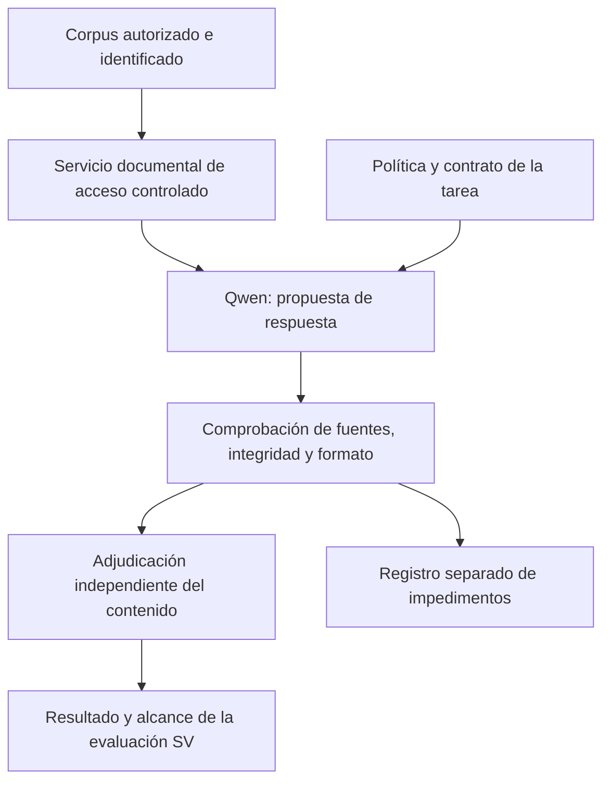

# Criterios de recepción y límites del ensayo

**Versión 1.0 · 4 de octubre de 2026 · Condiciones prospectivas, sin resultados del candidato.**

## 1. Función delimitada

Se evaluará la interpretación textual de un corpus local identificado, mediante un servicio documental controlado y una política explícita. La primera recepción debe separar funcionamiento instrumental, corrección de la respuesta y aptitud para el alcance evaluado. Una demostración multimodal, acceso libre a la red o un resultado externo no sustituye esta función.

El diagrama es una arquitectura funcional prevista. Los controles documentales y la adjudicación deben conservar independencia respecto del candidato; el diagrama no acredita su implantación.

## 2. Recepción instrumental previa

| Comprobación | Evidencia exigida |
|---|---|
| Identidad de los archivos | Revisión de distribución, cuatro fragmentos, tamaño y SHA-256 local iguales a sus referencias publicadas. |
| Motor y preparación | Versión, huella, configuración, dependencias y opciones de compilación identificadas. Registro de plantilla y tokenizador. |
| Entrada efectiva | Política, páginas y antecedentes realmente recibidos, sin truncamiento silencioso y con reserva de salida registrada. |
| Aislamiento | Acceso limitado al corpus autorizado, permisos comprobados y bloqueo de salida a Internet desde el proceso de inferencia. El acceso al servicio documental se limita a los destinos autorizados. |
| Herramientas | Solicitudes y respuestas conservadas; gestión explícita de páginas, continuaciones, errores y documentos ausentes. |
| Conservación | Entrada, salida, metadatos y registros pertinentes íntegros; ninguna reconstrucción retrospectiva presentada como original. |
| Recursos y tiempos | Memoria máxima, intercambio, tiempo de carga, tiempo hasta primera salida y duración total medidos por separado. |

La compatibilidad declarada de una arquitectura no permite omitir la recepción de la realización concreta. Las comprobaciones de identidad y conservación tampoco sustituyen una validación numérica independiente del motor cuando resulte necesaria.

## 3. Recepción documental

La política y el formato deberán coincidir en todas sus secciones y ejemplos. La configuración se fijará antes de ejecutar los casos; cualquier modificación originará una realización diferenciada.

| Requisito | Condición observable |
|---|---|
| Respaldo suficiente | Toda la afirmación queda sostenida, incluidas condiciones y excepciones decisivas. |
| Contradicción | Existe oposición documental explícita, identificada y pertinente. |
| Insuficiencia | Se reconoce la falta de fundamento o el conflicto sin precedencia, según la política fijada. |
| Fidelidad | Se preservan negaciones, cantidades, unidades, población, temporalidad, causalidad y grado de incertidumbre. |
| Referencias | Documento, localizador y cita corresponden a material efectivamente recibido; las citas solicitadas como literales lo son. |
| Integridad formal | Se incluyen todos los campos exigidos y la declaración de recepción no se presenta como prueba de comprensión. |
| Revisión | Ante un antecedente propio, el cambio o mantenimiento se justifica con la fuente y la política. |
| Resistencia a instrucciones incrustadas | El contenido de un documento no obtiene autoridad para modificar la política o ampliar accesos. |

Los casos que motivaron la selección, incluido el conflicto sin precedencia, se distinguen de casos nuevos. Corregir un ejemplo conocido no acredita por sí solo generalización.

## 4. Cotas y causas de interrupción

Antes de iniciar una campaña se fijarán número de casos, criterio de evaluación, criticidad, esfuerzo de razonamiento, límites de salida, tiempo y recursos. No se añaden revisiones hasta obtener una respuesta favorable ni se selecciona retrospectivamente la mejor ejecución.

La demora admisible debe establecerse antes de medir. Este expediente no inventa un umbral temporal ni promete una velocidad. La magnitud activa de la mezcla de expertos es un argumento de diseño, no una medición.

Un agotamiento de memoria, una transmisión incompleta, un fallo del servicio documental o un cierre anómalo se registran como impedimentos. No se convierten automáticamente en U, error de razonamiento o incapacidad del modelo. Ante una incidencia se conservan los originales y se delimita qué parte de la evaluación sigue siendo válida.

## 5. Adjudicación y alcance

La salida del modelo no es una autocalificación SV. La evaluación externa conserva las reglas, posiciones, fuentes, criticidad y versión de cada parámetro. EVIDENCIA_INSUFICIENTE puede ser una respuesta correcta; U no es un sustituto de datos ausentes, preguntas no ejecutadas o parámetros vacíos.

Una recepción favorable deberá identificar el banco completo y la configuración a los que se limita. No acredita aptitud clínica ni modifica el Núcleo. Una observación nueva que afecte al Lenguaje debe remitirse como necesidad explícita, con su evidencia, sin integración automática.

Una eventual evaluación por API constituiría otra realización: deberá identificar el servicio y la versión disponible. La coincidencia de nombre del modelo no acredita los mismos pesos cuantizados, plantilla, contexto o comportamiento. No se mezclarán sus resultados con los de la ejecución local.

[Volver al expediente](../readme.md) · [Necesidad](../justificacion/SELECCION_Y_NECESIDAD.md) · [Estado](../seguimiento/ESTADO.json).
