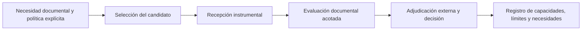

# Qwen3.5-122B-A10B · Q8_0

**Expediente de selección técnica · Versión 1.3 · 6 de octubre de 2026**

**Estado vigente:** Preevaluación cerrada: admisión no acreditada por impedimento temporal. Siete respuestas A0, seis conformes y un error crítico A06; A08/A09 sin ejecutar. Conservación cifrada sin pesos recuperada y cotejada con Rust. Retirada administrativa pendiente; arranque restaurado no ensayado. Recepción científica independiente de A04–A07 y fase pendiente al último corte competente. Véase el [cierre y conservación](seguimiento/cierre-20261006/DICTAMEN-CIERRE.md), el [archivo público](https://github.com/juantoniolloretegea/SV-motor/releases/tag/qwen3.5-122b-a10b-q8-0-archivo-cierre-20261006-v1) y la [edición cifrada restringida](https://github.com/juantoniolloretegea/SV-sala-de-maquinas/releases/tag/qwen35-122b-q8-imagen-cierre-20261006-v1). El hito anterior de cuatro casos se conserva en la historia del expediente y no sustituye al cierre de siete respuestas.

Se estudia **Qwen3.5-122B-A10B**, desarrollado por Qwen, en la distribución **GGUF Q8_0 de Unsloth**. El objetivo es comprobar si puede interpretar fuentes locales delimitadas, aplicar una política explícita y producir respuestas completas y verificables bajo el gobierno del Sistema Vectorial SV.

La selección se fundamenta en sus características técnicas, los resultados comparativos publicados y necesidades que no quedaron satisfechas en los contrastes documentados de GPT-OSS-Safeguard-120B. Es una hipótesis de mejora: las puntuaciones del modelo general y los resultados de otra representación numérica no constituyen recepción del candidato Q8_0.

## Recorrido de lectura

| Orden | Documento | Contenido |
|---|---|---|
| 1 | [Selección y necesidad](justificacion/SELECCION_Y_NECESIDAD.md) | Problema, antecedentes, hipótesis y límites de la sustitución. |
| 2 | [Ficha técnica](ficha-tecnica/FICHA_TECNICA.md) | Identidad, arquitectura, contexto, modalidades, cuantización y condiciones materiales. |
| 3 | [Comparativa con GPT-OSS](comparativa/COMPARATIVA_GPT_OSS.md) | Doce pruebas publicadas, diferencias y alcance de la comparación. |
| 4 | [Criterios de recepción](evaluacion/CRITERIOS_DE_RECEPCION.md) | Evidencias necesarias para comprobar utilidad, fidelidad, aislamiento y viabilidad temporal. |
| 5 | [Fuentes y versiones](fuentes/FUENTES.md) | Referencias primarias, revisiones fijadas y límites de verificación. |
| 6 | [Estado estructurado del corte previo](seguimiento/ESTADO.json) y [revisión documental](seguimiento/REVISION_DOCUMENTAL_20261004.md) | Estado de las afirmaciones y resultado de la revisión crítica previa a publicación. |
| 7 | [Cierre y conservación](seguimiento/cierre-20261006/DICTAMEN-CIERRE.md) · [Recepción](seguimiento/cierre-20261006/RECEPCION.md) · [Manifiesto](seguimiento/cierre-20261006/MANIFIESTO.json) | Resultados finales, alcance de recuperación y situación de retirada, con reservas conservadas. |

**Material complementario:** [identidad y archivos Q8_0](ficha-tecnica/IDENTIDAD_Y_ARCHIVOS.json), [datos comparativos CSV](comparativa/RESULTADOS_PUBLICADOS.csv), [tabla PNG](comparativa/COMPARATIVA_GPT_OSS_QWEN.png) y [huellas del expediente](fuentes/SHA256SUMS.txt).

## Situación que debe conservarse

- La comparación externa corresponde a **GPT-OSS-120B general**; los antecedentes experimentales propios citados corresponden a **GPT-OSS-Safeguard-120B**. Son objetos distintos.
- Q8_0 y FP8 son representaciones diferentes. No se afirma equivalencia de resultados, tiempos ni errores entre ellas.
- El modelo propone una respuesta documental. La validación y la adjudicación SV conservan su autoridad externa al modelo.
- La consulta se proyecta sobre un corpus local identificado y mediante acceso documental controlado. La restricción de fuentes requiere controles efectivos, además de instrucciones.
- El expediente no acredita ausencia universal de errores, aptitud clínica ni integración en el Núcleo.

El diagrama conserva la secuencia del ensayo. La recepción instrumental mínima y el cierre parcial de siete respuestas están documentados. La capa permanece incompleta y no habilita acceso al examen. El cierre y la conservación no modifican la adjudicación científica.

## Organización y continuidad

Cada subcarpeta tiene una función única. La ficha conserva especificaciones; la comparativa conserva datos externos; la justificación relaciona necesidades y antecedentes; la evaluación define condiciones pendientes; el seguimiento identifica las realizaciones efectivamente recibidas. Los resultados futuros deberán añadir fecha, configuración y evidencias propias, sin modificar retrospectivamente los antecedentes.

[Índice Qwen](../README.md) · [Catálogo de modelos](../../README.md) · [Ensayo de IA y observabilidad](../../../README.md).

---

Documentación del Sistema Vectorial SV. Los modelos y componentes de terceros conservan sus licencias de origen.
