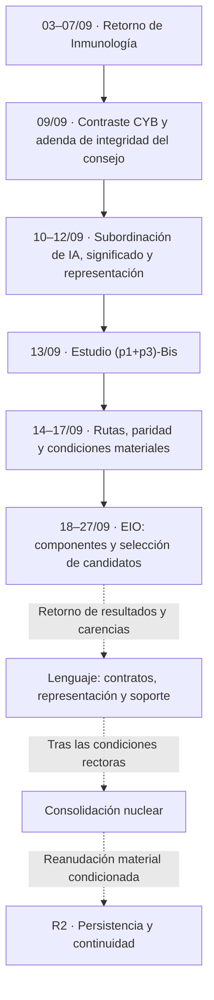
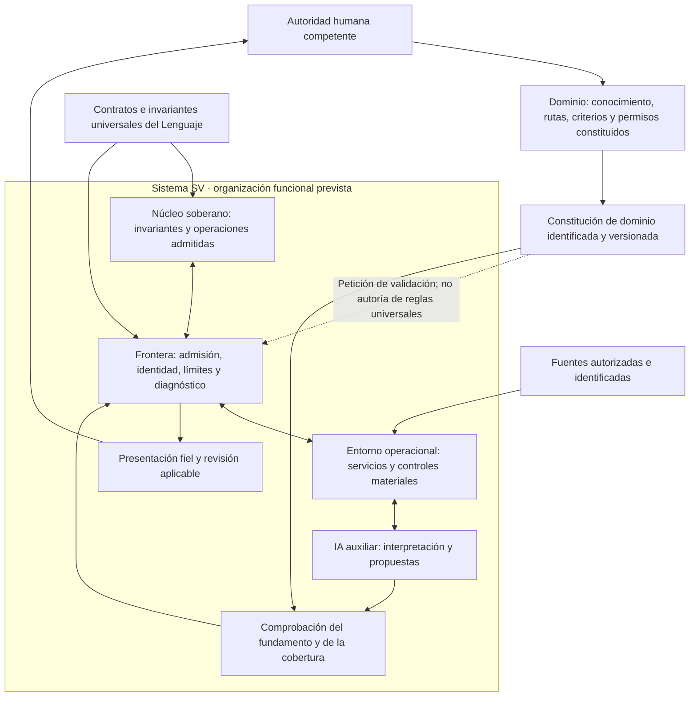
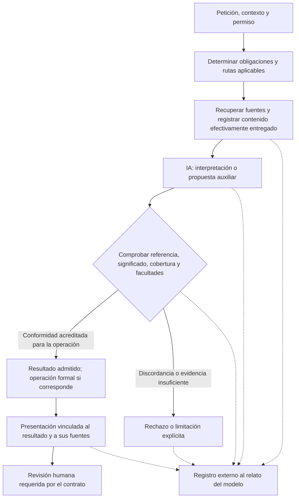
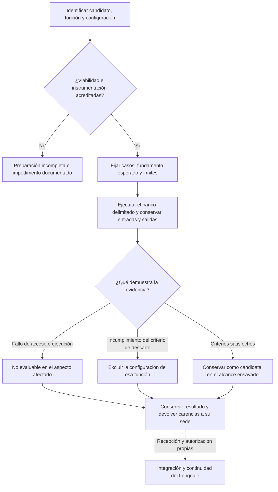

# Sistema conjunto del Lenguaje SV y la inteligencia artificial gobernada

**Guía de objetivo, arquitectura y continuidad · Revisión 2 · 27 de septiembre de 2026**

**Corte documental:** fuentes públicas consultadas el 27/09/2026; revisiones identificadas en el apartado 10. Esta síntesis relaciona decisiones, realizaciones experimentales y cuestiones pendientes. No introduce reglas de dominio, modifica contratos ni acredita nuevas ejecuciones.

## 1. Objeto y situación del conjunto

El Sistema Vectorial SV articula conocimiento constituido por dominios, representación matemática, operaciones del Lenguaje, agentes especializados y componentes de inteligencia artificial. El propósito de su integración es conservar el significado, la procedencia y la autoridad de la información desde su recepción hasta el resultado presentado y, cuando corresponda, hasta el efecto autorizado.

La investigación de inteligencia artificial y observabilidad —EIO, registrada como S39— pertenece al estudio **(p1+p3)-Bis**, derivado de las exigencias de integridad del consejo de OP-CYB-001. Sus resultados deben ayudar a determinar qué necesita la representación del Lenguaje, qué debe comprobar la integración y qué capacidades ofrece realmente cada candidato. Seleccionar un modelo y consolidar la arquitectura son decisiones relacionadas, pero distintas. [F05][F05] [F13][F13] [F14][F14]

La fase **R2**, relativa a persistencia, continuidad y recuperación, conserva su apertura contractual. Su realización material depende del núcleo consolidado y de los contratos necesarios. El contrato **R2-0** permanece como antecedente aplicable; su existencia no demuestra que las garantías de R2 estén ejecutadas. La investigación actual no constituye por sí misma una modificación de la semántica o de la representación intermedia, ni su cierre habilita automáticamente la continuación material. [F01][F01] [F03][F03]

**Criterio arquitectónico:** la IA puede formar parte del sistema gobernado por SV, con funciones explícitas y controles verificables. La inferencia del modelo no adquiere por ello la autoridad del núcleo semántico. La ubicación de un proceso o su pertenencia a una aplicación no sustituye la delimitación de responsabilidades. [F04][F04] [F06][F06]

### 1.1. Objetivo completo y pregunta de decisión

El objetivo es determinar si una realización local de IA puede prestar una función auxiliar útil dentro del SV: consultar conocimiento delimitado, conservar las distinciones relevantes, producir un consejo o una clasificación fundamentados y permitir su examen mediante evidencia observable. La selección del modelo sirve a ese objetivo; el resultado debe volver al Lenguaje cuando revele una necesidad de representación, de contrato o de comprobación. El conocimiento del dominio continúa en constitución y puede evolucionar mediante su procedimiento competente. Esa evolución no autoriza parámetros vacíos, cambios tácitos de significado ni ampliaciones autónomas de autoridad. [F02][F02] [F05][F05] [F09][F09] [F26][F26]

La comparación prospectiva incluye **GPT-OSS-120B y GPT-OSS-Safeguard-120B**, con funciones diferentes. El expediente de ejecución actualmente identificado sólo prepara GPT-OSS-120B; incorporar Safeguard a la comparación conceptual no acredita su instalación, no le transfiere esa recepción ni constituye un ensayo autorizado de dos modelos. La pregunta es qué función puede cumplir cada candidato con suficiente fidelidad, control y viabilidad temporal, y cuál debe descartarse para el alcance elegido. [F20][F20] [F27][F27] [E01][E01] [E02][E02]

La progresión parte de una fuente local conservada, continúa con las obligaciones de OP-IMM-001 y su conocimiento constituido, y requiere un contraste separado en OP-CYB-001. La caché profesional sobre tricoleucemia es un caso de acceso e interpretación documental; no representa todo el Universo 1 de inmunología ni los universos candidatos futuros. El resultado favorable de un tramo no extiende por sí mismo el alcance del siguiente. [F02][F02] [F05][F05] [F18][F18] [F26][F26]

**Resultado que debe producir el estudio:** una decisión de conservación o exclusión por candidato y función; una configuración reproducible; sus capacidades, límites y evidencias; y las necesidades concretas que deban recibir el dominio, el Lenguaje o el entorno operacional. El requisito de evitar errores materiales debe expresarse en controles y causas de descarte. Una campaña finita sin errores observados no demuestra error universal igual a cero. [F15][F15] [F20][F20]

**Recorrido de lectura:** [sedes y versiones](#sedes) → [secuencia histórica](#cronologia) → [células y representación](#celulas) → [arquitectura](#arquitectura) → [tubería de IA](#tuberia) → [estado comprobado](#estado) → [retorno al Lenguaje](#retorno) → [revisión adversarial](#adversarial) → [fuentes](#fuentes).

## 2. Sedes, competencias y criterio de versión

| Sede | Función en el conjunto | Distinción necesaria |
|---|---|---|
| **SVperitus-dataset** | Constitución de dominios, necesidades profesionales, parámetros, relaciones y contratos de cobertura de agentes. | Una necesidad profesional no se recorta para adaptarla a una representación insuficiente. Tampoco se deduce una arquitectura celular del mero recuento de parámetros. |
| **SV-lenguaje-de-computacion** | Contratos del Lenguaje, representación, validación, recepción de resultados y seguimiento canónico de la continuidad. | La representación de una obligación, su comprobación local y su imposición efectiva son estados diferentes. |
| **SV-motor** | Fuentes, componentes, ensayos de modelos, resultados técnicos y distribuciones experimentales. | Compilar, cargar o generar una respuesta no equivale a superar la selección ni a integrarse en el núcleo. |
| **SVcustos-dataset**, rama de laboratorio público | Consulta documental, proyecciones públicas y paquetes de verificación dentro de su alcance. | Una publicación derivada conserva su fecha y sus límites; no sustituye el estado canónico del Lenguaje. |

Fuentes del reparto y de sus límites: [F02][F02], [F04][F04], [F05][F05], [F15][F15] y [F21][F21].

Las referencias del SV fijan confirmaciones Git completas. En SVperitus se consultan las ramas específicas de inmunología y ciberseguridad; en SVcustos, la rama del laboratorio público. Consultar únicamente `main` en todos los repositorios omitiría documentos pertinentes.

Las referencias F01–F27 corresponden a documentos de esos repositorios. E01–E03 añaden documentación oficial de los modelos y de su formato de conversación; su fecha de consulta se identifica separadamente y no se les atribuye una confirmación Git inexistente.

La fecha del título no determina por sí sola la vigencia: varias actas incorporan apartados posteriores. Para describir el estado se consideran esas actualizaciones, el registro de sucesos y las fichas específicas. Un encabezado histórico no prevalece sobre una recepción posterior identificada. Los documentos primarios permanecen en sus sedes; esta síntesis no los sustituye.

La recepción de rutas del 14/09 advierte que las ampliaciones están incorporadas al Markdown, mientras que los dos PDF asociados conservan su edición anterior. Para esas ampliaciones se utiliza el Markdown actualizado; no se presupone equivalencia entre formatos. [F26][F26]

<strong>Numeraciones que deben mantenerse separadas</strong>

| Identificador | Qué designa |
|---|---|
| Gramática 0.2 | Superficie formal del Lenguaje. |
| IR 0.3 | Versión de la representación intermedia; conserva las partes heredadas que no hayan sido sustituidas. |
| Semántica del SV | Obligaciones contenidas en los fundamentos, la frontera normativa, la IR y las adendas aplicables. La referencia informal a «semántica 0.2» no identifica por sí sola una especificación independiente vigente. |
| R0–R4; R2-0 | Fases del entorno soberano y contrato de persistencia; no versiones de la IR. |
| P0–P6 | Etapas de una campaña acotada de subordinación de IA. |
| BIS-00–BIS-08 | Etapas del estudio de célula matemática, imagen y agentes. |
| S22, S26, S32, S39 | Identificadores de seguimiento documental; no estados celulares ni sucesos de un caso profesional por mera coincidencia de nombre. |
| TT-0014, TT-0015 | Seguimientos técnicos del servicio documental y del candidato GPT-OSS-120B. |
| Frame | Objeto constituido que vincula estado matemático y representación comprensible bajo un contrato; su propuesta conceptual no demuestra un tipo ya incorporado a la IR. |
| MCP | Protocolo de contexto del modelo: intercambio con servicios documentales o herramientas. Su presencia no demuestra que el modelo pueda invocarlos ni que comprenda sus resultados. |
| Harmony | Formato de conversación que distingue papeles, canales, cesión a herramientas y terminación en la familia GPT-OSS. |
| K2 | Tramo de decisiones de frontera posterior al contraste de contratos de inmunología y ciberseguridad; comprende identidades, versiones, procedencia y correspondencias pendientes. |

El plan V2 de Bis precisa expresamente la nomenclatura de gramática, IR y obligaciones semánticas. La continuidad posterior exige identificar el ámbito de códigos que puedan repetirse. Las definiciones complementarias proceden del contrato de transición, del estudio celular y de los documentos de integración. [F03][F03] [F09][F09] [F10][F10] [F12][F12] [F19][F19] [E03][E03]

## 3. Secuencia documental y experimental

Las fechas siguientes corresponden a hitos documentales o a campañas identificadas, no a una supuesta ejecución ininterrumpida. La última columna delimita lo que cada hito permite sostener.

| Fecha | Hito y relación con el siguiente | Alcance y fuente |
|---|---|---|
| **25/08/2026** | R2-0 define persistencia, continuidad y recuperación, separando estado técnico, derivado y autoritativo. | Contrato de realización; conservar bytes no basta para acreditar vigencia o autoridad. [F01][F01] |
| **03–07/09/2026** | OP-IMM-001 actúa como primer caso director. El retorno G/H devuelve necesidades, fidelidad y pérdidas al Lenguaje. | I1–I8 completados documentalmente; suficiencia no acreditada para ejecutar Q0. Se conservan 27 parámetros y cuatro salidas exclusivas. [F02][F02] [F03][F03] |
| **04–06/09/2026** | Se explicita la separación entre núcleo, frontera y entorno operacional, y la secuencia previa a consolidar el núcleo. | Arquitectura constituida y condiciones de realización; no garantía material completa. [F04][F04] |
| **08/09/2026** | El laboratorio establece evidencia pública verificable junto a la custodia restringida. | Especificación, observaciones y verificación deben distinguirse; el acceso a un manifiesto no acredita por sí solo el contenido reservado. [F21][F21] |
| **09/09/2026** | OP-CYB-001 devuelve un segundo contraste heterogéneo. Su adenda exige integridad del consejo, cobertura y separación entre contenido y autoridad. | Se conservan 32 definiciones y 17 controles. La recepción documental previa ya consta; la adenda añade exigencias a la capa asesora. [F05][F05] |
| **10–11/09/2026** | Se delimita la subordinación de IA: identificación de la petición, comprobación de referencias, trazabilidad, contención y viabilidad. | El plan V2 sucede al inicial sin reiniciar los bancos. Las propiedades previstas conservan sus condiciones de prueba. [F23][F23] [F06][F06] |
| **11–12/09/2026** | El estudio del frame conecta significado humano, evidencia y representación visual. | Una explicación o una imagen comprensible puede seguir siendo infiel; deben conservarse las distinciones decisivas de la operación. [F07][F07] [F08][F08] |
| **13/09/2026** | (p1+p3)-Bis V2 concreta la correspondencia entre célula, imagen y agentes. | Plan definido; realización y paridad integral sujetas a contraste. La célula mínima no se convierte en tamaño predeterminado. [F09][F09] [F10][F10] |
| **14/09/2026** | Se recibe el recorrido de conocimiento y consejo especializado, incluida la participación auxiliar de una IA de lenguaje probabilístico. | Se distinguen consulta, investigación e incorporación; permanece una reserva formal sobre la transición de incorporación de conocimiento. [F26][F26] |
| **15–17/09/2026** | Se ordenan la continuidad de Bis, riesgos materiales y privacidad, preservando las campañas previas. | Avances parciales y dependencias explícitas. La interfaz gráfica deja de ser una continuación automática. [F11][F11] [F12][F12] |
| **18–20/09/2026** | EIO obtiene su primer hito documental localizado y se concilia con Calidad como S39, dentro de Bis. | El 18/09 identifica una publicación comprobada; el alta del 20/09 no crea una autorización retrospectiva ni reinicia el ensayo. [F13][F13] |
| **22–26/09/2026** | Se conservan realizaciones conversacionales, controles instrumentales y campañas de candidatos de menor tamaño. | Resultados por configuración; no tasa conjunta ni validación general. GPT-OSS-20B queda excluido de la función médica ensayada. [F15][F15] [F17][F17] |
| **26–27/09/2026** | Se separan diagnóstico, acceso documental y selección final de Qwen3.8-27B; se conservan versiones del servicio documental. | La selección final no pasa. La recepción instrumental del MCP y la evaluación del modelo siguen siendo juicios distintos. [F16][F16] [F18][F18] [F19][F19] |
| **27/09/2026** | GPT-OSS-120B figura como candidato en preparación mediante TT-0015. | Sin resultado de inferencia o selección acreditado en el corte consultado. Su preparación no reabre los candidatos retirados ni incorpora el modelo al núcleo. [F20][F20] |

**Lectura del diagrama:** las flechas continuas expresan la relación documental entre hitos; no significan que cada bloque esté concluido. Las discontinuas representan retornos o continuaciones sujetos a condiciones todavía aplicables. La secuencia completa incluye otras obligaciones de la transición rectora. [F03][F03] [F12][F12]

## 4. Células, conocimiento y fidelidad de la representación

Una célula SV(n,b) es un estado ordenado y posicional sobre el alfabeto Σ = {0, 1, U}, con b natural, b ≥ 3 y n = b². Su espacio de estados tiene cardinalidad 3ⁿ. SV(9,3) tiene nueve posiciones y 19.683 configuraciones posibles; no es una matriz de 3 × 3 ni exige almacenar todas sus configuraciones. [F09][F09]

La convención canónica es **0 = Apto, 1 = No_Apto y U = Indeterminado**, bajo el significado de la operación constituida. La coincidencia de esos caracteres con una salida de un clasificador externo no establece identidad semántica. El paso a un estado SV requiere identificar parámetro, regla, evidencia, criticidad, versión y comprobación de admisión; la salida del modelo permanece como propuesta hasta satisfacer ese contrato. [F09][F09] [F24][F24]

La dimensión permanece fija una vez admitida la célula. El dominio competente constituye el significado, orden, fuentes y relaciones de sus posiciones. **No se completan posiciones mediante relleno, duplicación o U**. Un parámetro no crítico conserva identidad y función; no es una posición vacía. La criticidad depende de la operación y no se obtiene de la proximidad gráfica ni del recuento de parámetros. [F07][F07] [F09][F09] [F24][F24]

Las células de conocimiento nuclear del dominio y los parámetros singulares de decisión comparten un molde de representación. Ese uso de «nuclear» no sitúa el conocimiento médico o de ciberseguridad dentro del núcleo universal del Lenguaje. Su constitución sigue perteneciendo al dominio. La composición de células necesita relaciones, papeles y correspondencias explícitas; dos células no se convierten en una de tamaño intermedio por sumar sus posiciones. [F09][F09] [F26][F26]

El vínculo conceptual entre componente matemático y visual exige que ambos correspondan a la misma instancia, estado, constitución y versión. Deben distinguirse una imagen prevista, una imagen generada y una imagen realmente presentada o consumida. Acertar una clasificación global no prueba que se hayan conservado las posiciones ni que la explicación sea suficiente para otra operación. [F09][F09]

<strong>Precisiones de alcance de los dominios y de la indeterminación</strong>

- OP-IMM-001 delimita información predecisional sobre riesgo infeccioso antes de inmunosupresión en adultos. Sus 27 parámetros y cuatro salidas no constituyen un clasificador general de enfermedades. [F02][F02] [F26][F26]
- Los 32 identificadores raíz de Q0 no deben confundirse con el mapa de 32 universos candidatos mencionado en la ampliación de rutas; ninguno de esos recuentos acredita por sí mismo cobertura clínica completa. [F02][F02] [F26][F26]
- OP-CYB-001 estudia evidencia y legitimidad de corregir una vulnerabilidad mediante actualización. Sus 32 definiciones no determinan automáticamente una célula ni una arquitectura celular. [F05][F05]
- La caché del PDQ profesional sobre tricoleucemia es una fuente documental experimental. Su presencia en un catálogo MCP no constituye el dominio inmunológico. [F18][F18]
- U expresa indeterminación válida bajo el contrato correspondiente. Ausencia de un archivo, vencimiento de plazo, rechazo de entrada y fallo de inferencia requieren diagnósticos propios; no se convierten automáticamente en U. [F05][F05] [F09][F09]
- Un resultado algebraico no es una probabilidad diagnóstica. Los vetos y las dependencias críticas no se compensan mediante otros parámetros favorables. [F26][F26]

## 5. Arquitectura del sistema y gobierno de la IA

La arquitectura separa **núcleo soberano**, **frontera contractual** y **entorno operacional**. El núcleo preserva los invariantes y realiza las operaciones admitidas en su versión; la frontera identifica y comprueba los intercambios; el entorno materializa comunicaciones, persistencia e integración. La autoridad no procede del nombre del componente, del lenguaje de programación o de compartir un proceso. [F04][F04]

**Estatuto del diagrama:** síntesis funcional de los requisitos, no plano de una integración completa ya cualificada. No prescribe un proceso único, un proveedor ni una colocación física de los modelos. La comprobación de fundamento y cobertura representa una obligación que debe tener realización y evidencia; dibujarla no acredita que esté resuelta. [F04][F04] [F05][F05] [F06][F06]

La recepción del 14/09 admite una IA probabilística en interlocución, organización y exposición del consejo, con trazabilidad de lo efectivamente realizado. Ese papel no habilita al modelo para constituir rutas, modificar parámetros, clausurar U, ampliar permisos o incorporar conocimiento. Una propuesta puede resultar útil y, a la vez, requerir rechazo o revisión antes de adquirir un efecto reconocido por SV. [F26][F26]

El gobierno formal tampoco demuestra por sí solo aislamiento material. Los permisos, la red, la memoria, los procesos y los canales de salida deben imponerse y comprobarse en el entorno correspondiente. Las garantías frente a fallos de plataforma conservan sus condiciones propias. [F04][F04] [F23][F23]

## 6. Tubería de información, interpretación y comprobación

La tubería enlaza una petición con el conocimiento que está autorizado y obligado a consultar, conserva las entradas efectivas y comprueba las salidas antes de su uso. No equivale a transmitir un documento al modelo ni a exigirle una promesa de fidelidad.

El esquema expresa el recorrido exigible, no una comprobación semántica universal ya disponible. La suficiencia de cada control debe acreditarse para la operación. Un mensaje de instrucciones, una huella de archivo o la aprobación de un segundo modelo no sustituyen esa justificación. [F23][F23]

| Tramo | Evidencia necesaria | Error que debe evitarse |
|---|---|---|
| Petición y contexto | Texto original, objeto, finalidad, permiso y versión aplicables. | Responder sobre un sujeto, parámetro o episodio distinto. |
| Selección documental | Rutas exigibles, activaciones, inactividades justificadas, secciones y continuidad de lectura. | Citar correctamente una selección que omite una dependencia crítica. |
| Entrega al modelo | Contenido exacto, transformaciones, truncamientos, configuración y canales. | Confundir un archivo disponible con uno efectivamente recibido. |
| Interpretación | Propuesta conservada y contraste con las condiciones de la operación. | Admitir una propuesta bien formada pero semánticamente equivocada. |
| Resultado y efecto | Regla, entrada, salida y facultad de la operación; inscripción cuando sea exigible. | Convertir cualquier respuesta en una transición o un frame. |
| Presentación | Correspondencia con el resultado comprobado y contenido realmente mostrado. | Perder una negación, ocultar incertidumbre o presentar otro estado. |
| Conservación | Artefactos recuperables, versiones y registro de hechos observables. | Aceptar la narración del modelo como prueba de sus actuaciones. |

Estas obligaciones proceden de la adenda CYB, del plan de subordinación y de la recepción de rutas. La explicación puede ser contrastable sin que ello demuestre acceso al proceso interno completo del modelo. Tampoco un registro íntegro acredita por sí solo la verdad de su contenido. [F05][F05] [F06][F06] [F26][F26]

<strong>Consulta, investigación e incorporación de conocimiento</strong>

| Operación | Condición documental recibida | Efecto permitido |
|---|---|---|
| Consulta clínica constituida | Conocimiento previamente admitido; sin Internet durante el episodio. | Aplicar el alcance definido, sin actualización autónoma del conocimiento. |
| Investigación solicitada | Acceso a fuentes externas dentro de un encargo expreso. | Presentar hallazgos con procedencia y límites. |
| Incorporación de conocimiento | Procedimiento custodial, condiciones de aceptación y autorización pertinentes. | Cambiar el conocimiento admitido sólo mediante la transición constituida. |

Las tres operaciones mantienen registros y facultades diferentes. Un hallazgo de investigación no entra automáticamente en el episodio clínico. La recepción del 14/09 identifica una reserva específica en la traducción ejecutable del mecanismo de promoción desde custodia; no se presenta ese mecanismo como cerrado. [F26][F26]

## 7. Estado documentado al corte de esta revisión

### 7.1. Lenguaje, Bis y garantías materiales

| Objeto | Estado documentado | Límite que permanece |
|---|---|---|
| R2 y R2-0 | Apertura contractual conservada; realización material condicionada. | No consta cierre material de persistencia, continuidad y recuperación en las fuentes receptoras examinadas. [F01][F01] [F03][F03] |
| BIS-00 y BIS-01 | Finalizados en sus alcances de fijación y revisión documental/estática. | No equivalen a suficiencia integral. [F11][F11] |
| BIS-02, BIS-03 y BIS-04 | En ejecución; existen decisiones parciales, realización Rust y contrastes acotados. | Contratos, responsabilidades y realización no están cerrados globalmente. [F11][F11] |
| BIS-05 a BIS-08 | Pendientes como etapas globales. | Los avances parciales no acreditan paridad integrada, integración final ni retorno completo al catálogo. [F11][F11] |
| S22 | En ejecución; el último asiento examinado distingue custodia comprobada de cualificación del reconocedor pendiente. | No se atribuye reconocimiento visual cualificado a la mera conservación de fuentes o imágenes. [F14][F14] |
| S26 | Estudio material en ejecución. | Consulta histórica y resolución por instancia/posición conservan dependencias pendientes; no se cierran por disponer de ligaduras documentales. [F14][F14] |
| S32 / privacidad | Recepciones instrumentales parciales; seguimiento abierto. | No acreditan privacidad, aislamiento o cumplimiento general del sistema. [F14][F14] |
| S39 / EIO | Registro pendiente de la continuación preliminar del 120B; existen campañas anteriores conservadas. | «Pendiente» no significa ausencia de ensayos históricos ni proceso de inferencia actualmente activo. [F14][F14] [F20][F20] |

El registro de Bis incluye realización parcial C02–C05 y pruebas de representación y consumo SVG, pero conserva expresamente la ausencia de suficiencia global. Las cifras y los resultados pertenecen a sus campañas; aquí no se agregan ni se presentan como pruebas nuevas. [F11][F11]

### 7.2. Modelos y servicio documental

| Configuración o componente | Resultado conservado | Consecuencia documental |
|---|---|---|
| Qwen3-0.6B | Inferencia nativa y controles parciales; cuatro consultas DOC-01 terminadas sin conformidad completa. | Campaña cerrada con limitaciones. [F15][F15] |
| GPT-OSS-20B | Errores de contenido y un defecto de terminación identificado en un contraste acotado. | Configuración excluida de la función médica ensayada. Cuatro casos y diecinueve condiciones no son diecinueve problemas independientes. [F17][F17] |
| Qwen3.8-27B | La selección final obtuvo respuesta completa, con omisión material y deficiencias de citas y localización. | No pasa la selección actual. Se distingue este resultado de las interrupciones instrumentales anteriores. [F16][F16] |
| GPT-OSS-120B | Preparación preliminar registrada en TT-0015. | Candidato pendiente; no se le transfieren los resultados del 20B. [F20][F20] |
| MCP documental 0.1.1 | Comprobaciones instrumentales dirigidas y recuperación documental; la consulta generativa asociada no concluyó dentro de su plazo. | Acceso documental no equivale a interpretación correcta ni a aceptación clínica. [F18][F18] |
| Servicio y cliente local 0.1.2 | Versión sucesora con cliente y supervisión delimitados. | El cliente no proporciona herramientas al modelo; no debe describirse como búsqueda autónoma acreditada. TT-0014 conserva recepción pendiente. [F19][F19] [F25][F25] |

La ficha general del MCP describe 0.1.1, mientras que el documento específico y TT-0015 identifican 0.1.2. Ambos cortes se conservan con su alcance: la existencia de la versión sucesora no convierte en aceptada toda la recepción ni modifica retrospectivamente el recorrido de la anterior.

### 7.3. Función de GPT-OSS-120B y de GPT-OSS-Safeguard-120B

GPT-OSS-120B es un modelo de razonamiento de pesos abiertos, de entrada y salida textual, con capacidad declarada de llamadas a herramientas. GPT-OSS-Safeguard es una especialización para clasificar texto conforme a políticas explícitas aportadas a la consulta. Su guía exige definir categorías, condiciones y formato de respuesta. Ambos utilizan Harmony. [E01][E01] [E02][E02] [E03][E03]

La interpretación textual tampoco acredita reconocimiento visual del frame. GPT-OSS-120B no declara entrada de imagen; el acceso a un vector o a una descripción de la imagen constituye otra operación. El objetivo de paridad entre estado matemático, imagen efectiva y comprensión profesional conserva sus comprobaciones propias. [E01][E01] [F09][F09]

De estas funciones no se deduce que Safeguard garantice hechos verdaderos, lectura íntegra o ausencia de alucinaciones, ni que sustituya con igual rendimiento al modelo general para el consejo especializado. **Conformidad con una política y corrección sustantiva son propiedades diferentes.** Su relación deberá especificarse y contrastarse en el SV. La seguridad de contenido no equivale a seguridad clínica. [F05][F05] [F20][F20]

| Alternativa de estudio | Pregunta que debe resolver | Límite de la inferencia permitida |
|---|---|---|
| GPT-OSS-120B como único candidato activo | ¿Puede consultar y responder con fundamento y cobertura dentro de los controles externos del SV? | Seguir instrucciones no demuestra por sí solo imposición de permisos ni corrección del contenido. |
| Safeguard-120B para clasificación conforme a una política SV explícita | ¿Reconoce incumplimientos, excepciones y evidencia insuficiente en la función delimitada? | Un dictamen favorable no sustituye una comprobación semántica ni constituye una célula válida. |
| Safeguard-120B como único interlocutor especializado | ¿Puede además satisfacer las tareas de consulta y consejo previstas? | Es una hipótesis adicional; no queda acreditada por su especialización en políticas. |
| Generador y clasificador encadenados | ¿La comprobación adicional detecta errores relevantes con una demora aceptable? | El acuerdo entre modelos no acredita independencia ni verdad. No es la arquitectura seleccionada por esta guía. |

La comparación debe poder efectuarse por separado. No se exige mantener dos modelos de 120B residentes ni ejecutar dos inferencias para cada respuesta. Incorporar un segundo modelo requiere justificar una mejora concreta y medir la demora total; una revisión del mismo modelo sobre su propia salida tampoco cuenta como comprobación independiente. Estas son condiciones propuestas de comparación, no resultados observados ni ampliaciones del encargo registrado. [F20][F20] [F27][F27]

<strong>Correspondencia entre clasificación y estados SV</strong>

Una etiqueta binaria de ausencia de infracción no prueba por sí sola suficiencia positiva para una operación SV. La adaptación debe preservar tres situaciones distintas: conformidad acreditada, incumplimiento acreditado e indeterminación admitida por el contrato. Además, debe conservar por separado los fallos instrumentales, las entradas inválidas y las ausencias de respuesta.

No se asignará U indiscriminadamente a todos esos fallos ni se transformará en Apto una respuesta por contener una etiqueta válida. Una salida desconocida, incompleta o incompatible con su contrato debe quedar rechazada o pendiente de la revisión establecida. Esta separación desarrolla los límites de admisión ya expuestos; no introduce una nueva tabla de verdad del SV. [F09][F09] [F24][F24]

### 7.4. Instalación prevista y viabilidad temporal

La realización inmediata documentada es **nativa CPU, en Rust, con mistral.rs como motor candidato, Harmony y catálogo local de fuentes**. La referencia de 128 GB es una hipótesis de dimensionamiento; aún deben fijarse la revisión de pesos, el artefacto ejecutado, el binario efectivo, su compatibilidad y la memoria total necesaria. La vía de navegador con WebAssembly queda diferida. [F20][F20] [F27][F27]

El horizonte de ejecución local comprende equipos de sobremesa o portátiles con 128 GB, considerados como posibles destinos del experimento, no como plataformas ya cualificadas. La memoria principal de una instancia CPU, la memoria compartida de un equipo local y la memoria de una GPU dedicada no son capacidades intercambiables a efectos de rendimiento. Una ejecución satisfactoria en el servidor aportaría evidencia sobre esa configuración; el traslado al equipo local conservaría un contraste específico de compatibilidad y tiempos.

| Aspecto que debe quedar identificado | Evidencia exigible para cerrar la viabilidad |
|---|---|
| Plataforma | CPU, acelerador si lo hubiera, memoria utilizable, sistema operativo y bibliotecas efectivas. |
| Modelo y representación | Identidad y revisión de pesos, tokenizador, cuantización, procedencia y huellas. |
| Memoria | Pesos residentes, conversiones, carga máxima, caché de atención, temporales, servicios y reserva del sistema. |
| Conversación | Plantilla Harmony, herramientas realmente disponibles, canales y condiciones de terminación. |
| Demora | Carga inicial, recuperación documental, procesamiento de entrada, razonamiento, respuesta final y comprobación. |
| Concurrencia | Número de peticiones y modelos residentes, con su repercusión observada sobre memoria y tiempo. |

Los tokens de razonamiento y la lectura documental cuentan en la demora aunque la respuesta visible sea breve. La velocidad de otro modelo, otro tamaño o una prueba gráfica del fabricante no es una medición del sistema propuesto. El límite temporal aceptable para el uso final **está pendiente de fijación**; no se inventa aquí una cifra ni se sustituye por «tan rápido como sea posible». La carga de pesos demuestra un hecho técnico, no utilidad ni aptitud. [F20][F20] [F27][F27]

### 7.5. Acceso documental que debe demostrar el candidato

El objetivo de acceso es que el modelo pueda solicitar documentos, seleccionar secciones y continuar su lectura dentro de un catálogo autorizado, conservando exactamente lo entregado. Eso permite examinar su conducta documental sin resolver previamente el caso mediante una sinopsis preparada. No exige alojar todo el dominio en una única entrada: el acceso sucesivo es admisible si la continuidad, las omisiones y las obligaciones de cobertura quedan comprobables. [F05][F05] [F18][F18] [F25][F25]

El cliente 0.1.2, por sí solo, no satisface esa función porque no ofrece herramientas al modelo. Un ensayo que le entregue texto por mediación del cliente puede medir interpretación de ese texto, pero no búsqueda autónoma. Antes de atribuir un resultado a esta última función debe quedar identificada su integración real y separada la prueba de recuperación de la de interpretación. [F19][F19] [F20][F20]

El aislamiento de la consulta debe imponerse fuera del modelo. El catálogo y sus documentos se tratan como contenido, sin facultad para cambiar instrucciones, permisos o rutas admitidas. Una orden inserta en una fuente no adquiere autoridad por haber sido recuperada correctamente. [F05][F05] [F23][F23]

<strong>Qué permiten concluir las campañas y sus archivos de conservación</strong>

Los resultados califican configuraciones, operaciones y bancos determinados. No permiten establecer una tasa general de error clínico, una incapacidad de toda una familia de modelos o la inutilidad de cualquier entrenamiento futuro. Tampoco una respuesta correcta aislada acredita la función completa. [F15][F15] [F16][F16] [F17][F17]

Las distribuciones y las imágenes de recuperación conservan trabajo y facilitan su reconstrucción. No acreditan por sí mismas calidad de la respuesta, restauración ensayada de cada archivo nuevo ni continuidad autoritativa de R2. Las comprobaciones de integridad, descifrado, restauración y ejecución tienen alcances diferentes. [F01][F01] [F16][F16] [F17][F17]

Algunas evidencias operativas completas permanecen en custodia restringida. La lectura de sus síntesis públicas no equivale a haber reproducido aquellas ejecuciones. El régimen de evidencia pública exige declarar qué puede comprobarse sin acceso adicional y qué queda únicamente identificado bajo custodia. [F21][F21]

## 8. Retorno de resultados al Lenguaje y condiciones para continuar R2

La consecuencia arquitectónica de un ensayo debe localizarse antes de decidir una modificación. Un fallo generativo no demuestra automáticamente una carencia del Lenguaje; una carencia de representación tampoco se resuelve atribuyéndola al modelo.

| Observación | Sede que debe examinarse | Entrega necesaria |
|---|---|---|
| Fuente suficiente recibida; interpretación o respuesta incorrecta. | Candidato, configuración y función asignada. | Caso, entrada efectiva, esperado justificado y decisión de selección. |
| Fuente incompleta, transformación no declarada, pérdida de contexto o terminación defectuosa. | Acceso documental, motor, cliente o supervisión. | Identificación causal y contraste que separe fallo instrumental de error de contenido. |
| Información representable, pero comprobación ausente o incorrecta. | Realización, receptor o comprobador. | Obligación, mecanismo faltante y prueba discriminante. |
| Dos situaciones profesionalmente distintas no pueden conservarse o recuperarse mediante la representación admitida. | Contratos del Lenguaje, semántica o IR. | Par discriminante, operación afectada, información perdida y propuesta mínima de cambio. |
| Falta una definición de significado, activación, criticidad o autoridad. | Constitución competente del dominio o de la operación. | Carencia concreta, efecto y dependencia; sin completar posiciones por inferencia. |
| El contrato es suficiente, pero no se imponen permisos, límites o continuidad. | Entorno operacional y garantías materiales aplicables. | Ensayo sobre el límite real, dependencias de confianza y alcance de la garantía. |

Esta clasificación sintetiza el método de retorno: localizar la pérdida, justificar la sede y conservar la evidencia. No establece una nueva secuencia normativa. [F03][F03] [F05][F05] [F06][F06] [F10][F10]

La entrega de esta investigación debe dejar identificadas las capacidades acreditadas, las exclusiones y las obligaciones pendientes. La consolidación nuclear exige cotejarlas con las operaciones que se pretenda admitir; no exige cerrar todos los dominios futuros ni autoriza a omitir una dependencia necesaria del alcance elegido. [F03][F03]

El retorno material a R2 conserva las condiciones de la transición rectora: núcleo consolidado, salida de K2, identidades y contratos suficientes y autorización aplicable. R2-0 debe reconciliarse con ese corte, sin borrar su apertura anterior. R3 mantiene su objeto de confianza de plataforma y R4 el contraste de la realización integrada. **Superar la selección de un modelo no satisface por sí solo esas condiciones.** [F03][F03]

### 8.1. Secuencia de decisión y puntos de cierre

La tabla convierte el objetivo en una secuencia de lectura y recepción. Los pasos 1–2 resumen condiciones del expediente vigente; los restantes identifican los cierres que deberán constituirse para evaluar la función completa. No autorizan una nueva ejecución ni fijan umbrales todavía no aprobados. [F20][F20] [F27][F27]

| Paso | Pregunta de recepción | Producto y decisión |
|---|---|---|
| 1. Identidad y viabilidad | ¿Se conoce qué se ejecutaría y si los recursos permiten hacerlo? | Configuración identificada y dimensionamiento; favorable condicionado, preparación incompleta o impedimento. |
| 2. Instrumentación y acceso | ¿Termina correctamente la conversación y puede acreditarse el acceso solicitado a las fuentes? | Prueba de protocolo, catálogo y contenido efectivo; el fallo instrumental conserva su diagnóstico. |
| 3. Especificación del banco | ¿Están fijados función, casos, respuestas esperadas, errores materiales y límites? | Protocolo cerrado antes de observar respuestas; cada criterio con su fundamento. |
| 4. Selección acotada | ¿Responde o clasifica correctamente dentro de ese alcance y esos límites? | Respuestas y sucesos íntegros; aceptación acotada, descarte por criterio incumplido o resultado no evaluable. |
| 5. Interpretación del resultado | ¿Qué ha quedado demostrado y qué sigue pendiente? | Decisión por candidato, función y dominio; los casos conocidos no se presentan como independientes. |
| 6. Devolución e integración | ¿La carencia pertenece al candidato, al dominio, al Lenguaje o al soporte material? | Entrega a la sede correspondiente y recepción propia antes de cualquier integración. |
| 7. Conservación | ¿Puede reconstruirse la configuración y examinarse su evidencia? | Fuentes, identidades, manifiesto, informe y alcance público comprobable; archivo y aptitud permanecen separados. |

**Límites de esta secuencia:** no se repite una respuesta para sustituir un fallo por un acierto ni se modifica el criterio después de medir. Una repetición diagnóstica autorizada conserva el fallo inicial y se identifica como tal. El presupuesto y las causas de parada se fijan previamente; no se prolonga la selección por ausencia de un resultado favorable. Si un fallo instrumental impide juzgar el contenido, no se atribuye al modelo un error clínico no observado. [F16][F16] [F17][F17] [F20][F20]

<strong>Condiciones todavía pendientes para una auditoría material del objetivo completo</strong>

| Condición pendiente | Consecuencia de su ausencia |
|---|---|
| Artefacto y plataforma efectivos del 120B | No puede afirmarse instalación reproducible ni suficiencia de 128 GB. |
| Función y recepción propias de Safeguard | No puede afirmarse que sustituya al modelo general ni que su empleo esté seleccionado. |
| Política y correspondencia de salidas con SV | No puede atribuirse autoridad celular a una clasificación del modelo. |
| Integración que permita las solicitudes documentales del candidato | No puede calificarse la búsqueda a partir de una prueba que sólo entregue texto. |
| Banco, criterios materiales y límites de tiempo y memoria | No puede emitirse una decisión de aceptación completa para el uso previsto. |
| Evidencia accesible para cada afirmación experimental | La revisión pública se limita a las propiedades sustentadas por los artefactos disponibles. |

Esta guía permite reconstruir el objetivo y localizar sus decisiones abiertas sin recurrir a una conversación previa. **No contiene todavía un expediente de ejecución completo de ambos modelos.** Para cada afirmación de una campaña posterior deberá relacionarse requisito, caso, resultado esperado, observación, artefacto, huella y decisión. Cuando los datos no puedan divulgarse, la versión pública delimitará qué acredita mediante testigos comprobables y qué permanece bajo custodia; una huella sin los datos no permite revisar su contenido. [F20][F20] [F21][F21] [F27][F27]

## 9. Revisión adversarial documental de esta síntesis

Se contrasta la consistencia de las afirmaciones y diagramas con las fuentes fijadas. Esta revisión no constituye una campaña experimental ni una auditoría independiente de los componentes.

| Riesgo de interpretación | Tratamiento aplicado |
|---|---|
| Confundir apertura contractual de R2 con realización o cierre. | Se mantiene la distinción entre contrato existente, reanudación condicionada y garantía material no acreditada. |
| Afirmar que la IA forma parte de la autoridad semántica por estar integrada en el sistema. | Se separan inferencia auxiliar, comprobación contractual y autoridad de la operación. |
| Presentar los diagramas como una integración ya realizada. | Se declara su carácter funcional y se señalan condiciones y continuaciones pendientes. |
| Utilizar únicamente el acta CYB anterior a su adenda. | Se consulta el corte que incorpora el apartado 12 y reconoce la recepción documental previa. |
| Excluir toda IA probabilística por una lectura incompleta de las restricciones. | Se incorpora la recepción del 14/09 y se preservan sus límites de consejo, rutas y autoridad. |
| Tratar toda actividad prevista en Bis como pendiente, ignorando realizaciones posteriores. | Se distinguen etapas globales abiertas y resultados parciales consignados en el estado del estudio. |
| Convertir una lista de citas válidas en prueba de cobertura. | Se exige contraste con las dependencias obligatorias, incluidas las omisiones. |
| Confundir cliente MCP, acceso autónomo y comprensión. | Se diferencian 0.1.1, el cliente 0.1.2 y la recepción técnica aún pendiente. |
| Tratar una imagen de recuperación como garantía R2 o como validación del candidato. | Se separan conservación, restauración, continuidad autoritativa y resultado experimental. |
| Presentar una preferencia de modelo como selección ejecutada. | Se recoge únicamente el estado candidato de GPT-OSS-120B y se delimita cualquier comparación futura. |
| Reutilizar una página histórica como estado global vigente. | Se emplean referencias inmutables y se cotejan sus actualizaciones con los seguimientos específicos. |
| Suponer que la consulta de fuentes equivale a repetir sus pruebas. | Se declara el alcance documental y la limitación de las evidencias reservadas. |
| Confundir una síntesis histórica con una guía completa de selección. | Se incorporan objetivo, funciones alternativas, instalación, criterios de cierre y pendientes concretos. |
| Identificar seguridad de contenido con verdad clínica. | Se distinguen clasificación de políticas, corrección, cobertura y autoridad SV. |
| Dar por equivalentes una etiqueta externa y 0, 1 o U. | Se exige una correspondencia constituida y se separan fallos instrumentales. |
| Introducir conocimiento particular en el núcleo mediante el diagrama. | Se separan constitución de dominio y contratos universales del Lenguaje. |
| Suponer que hacen falta dos modelos simultáneos o que 128 GB garantizan viabilidad. | Se mantienen alternativas por función, una instalación no cualificada y mediciones pendientes. |
| Confundir claridad documental con auditabilidad material completa. | Se identifica expresamente la evidencia de ejecución que aún falta. |

**Resultado:** la revisión 1 era una síntesis histórica y arquitectónica insuficiente para reconstruir por sí sola la comparación prospectiva completa. La revisión 2 incorpora sus elementos faltantes y delimita las decisiones aún abiertas. Su suficiencia como guía documental no se presenta como conformidad experimental, aptitud clínica ni cierre de las recepciones pendientes.

## 10. Fuentes, revisiones y mantenimiento

Se verificó la recuperación de 27 documentos públicos del SV y se consultaron tres referencias oficiales externas. Las referencias F01–F27 fijan repositorio, confirmación y ruta; la edición o el estado se interpreta dentro del documento, no a partir de la fecha global del repositorio. E01–E03 corresponden a documentación oficial consultada el 27/09/2026, de actualización independiente. La consulta cubre las secciones pertinentes a esta guía y no se presenta como auditoría íntegra de todos los repositorios.

| Repositorio y rama consultada | Confirmación fijada |
|---|---|
| SV-lenguaje-de-computacion · main | `f8577f869e9e0bed85da9b6ce7b8e7b3b2cefa52` |
| SVperitus-dataset · dominio-inmunologia | `bba2d3ae24cdc20e33b90375f295916928011985` |
| SVperitus-dataset · dominio-ciberseguridad-inteligente | `bbac1b44b1d3b845305e9cde492a08221206d631` |
| SV-motor · main, corte previo a esta publicación | `9e7e6afb7ee05a44e5005e7b18d9ac60e0ce28fb` |
| SVcustos-dataset · laboratorio-publico | `1ea3e45c085e728228b54238c88178806484586a` |

<strong>Índice de fuentes y alcance utilizado</strong>

| Ref. | Documento | Apartado o función en la síntesis |
|---|---|---|
| [F01][F01] | Contrato R2-0, 25/08 | Persistencia, autoridad del estado y recuperación. |
| [F02][F02] | Pausa y retorno de Inmunología, con devolución del 07/09 | §§8–9; 27 parámetros, cuatro salidas y alcance documental. |
| [F03][F03] | Transición secuencial del Lenguaje, con adendas | §§12–17 y relevos; consolidación y retorno a R2. |
| [F04][F04] | Arquitectura de núcleo, frontera y entorno operacional | Reparto de responsabilidades y límites materiales. |
| [F05][F05] | Continuidad OP-CYB-001, incluida adenda del consejo | §§1–3 y 12; recepción, cobertura y autoridad de la IA. |
| [F06][F06] | Plan de subordinación de IA, V2, 11/09 | Secuencia, trazabilidad y retorno de carencias. |
| [F07][F07] | Frame: significado, trazabilidad y fidelidad, con ampliaciones | Significado humano, criticidad, rutas y explicación. |
| [F08][F08] | Adenda de encaje visual, 12/09 | Representación, agente y revisión profesional. |
| [F09][F09] | Célula matemática, imagen y agentes, V2, 13/09 | Dimensión, paridad y responsabilidades. |
| [F10][F10] | Plan (p1+p3)-Bis, V2 | Etapas, obligaciones y nomenclatura. |
| [F11][F11] | Estado estructurado del estudio Bis | Estados por etapa, realizaciones parciales y límites. |
| [F12][F12] | Acta de continuidad desde el 15/09, con actualizaciones | Dependencias, separación de ámbitos y sucesión documental. |
| [F13][F13] | Conciliación EIO con Calidad, desde el 20/09 | §§1–7 y continuidad; procedencia de S39. |
| [F14][F14] | Registro de Sucesos SV | Entradas S22, S26, S32 y S39, con fecha y revisión propias. |
| [F15][F15] | EIO, edición documental 2.16, 27/09 | Candidatos, componentes y límites de los resultados. |
| [F16][F16] | Seguimiento Qwen3.8-27B, 27/09 | Diagnóstico, selección y conservación separados. |
| [F17][F17] | Dictamen de cierre GPT-OSS-20B, 26/09 | Exclusión de la configuración y límites de generalización. |
| [F18][F18] | Ficha MCP, revisión documental 2, 27/09 | Resultado del componente 0.1.1 y recepción pendiente. |
| [F19][F19] | Servicio documental y cliente local 0.1.2 | Sucesión, funciones del cliente y límites de supervisión. |
| [F20][F20] | TT-0015, 27/09 | Preparación de GPT-OSS-120B y ausencia de resultado de selección. |
| [F21][F21] | Régimen de evidencia pública verificable | Acceso, custodia, oráculos y alcance demostrable. |
| [F22][F22] | Entrada pública a documentación de laboratorios | Navegación derivada; conserva cortes históricos. |
| [F23][F23] | Plan inicial de subordinación, 10/09 | P2–P4 y condiciones funcionales conservadas por V2. |
| [F24][F24] | Pilares y restricciones de diseño, con adendas | Invariantes y competencia de constitución del dominio. |
| [F25][F25] | TT-0014 | Recepción separada del servicio documental. |
| [F26][F26] | Recepción de rutas y consejo especializado, 14/09 | IA probabilística auxiliar, cobertura y reserva de incorporación. |
| [F27][F27] | Ficha técnica GPT-OSS-120B, preparación 1, 27/09 | Instalación candidata, dimensionamiento, Harmony y condiciones de selección. |
| [E01][E01] | Ficha oficial de GPT-OSS-120B | Modelo general, modalidad textual y capacidades declaradas. |
| [E02][E02] | Guía oficial de GPT-OSS-Safeguard | Clasificación de políticas y formato de salida; sin inferir aptitud clínica. |
| [E03][E03] | Formato oficial Harmony | Papeles, canales, herramientas y terminación. |

### Condición de actualización

Una revisión posterior deberá identificar las fuentes que cambien, incorporar sus sucesiones sin borrar el significado de los resultados históricos y actualizar conjuntamente cronología, diagramas y estados afectados. Un nuevo modelo, una distribución o una comprobación instrumental no cerrarán por arrastre Bis, la recepción del servicio documental ni R2. Los cierres se atribuirán únicamente al objeto y al alcance de su recepción.

| Revisión | Fecha | Alcance |
|---|---|---|
| 1 | 27/09/2026 | Composición inicial de arquitectura, secuencia, estado y condiciones de retorno, con fuentes inmutables y revisión adversarial documental. |
| 2 | 27/09/2026 | Revisión de suficiencia: objetivo completo, funciones de los dos candidatos, correspondencia con SV, instalación, límites temporales, secuencia de decisión y evidencia pendiente. |

La revisión 1 permanece identificada en la [publicación inicial](https://github.com/juantoniolloretegea/SV-motor/blob/fe957f389c19661ff94fb460c77bfd4174e131b7/laboratorio/sistema-conjunto-lenguaje-computacion-ia-gobernada/README.md). La ficha añadida F27 se fija en el mismo corte de Motor ya consignado; no se presenta su preparación como un resultado nuevo.

[F01]: https://github.com/juantoniolloretegea/SV-lenguaje-de-computacion/blob/f8577f869e9e0bed85da9b6ce7b8e7b3b2cefa52/docs/arquitectura/CONTRATO_R2_0_PERSISTENCIA_CONTINUIDAD_Y_RECUPERACION_2026_08_25.md
[F02]: https://github.com/juantoniolloretegea/SVperitus-dataset/blob/bba2d3ae24cdc20e33b90375f295916928011985/dominios/inmunologia/ACTA_PAUSA_RETORNO_ACOTADO_Y_RELEVO_AL_LENGUAJE_SV_2026-09-04.md
[F03]: https://github.com/juantoniolloretegea/SV-lenguaje-de-computacion/blob/f8577f869e9e0bed85da9b6ce7b8e7b3b2cefa52/docs/dominios/inmunologia/ACTA_DE_CONFORMIDAD_DE_TRANSICION_SECUENCIAL_DESDE_OP-IMM-001_AL_LENGUAJE_SV_2026_09_03.md
[F04]: https://github.com/juantoniolloretegea/SV-lenguaje-de-computacion/blob/f8577f869e9e0bed85da9b6ce7b8e7b3b2cefa52/docs/calidad/ACTA_TECNICA_DE_ARQUITECTURA_DE_SOFTWARE_NUCLEO_FRONTERA_Y_HOST_SV_2026_09_04.md
[F05]: https://github.com/juantoniolloretegea/SVperitus-dataset/blob/bbac1b44b1d3b845305e9cde492a08221206d631/dominios/ciberseguridad-inteligente/dominio-04-09-26/universos/OP-CYB-001/ACTA_CONTINUIDAD_Y_RELEVO_OP_CYB_001_AL_LENGUAJE_SV_2026_09_09.md
[F06]: https://github.com/juantoniolloretegea/SV-lenguaje-de-computacion/blob/f8577f869e9e0bed85da9b6ce7b8e7b3b2cefa52/docs/calidad/tuberias-ia/WORKFLOW_ACOTADO_SUBORDINACION_IA_ES_V2_2026_09_11.md
[F07]: https://github.com/juantoniolloretegea/SV-lenguaje-de-computacion/blob/f8577f869e9e0bed85da9b6ce7b8e7b3b2cefa52/docs/calidad/tuberias-ia/frame-significado-humano-trazabilidad-y-fidelidad/FRAME_SIGNIFICADO_HUMANO_TRAZABILIDAD_Y_FIDELIDAD_2026_09_11.md
[F08]: https://github.com/juantoniolloretegea/SV-lenguaje-de-computacion/blob/f8577f869e9e0bed85da9b6ce7b8e7b3b2cefa52/docs/calidad/tuberias-ia/frame-significado-humano-trazabilidad-y-fidelidad/ADENDA_ENCAJE_VISUAL_EXPERTO_AGENTE_Y_LOGO_SV_2026_09_12.md
[F09]: https://github.com/juantoniolloretegea/SV-lenguaje-de-computacion/blob/f8577f869e9e0bed85da9b6ce7b8e7b3b2cefa52/docs/calidad/tuberias-ia/paridad-imagen-celula-matematica/CELULA_IMAGEN_Y_AGENTES_EN_EL_SV_P1_P3_BIS_2026_09_13_V2.md
[F10]: https://github.com/juantoniolloretegea/SV-lenguaje-de-computacion/blob/f8577f869e9e0bed85da9b6ce7b8e7b3b2cefa52/docs/calidad/tuberias-ia/paridad-imagen-celula-matematica/estudio-nucleo-agentes/WORKFLOW_P1_P3_BIS_v2.md
[F11]: https://github.com/juantoniolloretegea/SV-lenguaje-de-computacion/blob/f8577f869e9e0bed85da9b6ce7b8e7b3b2cefa52/docs/calidad/tuberias-ia/paridad-imagen-celula-matematica/estudio-nucleo-agentes/ESTADO_WORKFLOW.json
[F12]: https://github.com/juantoniolloretegea/SV-lenguaje-de-computacion/blob/f8577f869e9e0bed85da9b6ce7b8e7b3b2cefa52/docs/calidad/tuberias-ia/continuacion-15-09-2026/ACTA_001_CONTINUIDAD_Y_RUMBO_2026_09_15.md
[F13]: https://github.com/juantoniolloretegea/SV-lenguaje-de-computacion/blob/f8577f869e9e0bed85da9b6ce7b8e7b3b2cefa52/docs/calidad/tuberias-ia/continuacion-15-09-2026/ACTA_003_CONCILIACION_EIO_SUCESOS_Y_CALIDAD_2026_09_20.md
[F14]: https://github.com/juantoniolloretegea/SV-lenguaje-de-computacion/blob/f8577f869e9e0bed85da9b6ce7b8e7b3b2cefa52/docs/calidad/Inventario-sv/sucesos/SUCESOS_SV.md
[F15]: https://github.com/juantoniolloretegea/SV-motor/blob/9e7e6afb7ee05a44e5005e7b18d9ac60e0ce28fb/laboratorio/ensayo-ia-y-observabilidad/README.md
[F16]: https://github.com/juantoniolloretegea/SV-motor/blob/9e7e6afb7ee05a44e5005e7b18d9ac60e0ce28fb/laboratorio/ensayo-ia-y-observabilidad/modelos-de-ia/qwen/qwen3.8-27b/SEGUIMIENTO.md
[F17]: https://github.com/juantoniolloretegea/SV-motor/blob/9e7e6afb7ee05a44e5005e7b18d9ac60e0ce28fb/laboratorio/ensayo-ia-y-observabilidad/modelos-de-ia/openai/gpt-oss-20b/imagen-onecloud/cierre-20260926/DICTAMEN-CIERRE.md
[F18]: https://github.com/juantoniolloretegea/SV-motor/blob/9e7e6afb7ee05a44e5005e7b18d9ac60e0ce28fb/laboratorio/ensayo-ia-y-observabilidad/modelos-de-ia/model-context-protocol/FICHA_TECNICA.md
[F19]: https://github.com/juantoniolloretegea/SV-motor/blob/9e7e6afb7ee05a44e5005e7b18d9ac60e0ce28fb/laboratorio/ensayo-ia-y-observabilidad/modelos-de-ia/model-context-protocol/0.1.2/LEAME.md
[F20]: https://github.com/juantoniolloretegea/SV-lenguaje-de-computacion/blob/f8577f869e9e0bed85da9b6ce7b8e7b3b2cefa52/docs/calidad/Inventario-sv/tiques-tecnicos/TT-0015.md
[F21]: https://github.com/juantoniolloretegea/SVcustos-dataset/blob/1ea3e45c085e728228b54238c88178806484586a/docs/laboratorio-de-infraestructura-SV/documentacion/regimen-evidencia-publica.md
[F22]: https://github.com/juantoniolloretegea/SVcustos-dataset/blob/1ea3e45c085e728228b54238c88178806484586a/docs/laboratorio-de-infraestructura-SV/documentacion/index.html
[F23]: https://github.com/juantoniolloretegea/SV-lenguaje-de-computacion/blob/f8577f869e9e0bed85da9b6ce7b8e7b3b2cefa52/docs/calidad/tuberias-ia/WORKFLOW_ACOTADO_SUBORDINACION_IA_ES_2026_09_10.md
[F24]: https://github.com/juantoniolloretegea/SV-lenguaje-de-computacion/blob/f8577f869e9e0bed85da9b6ce7b8e7b3b2cefa52/docs/calidad/PILARES_Y_RESTRICCIONES_DE_DISENO_DEL_LENGUAJE_DE_COMPUTACION_SV_2026_09_05.md
[F25]: https://github.com/juantoniolloretegea/SV-lenguaje-de-computacion/blob/f8577f869e9e0bed85da9b6ce7b8e7b3b2cefa52/docs/calidad/Inventario-sv/tiques-tecnicos/TT-0014.md
[F26]: https://github.com/juantoniolloretegea/SV-lenguaje-de-computacion/blob/f8577f869e9e0bed85da9b6ce7b8e7b3b2cefa52/docs/calidad/tuberias-ia/frame-significado-humano-trazabilidad-y-fidelidad/ACTA_EVALUACION_Y_RECEPCION_DOCUMENTAL_RUTAS_CONOCIMIENTO_SV_2026_09_14.md
[F27]: https://github.com/juantoniolloretegea/SV-motor/blob/9e7e6afb7ee05a44e5005e7b18d9ac60e0ce28fb/laboratorio/ensayo-ia-y-observabilidad/modelos-de-ia/openai/gpt-oss-120b/FICHA_TECNICA.md
[E01]: https://developers.openai.com/api/docs/models/gpt-oss-120b
[E02]: https://developers.openai.com/cookbook/articles/gpt-oss-safeguard-guide
[E03]: https://developers.openai.com/cookbook/articles/openai-harmony
